# Laporan Praktikum #2 - Class dan Object

## Kompetensi

Setelah menempuh materi percobaan ini, mahasiswa mampu mengenal:
1. Mahasiswa dapat memahami deskripsi dari class dan object
2. Mahasiswa memahami implementasi dari class
3. Mahasiswa dapat memahami implementasi dari attribute
4. Mahasiswa dapat memahami implementasi dari method
5. Mahasiswa dapat memahami implementasi dari proses instansiasi
6. Mahasiswa dapat memahami implementasi dari try-catch
7. Mahasiswa dapat memahami proses pemodelan class diagram menggunakan UML

## Ringkasan Materi

1. Class merukapan rangka, blueprint, rancangan sedangkan objek merupakan hasil dari rancangan tersebut,
2. Pada saat operasi hitung terjadi, digunakan fungsi return untuk mengembalikan nilai hasil operasi tadi.
3. Method operasi hitung tidak boleh menggunakan void
4. Untuk mengisi langsung nilai objek, harus dibuat method construct 

## Percobaan

### Percobaan 1

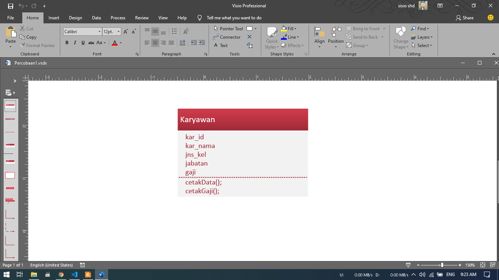 

1. Gambar diatas merupakan hasil dari Class Diagram Karyawan.
2. Menurut saya, yang dapat dibuat dari kasus diatas hanya Class Diagram Karyawan.
3. Atribut yang dapat diidentifikasi dari class diagram diatas yaitu :
   - kar_id : int, PK
   - kar_nama : String (30)
   - jns_kel : Enum('L','P')
   - jabatan : String(10)
   - gaji : Float(12)
4. Method yang dihasilkan dari data diatas yaitu :
   - cetakData()
   - cetakGaji().

Berikut untuk link ke file Class Diagram Karyawan : [klik untuk menuju file Karyawan.vsdx](../../src/2_Class_dan_Object/Percobaan1.vsdx)

### Percobaan 2

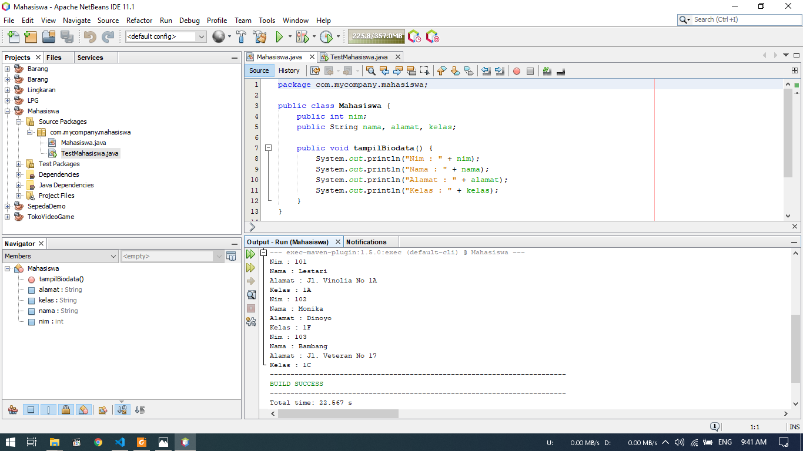
- Pada percobaan ini kita akan membuat Project Baru Mahasiswa.
- Gambar diatas ialah hasil dari project Mahasiswa.
- Pada project ini akan ditampilkan data NIM, Nama, Alamat, Kelas.

Berikut untuk link ke file Mahasiswa : [klik untuk menuju file Barang.java](../../src/2_Class_dan_Object/Barang.java) 
Berikut untuk link ke file MainMahasiswa : [klik untuk menuju file MainBarang.java](../../src/2_Class_dan_Object/MainBarang.java)  

### Percobaan 3

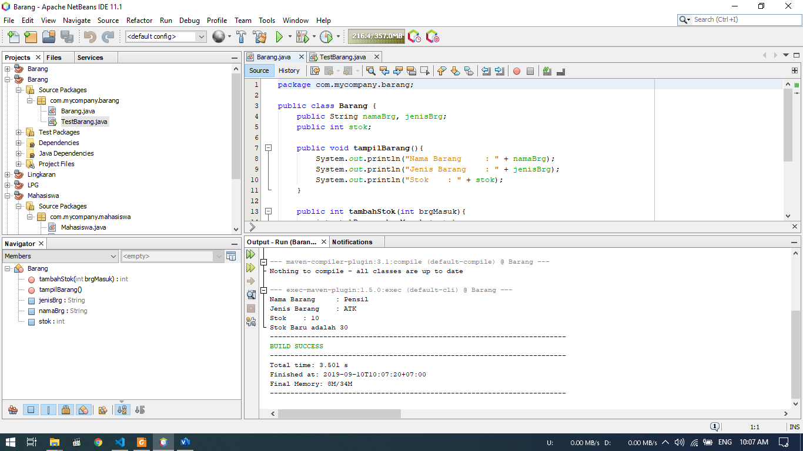 
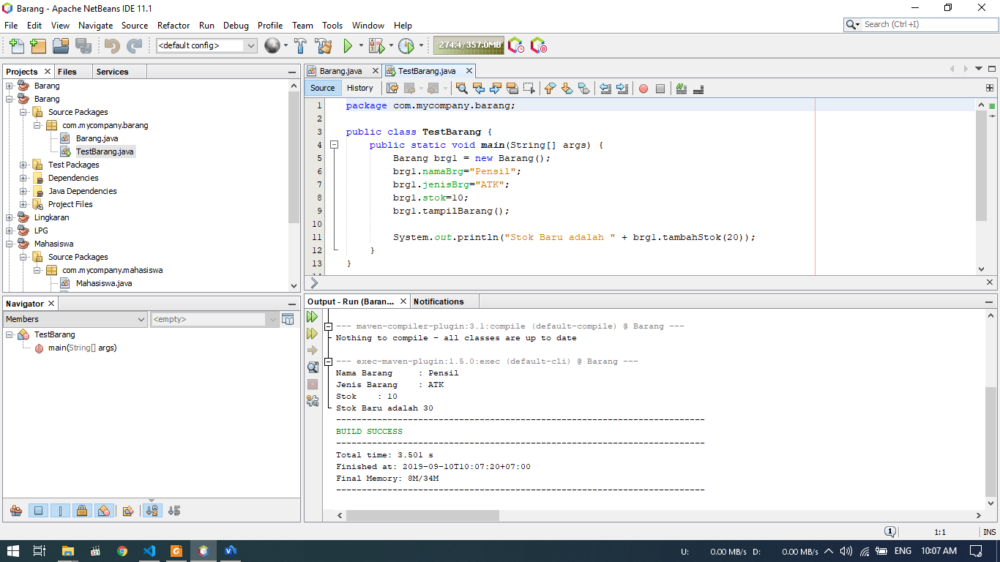
- Pada percobaan ini kita akan membuat project Barang
- Dimana pada project ini kita akan menampilkan Nama Barang, Jenis Barang, Stok dan Stok setelah diubah

Berikut untuk link ke file Barang : [klik untuk menuju file Mahasiswa.java](../../src/2_Class_dan_Object/Mahasiswa.java) 
Berikut untuk link ke file MainBarang : [klik untuk menuju file MainMahasiswa.java](../../src/2_Class_dan_Object/MainMahasiswa.java)  

## Pertanyaan

### Percobaan 1

1. Gambar diatas merupakan hasil dari Class Diagram Karyawan.
2. Menurut saya, yang dapat dibuat dari kasus diatas hanya Class Diagram Karyawan.
3. Atribut yang dapat diidentifikasi dari class diagram diatas yaitu :
   - kar_id : int, PK
   - kar_nama : String (30)
   - jns_kel : Enum('L','P')
   - jabatan : String(10)
   - gaji : Float(12)
4. Method yang dihasilkan dari data diatas yaitu :
   - cetakData()
   - cetakGaji().

### Percobaan 2

7. Proses pendeklarasian atribut terjadi pada saat class Mahasiswa dibuat. Pendeklarasian terjadi dengan menentukan tipe data setiap atribut.
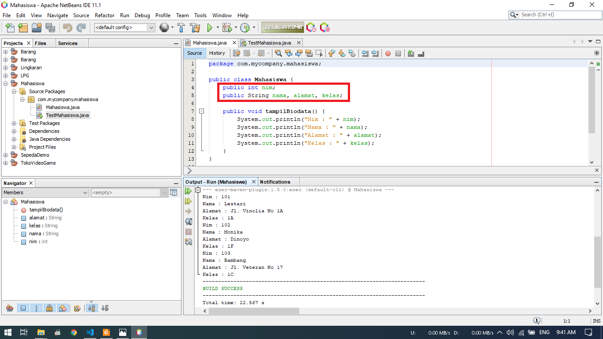
8. Pendeklarasian Method terjadi setelah atribut dideklarasikan. Pada tahap ini dibuat method tampilBiodata() dimana akan menghasilkan output NIM, Nama, Alamat dan Kelas
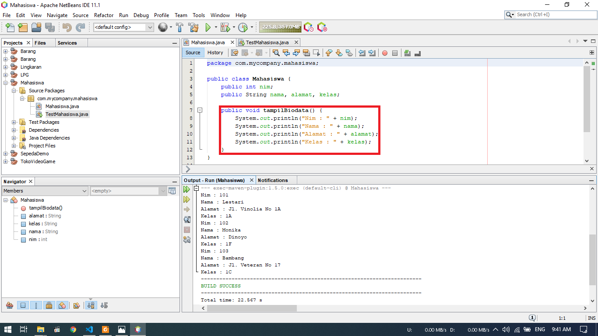
9. Objek yang dihasilkan dari project diatas ialah 1 objek(3 setelah penambahan)
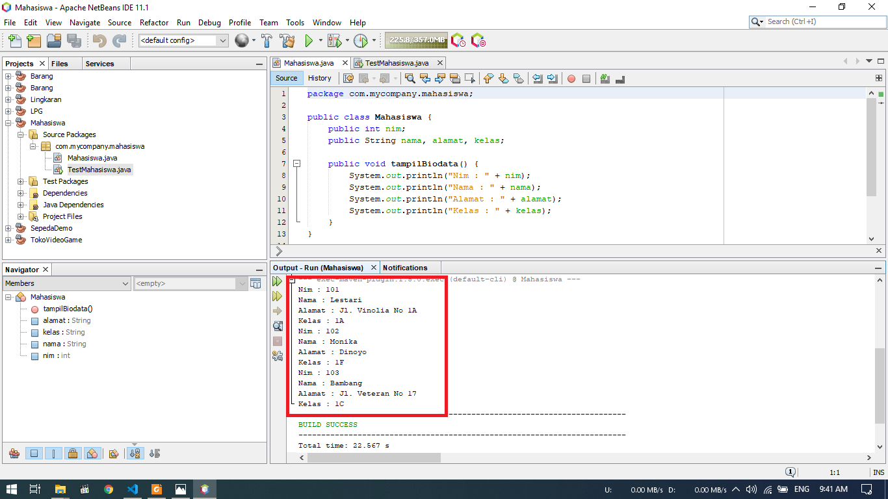
10. Mengisi nilai NIM objek mhs1 dengan input nilai : 101
11. Menampilkan nilai dari objek mhs1 dengan method tampilBiodata()
12. 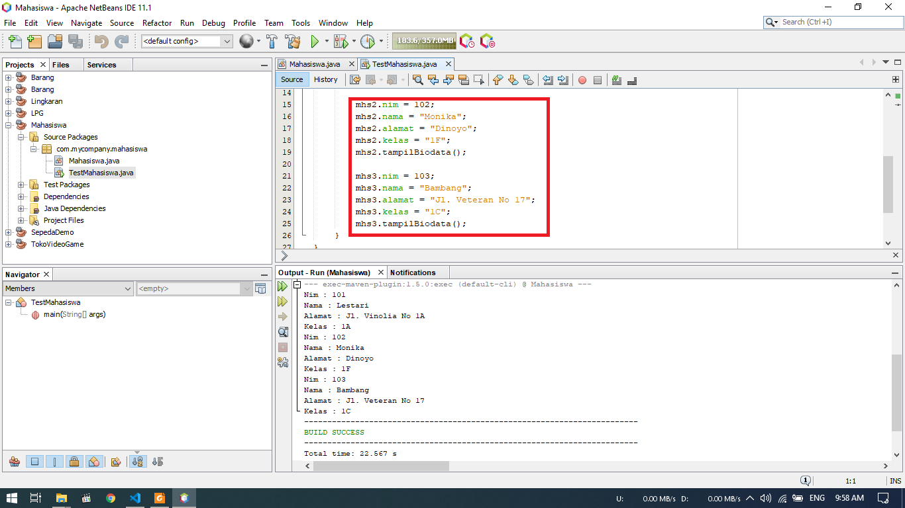

### Percobaan 3

7. Sebagai parameter untuk mengisi nilai
8. Return digunakan untuk mengembalikan nilai yang merupakan hasil dari suatu operasi bilangan.

## Tugas
1. 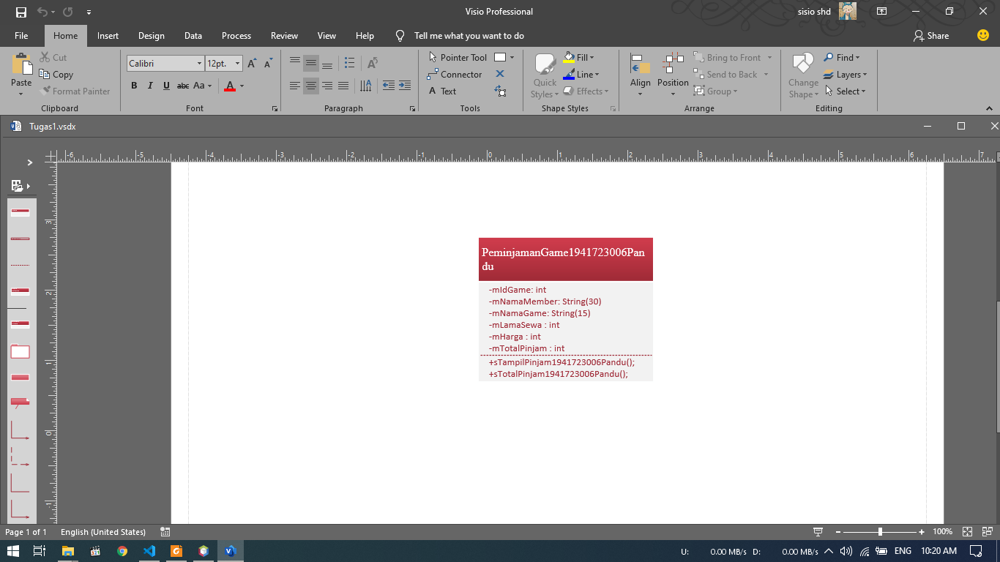
   - Pada Kasus ini kita akan diminta membuat Class DIagram  Peminjaman Game
   - DImmana pada class tersebut memiliki atribut :
     - mIdGame : int
     - mNamaMember : String(30)
     - mNamaGame : String(15)
     - mLamaSewa : int
     - mHarga : int
     - mTotalPinjam : int
   - Terdapat 2 method yaitu :
     - TampillPinjam();
     - TotalPinjam();
2. Pada kali ini kita akan membuat program berdasarkan data dari no 1
   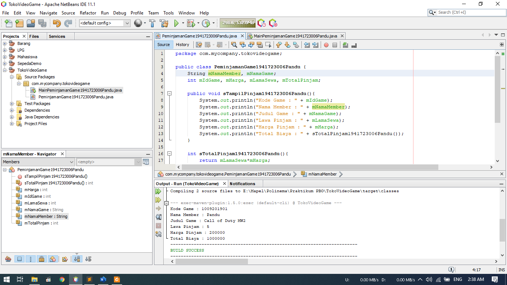
   Gambar diatas merupakan skrip dari class Peminjaman Game beserta hasil dibawahnya
   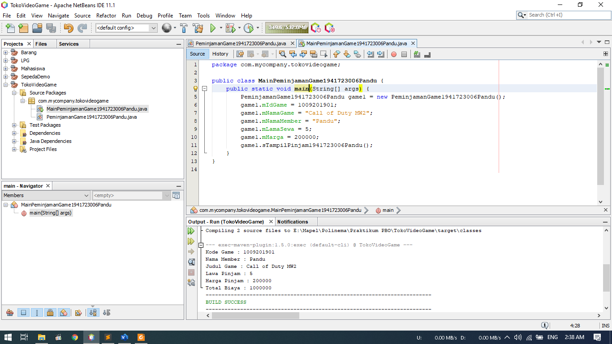
   Berikut merupakan Main Class dari Peminjaman Game diatas

   Berikut untuk link ke file Peminjaman Game : [klik untuk menuju file Peminjaman Game](../../src/2_Class_dan_Object/PeminjamanGame1941723006Pandu.java) 
   Berikut untuk link ke file Main Peminjaman Game : [klik untuk menuju file Main Peminjaman Game](../../src/2_Class_dan_Object/MainPeminjamanGame1941723006Pandu.java) 

3. - Pada soal ini kita akan membuat program Lingkaran
   - Dimana terdapat atribut mPhi, mR, mHitungLuas, mHitungKll
   - Terdapat method sHitungLuas(), sHitungKll, sTampilLingkaran
   
   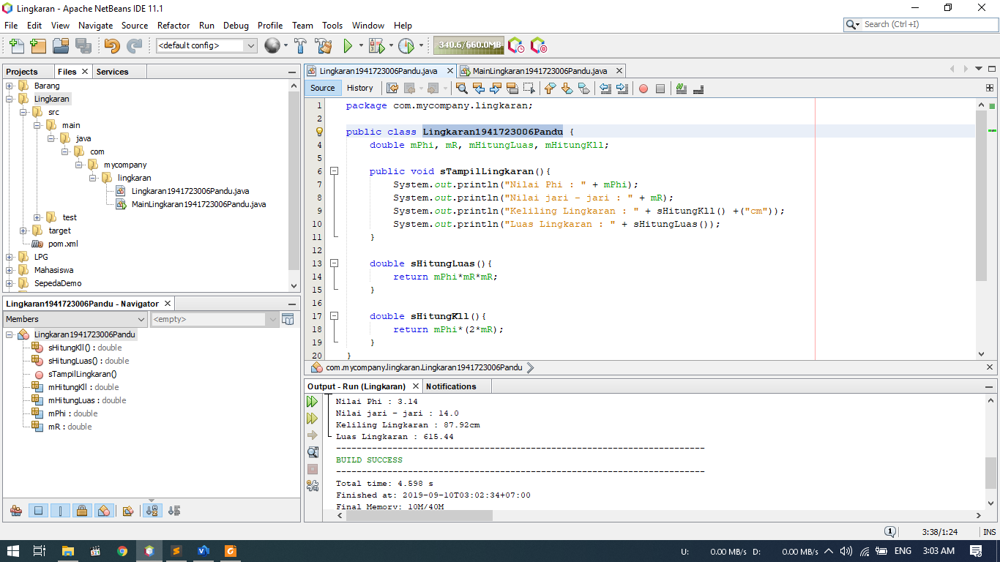 
   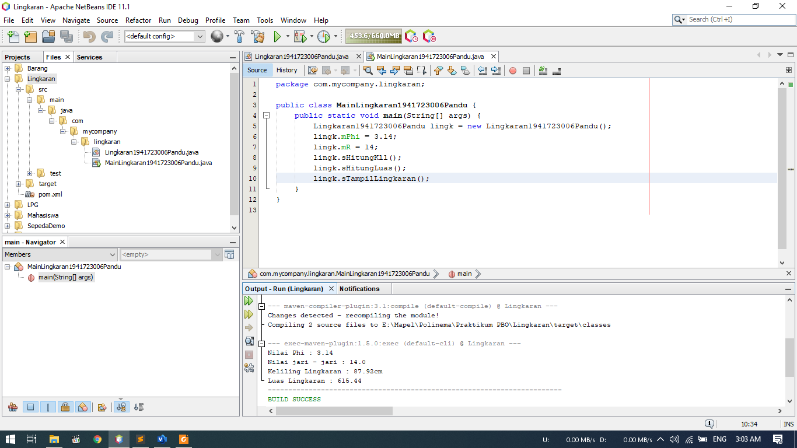

   Berikut untuk link ke file Lingkaran: [klik untuk menuju file Lingkaran](../../src/2_Class_dan_Object/Lingkaran1941723006Pandu.java) 
   Berikut untuk link ke file Main Lingkaran : [klik untuk menuju file Main Lingkaran](../../src/2_Class_dan_Object/MainLingkaran1941723006Pandu.java) 

4. - Pada kali ini kita akan membuat program yang bernama Barang
   - Dimana dalam program tersebut akan menghitung total pembayaran berdasarkan diskon yang ada

   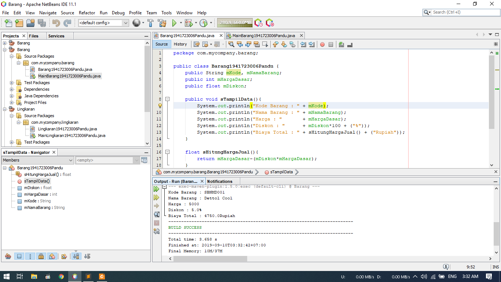 
   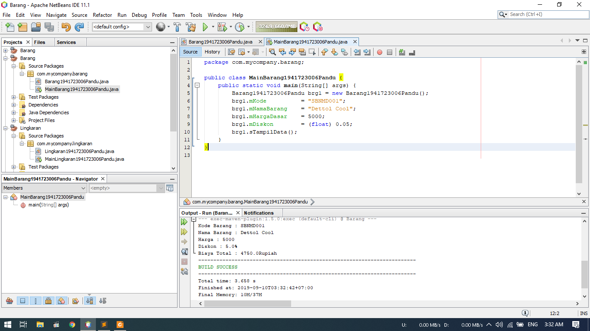

   Berikut untuk link ke file Barang: [klik untuk menuju file Barang](../../src/2_Class_dan_Object/Barang1941723006Pandu.java) 
   Berikut untuk link ke file Main Barang : [klik untuk menuju file Main Barang](../../src/2_Class_dan_Object/MainBarang1941723006Pandu.java) 

## Kesimpulan

Kesimpulan yang saya dapat selama praktikum ini adalah kita dapat menyimpan array dalam bentuk objek. Dalam materi kali ini digunakan fungsi return untuk mengembalikan nilai saat operasi hitung terjadi.

## Pernyataan Diri

Saya menyatakan isi tugas, kode program, dan laporan praktikum ini dibuat oleh saya sendiri. Saya tidak melakukan plagiasi, kecurangan, menyalin/menggandakan milik orang lain.

Jika saya melakukan plagiasi, kecurangan, atau melanggar hak kekayaan intelektual, saya siap untuk mendapat sanksi atau hukuman sesuai peraturan perundang-undangan yang berlaku.

Ttd,

***(Pandu Dwi Laksono)***
