# Laporan Praktikum #3 - Enkapsulasi

## Kompetensi

Setelah melakukan percobaan pada modul ini, mahasiswa memahami konsep:
1. Konstruktor
2. Akses Modifier
3. Atribut/method pada class
4. Intansiasi atribut/method
5. Setter dan getter
6. Memahami notasi pada UML Class Diagram

## Ringkasan Materi

1. Enkapsulasi merupakan penyembunyian atribut dari kelas lain
2. Enkapsulasi digunakan untuk tujuan keamanan
3. Mempelajari konstruktor sehingga dapat mengisi nilai data saat objek dibuat
4. Mempelajari getter dan setter
5. Mengetahui konsep akses modifier

## Percobaan

### Percobaan 1

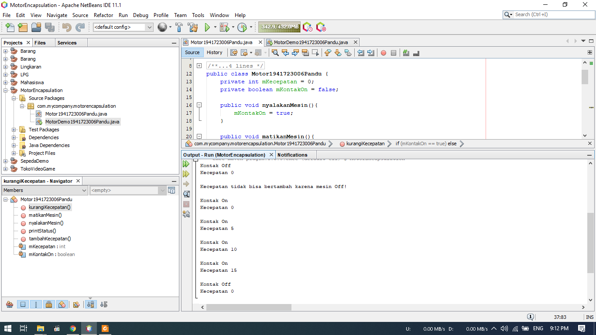 

1. Gambar diatas merupakan hasil Project Motor
2. Dimana saat kecepatan 0, maka kontak akan off, dan jika mau menambah ekcepatan, kontak harus on terlebih dahulu

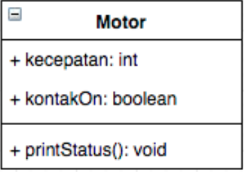 

Gambar diatas merupakan Class Diagram dari Project Motor

Berikut untuk link ke file Motor : [klik untuk menuju file Motor.java](../../src/3_Enkapsulasi/Motor1941723006Pandu.java) 
Berikut untuk link ke file MainMotor : [klik untuk menuju file MotorDemo.java](../../src/3_Enkapsulasi/MotorDemo1941723006Pandu.java)

### Percobaan 2

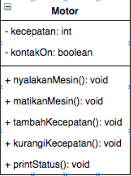
- Pada percobaan ini kita akan merubah Class Diagram Motor menjadi seperti ini.
- Gambar dibawah ialah hasil dari project Mahasiswa.

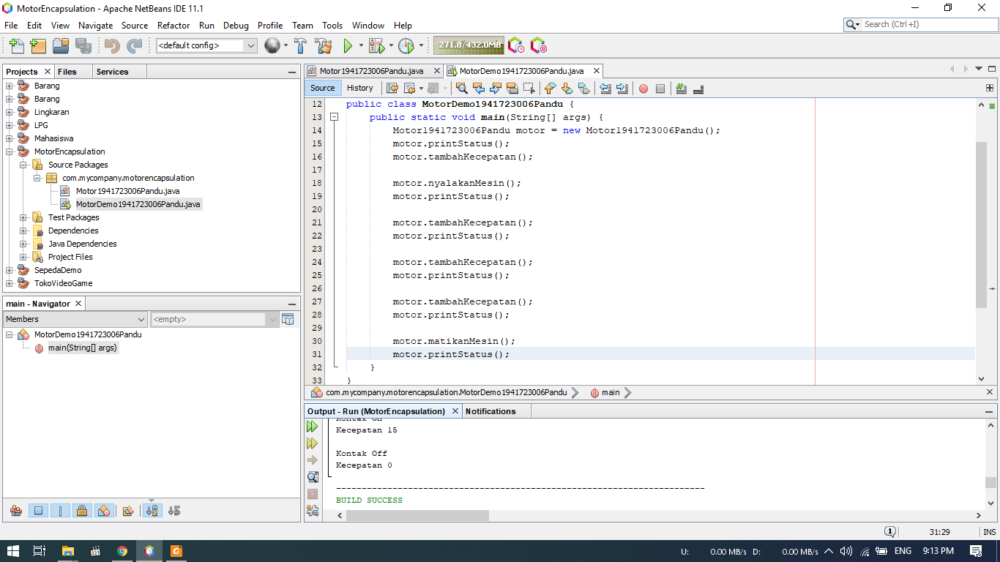
- Pada project ini akan ditampilkan kondisi kontak saat motor dinyalakan pada awalnya, kemudian ditambah kecepatan sampai berhenti dan kontak motor mati.

Berikut untuk link ke file Motor : [klik untuk menuju file Motor.java](../../src/3_Enkapsulasi/Motor1941723006Pandu.java) 
Berikut untuk link ke file MainMotor : [klik untuk menuju file MotorDemo.java](../../src/3_Enkapsulasi/MotorDemo1941723006Pandu.java)

### Pertanyaan Percobaan 2
  1. Pada class TestMobil, saat kita menambah kecepatan untuk pertama kalinya, mengapa muncul peringatan “Kecepatan tidak bisa bertambah karena Mesin Off!”?
      Jawab :
      karena kontak harus dinyalakan sebelum kita menambah kecepatan
  2. Mengapat atribut kecepatan dan kontakOn diset private?
      Jawab :
      Supaya tidak bisa diakses dari luar dan tidak terganggu programnya
  3. Ubah class Motor sehingga kecepatan maksimalnya adalah 100!
      Jawab :
      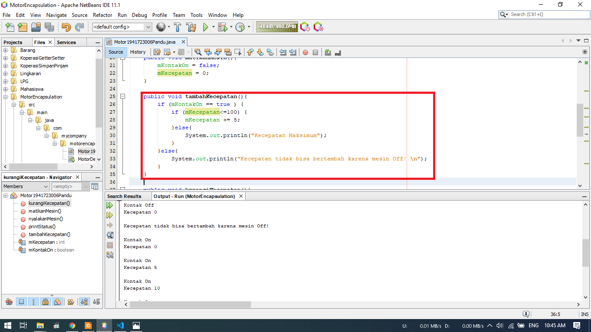
      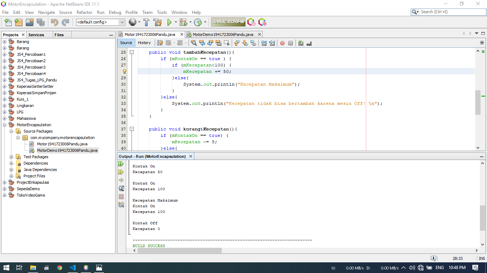

### Percobaan 3

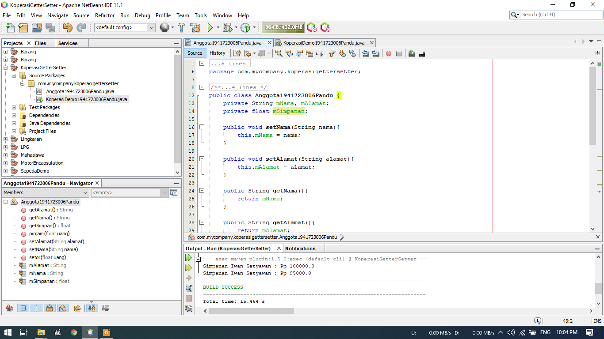 

- Pada percobaan ini kita akan membuat project KoperasiGetterSetter
- Dimana pada project ini kita akan belajar menggunakan getter dan setter

Berikut untuk link ke file Koperasi : [klik untuk menuju file ](../../src/3_Enkapsulasi/Anggota1941723006Pandu.java) 
Berikut untuk link ke file MainKoperasi : [klik untuk menuju file ](../../src/3_Enkapsulasi/KoperasiDemo1941723006Pandu.java)  

### Percobaan 4

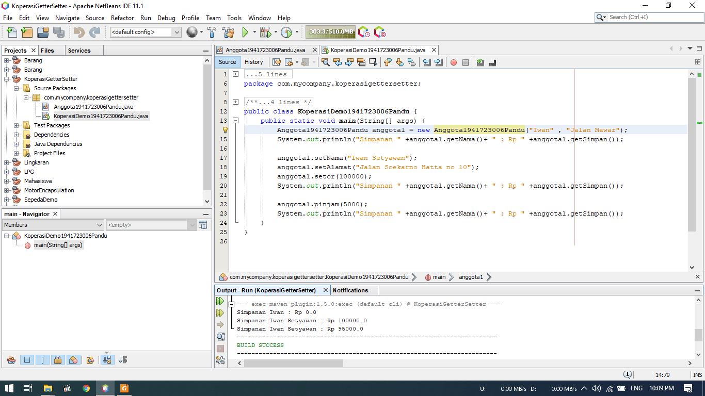 
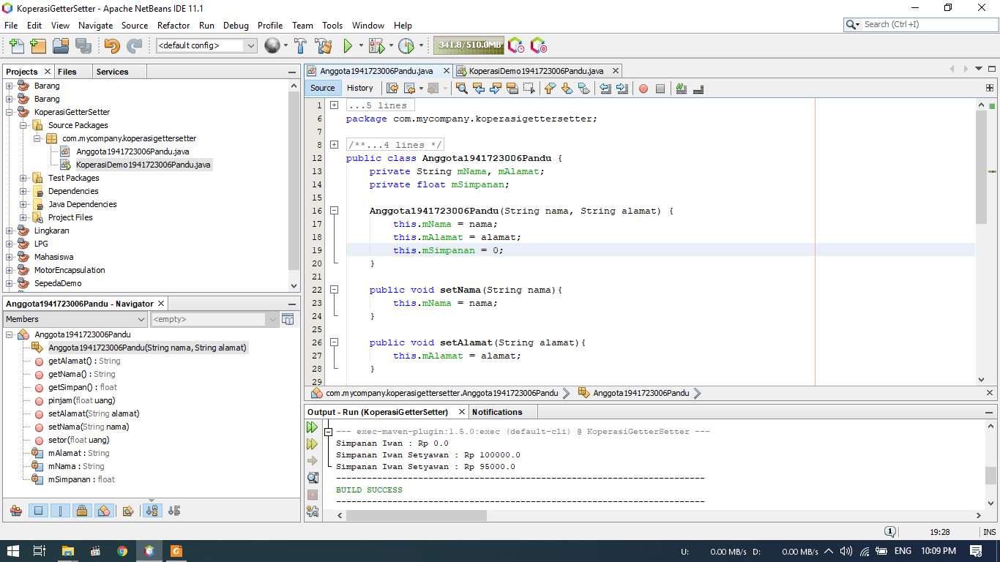
- Pada percobaan ini kita akan memambah data pada KoperasiGetterSetter dengan menggunakan kontruktor
- Dimana pada project ini kita akan mengisi nilai objek langsung setelah objek itu dibuat

Berikut untuk link ke file Koperasi : [klik untuk menuju file ](../../src/3_Enkapsulasi/Anggota1941723006Pandu.java) 
Berikut untuk link ke file MainKoperasi : [klik untuk menuju file ](../../src/3_Enkapsulasi/KoperasiDemo1941723006Pandu.java)  

### Pertanyaan Percobaan 3 dan 4
1. Apa yang dimaksud getter dan setter?
    - Getter dibunakan untuk mengambil nilai dari atribut yang dienkapsulasi, sedangkan Setter digunakan untuk mengeset/menentukan suatu nilai pada atribut tersebut
2. Apa kegunaan dari method getSimpanan()?
    - Mengambil nilai dari atribut mSimpanan
3. Method apa yang digunakan untk menambah saldo?
    - void setor(float uang)
4. Apa yand dimaksud konstruktor?
    - Sebuah method yang berfungsi untuk mengisi langsung nilai saat objek baru dibuat
5. Sebutkan aturan dalam membuat konstruktor?
    - Nama konstruktor harus sama dengan nama class
    - Konstruktor tidak memiliki tipe data return
    - Konstruktor tidak boleh menggunakan modifier abstract, static, final, dan syncronized
6. Apakah boleh konstruktor bertipe private?
    - boleh
7. Kapan menggunakan parameter dengan passsing parameter?
    - pada saat objek baru dibuat
8. Apa perbedaan atribut class dan instansiasi atribut?
    - atribut class ialah atribut yang ada pada class tersebut
    - instansiasi atribut ialah atribut yang baru dibuat saat proses instansiasio
9. Apa perbedaan class method dan instansiasi method?
    - class method ialah method yang ada pada class tersebut
    - instansiasi method ialah method yang dipanggil saat proses instansiasi

## Tugas
1. 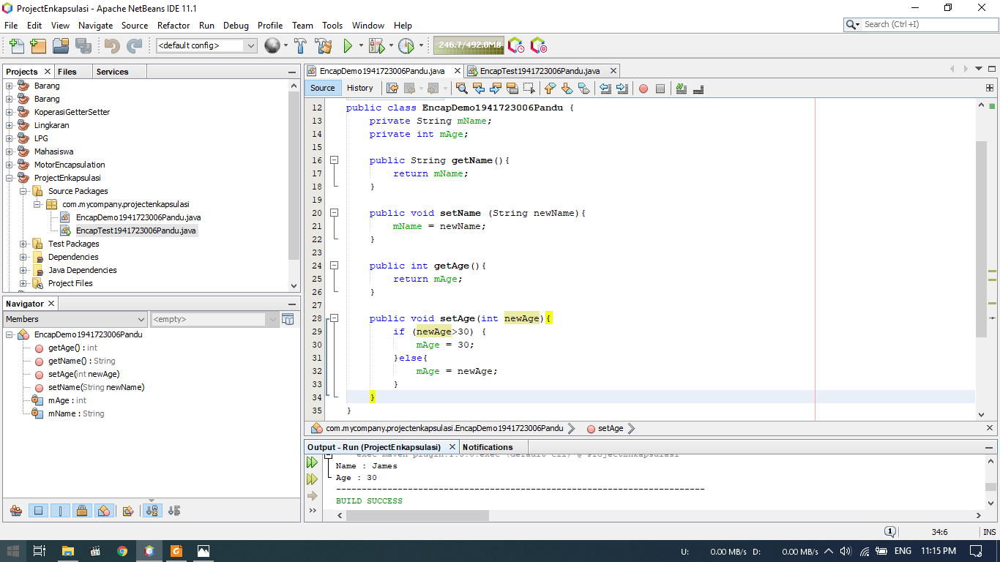
   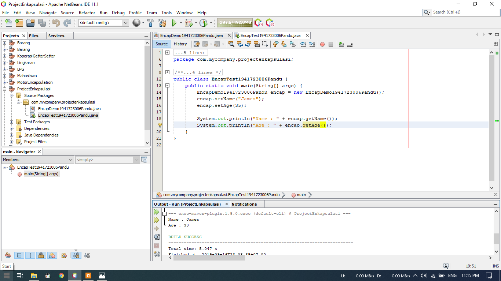

   Berikut merupakan hasil dari program yang ada pada nomor 1

2. 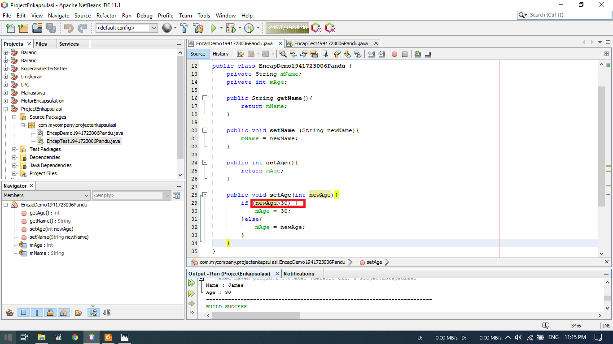
   
   Karena tanda pada if terbalik. jadi hasil yang diatas 30 tetap mengeluarkan output 30

3. 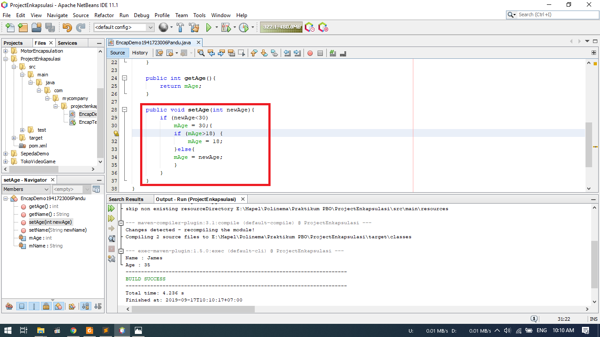

4.  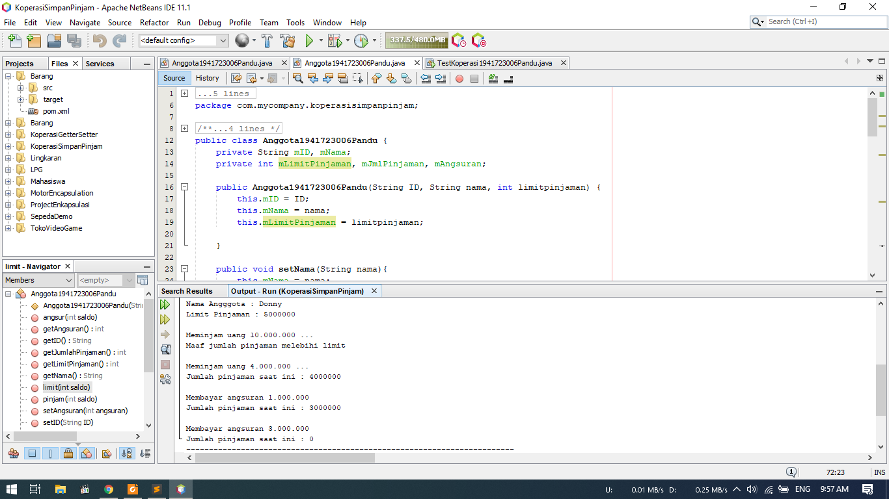
       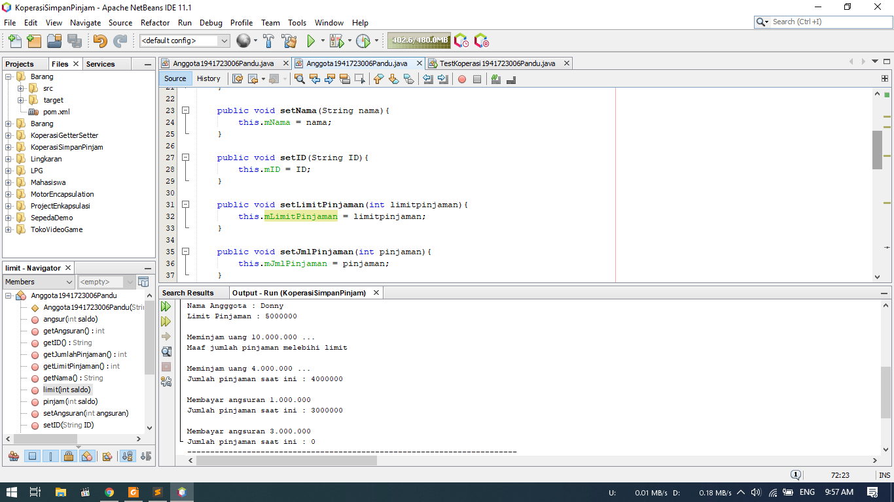
       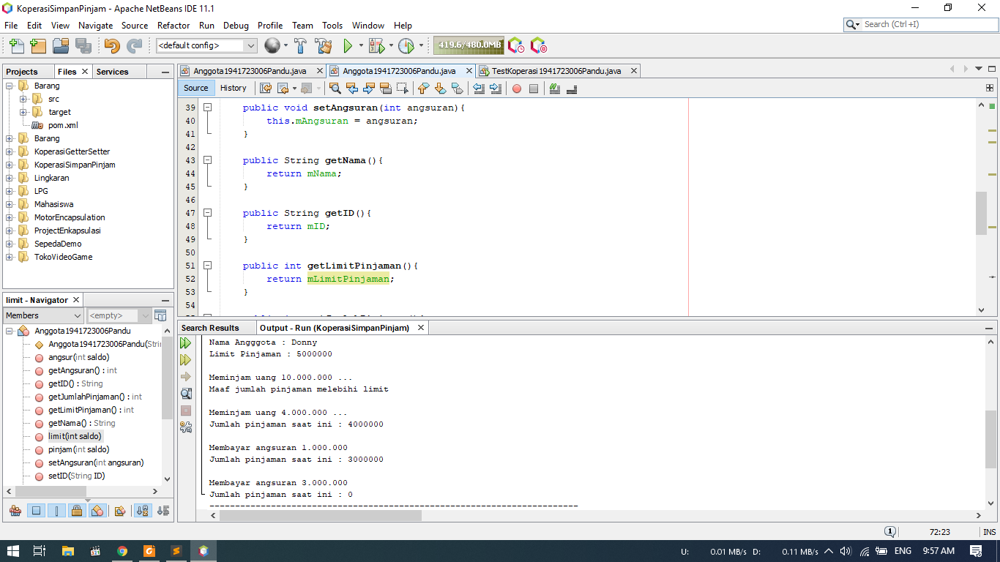
       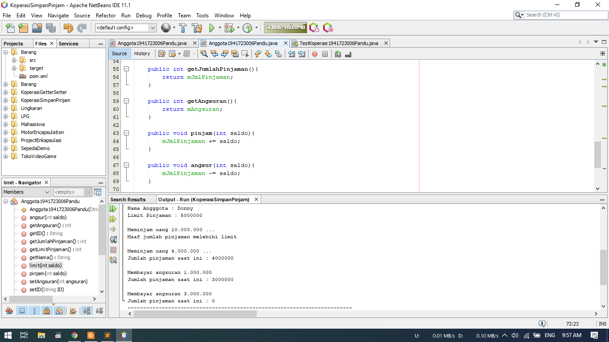
       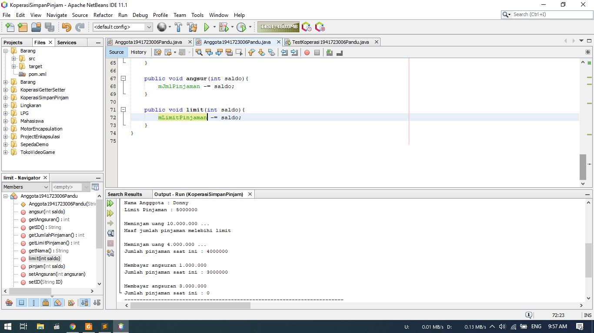
       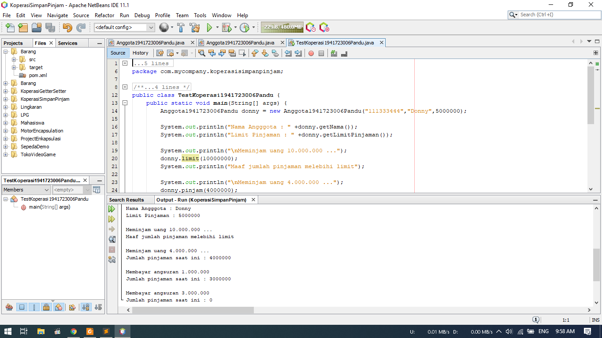
       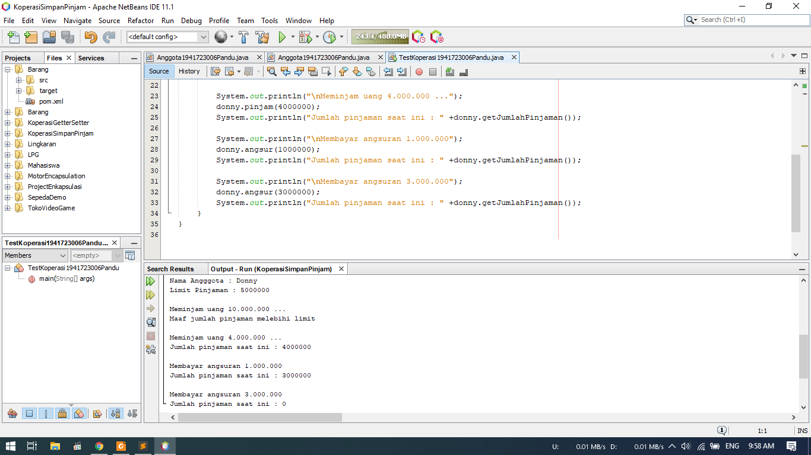

       Berikut untuk link ke file KoperasiSimpanPinjam : [klik untuk menuju file ](../../src/3_Enkapsulasi/Tugas_no_4/Anggota1941723006Pandu.java) 
       Berikut untuk link ke file MainKoperasiSimpanPinjam : [klik untuk menuju file ](../../src/3_Enkapsulasi/Tugas_no_4/TestKoperasi1941723006Pandu.java)

## Kesimpulan

Kesimpulan yang saya dapat selama praktikum ini adalah kita dapat mengisi nilai data setelah objek dibuat menggunakan construktor. Penggunaan getter dan setter dapat mempermudah dalam pemanggilan nilai

## Pernyataan Diri

Saya menyatakan isi tugas, kode program, dan laporan praktikum ini dibuat oleh saya sendiri. Saya tidak melakukan plagiasi, kecurangan, menyalin/menggandakan milik orang lain.

Jika saya melakukan plagiasi, kecurangan, atau melanggar hak kekayaan intelektual, saya siap untuk mendapat sanksi atau hukuman sesuai peraturan perundang-undangan yang berlaku.

Ttd,

***(Pandu Dwi Laksono)***
