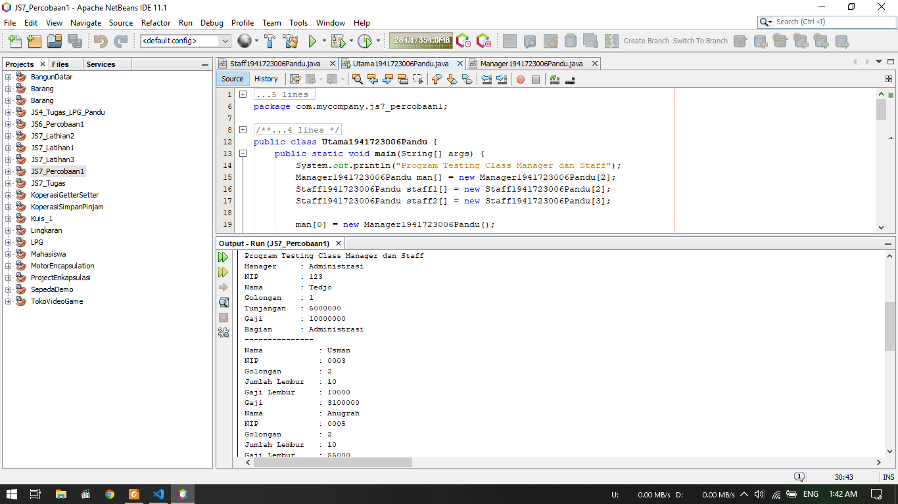
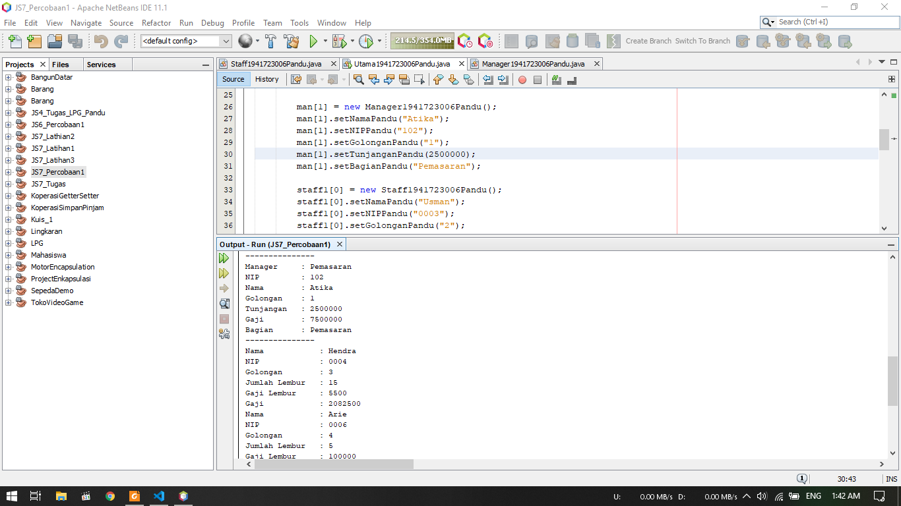
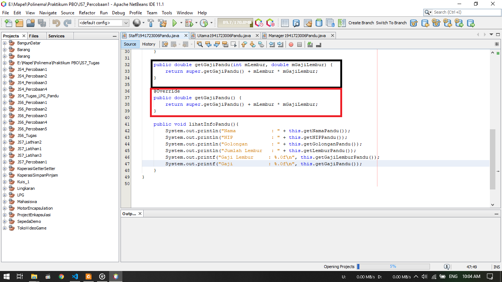
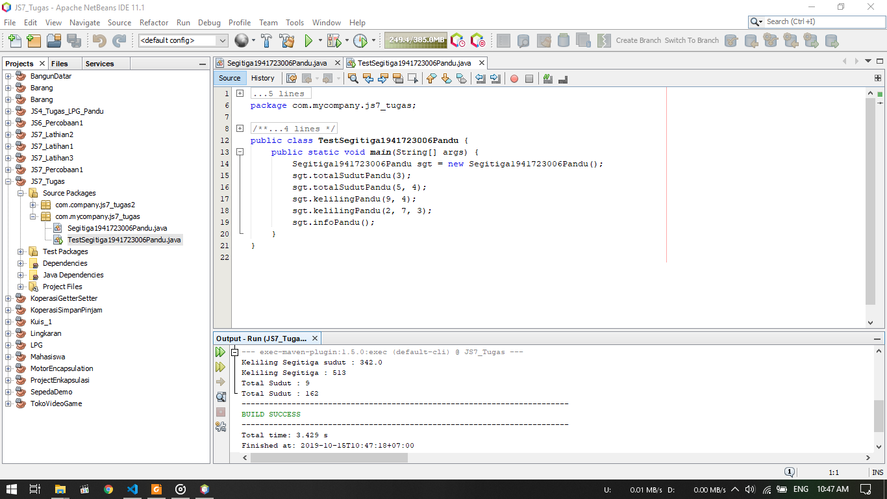
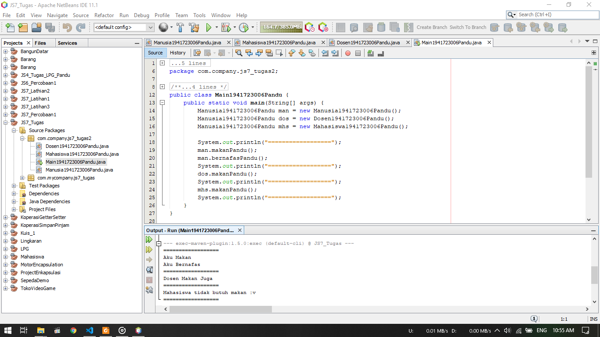
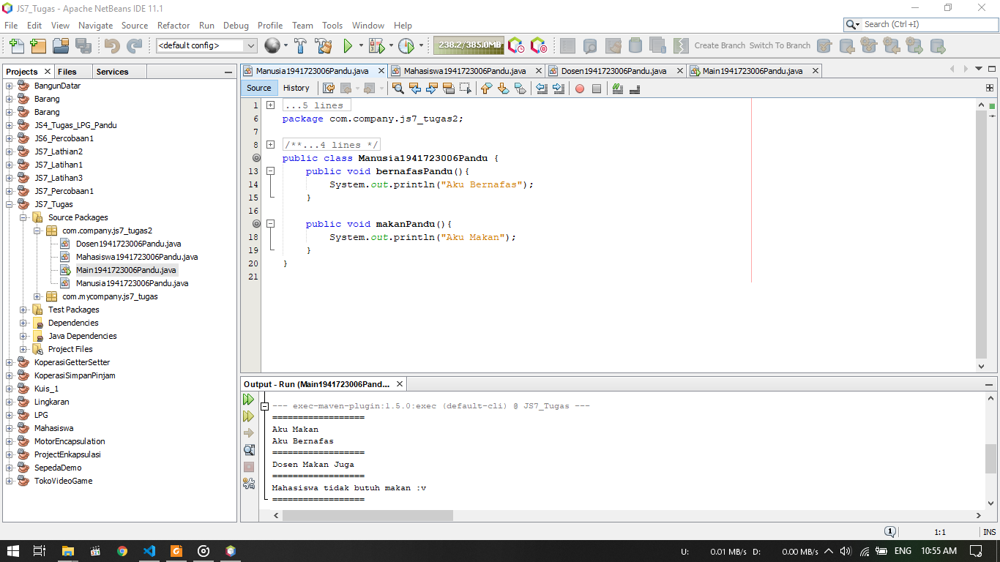
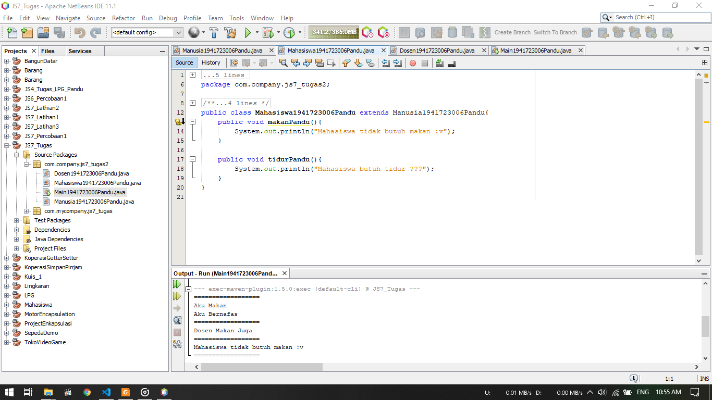
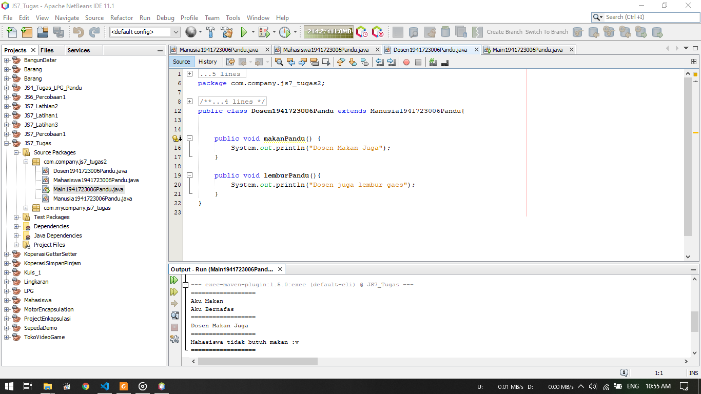

# Laporan Praktikum #7 - Overriding dan Overloading

## Kompetensi

Setelah menempuh pokok bahasan ini, mahasiswa mampu :
1. Memahami konsep overloading dan overriding,
2. Memahami perbedaan overloading dan overriding,
3. Ketepatan dalam mengidentifikasi method overriding dan overloading
4. Ketepatan dalam mempraktekkan instruksi pada jobsheet
5. Mengimplementasikan method overloading dan overriding

## Ringkasan Materi

1. Overloading adalah menuliskan kembali method dengan nama yang sama pada suatu class
2. Tujuan dari overloading agar dapat memudahkan penggunaan/pemanggilan method dengan fungsionalitas yang mirip
3. Pada saat overloading, parameter method yang overload harus berbeda agar tidak terjadi tumbukan
4. Overriding adalah Sublass yang berusaha memodifkasi tingkah laku yang diwarisi dari superclass
5. Tujuannya subclass dapat memiliki tingkah laku yang lebih spesifik sehingga dapat dilakukan dengan cara mendeklarasikan kembali method milik parent class di subclass.
6. Pada overriding, yang dapat berubah ialah isi dari method tersebut

## Percobaan

### Percobaan 1

1. Gambar diatas merupakan hasil dari percobaan 1
2. Dimana saat terdapat tiga class, yaitu class Karyawan, class Manager dan class Staff dimana class Manager dan class Staff merupakan subclass dari class Karyawan
3. Pada class Staff terdapat method overloading yang berada pada kotak hitam dan method overriding yang berada pada kotak merah

Berikut untuk link ke file Karyawan : [klik untuk menuju file ](../../src/7_Overriding_dan_Overloading/Percobaan_1/Karyawan1941723006Pandu.java) 
Berikut untuk link ke file Manager : [klik untuk menuju file ](../../src/7_Overriding_dan_Overloading/Percobaan_1/Manager1941723006Pandu.java) 
Berikut untuk link ke file Staff : [klik untuk menuju file ](../../src/7_Overriding_dan_Overloading/Percobaan_1/Staff1941723006Pandu.java) 
Berikut untuk link ke file Utama : [klik untuk menuju file ](../../src/7_Overriding_dan_Overloading/Percobaan_1/Utama1941723006Pandu.java)

### Latihan 1

1. Pada latihan ini, akan mencoba mengimplementasikan method overloading
2. Dimana method yang dioverload ialah method perkalian
3. Sehingga kita tidak perlu menulis ulang method lain untuk tujuan yang sama dengan objek atau isi yang berbeda

### Pertanyaan Latihan 1
1. Dari source coding diatas terletak dimanakah overloading?

    
    Pada method yang terletak pada kotak merah
2. Jika terdapat overloading ada berapa jumlah parameter yang berbeda?  
    
    Terdapat 1 parameter yang berbeda yaitu penambahan 1 lagi parameter bertipe data integer yaitu int mC

Berikut untuk link ke file Perkalian : [klik untuk menuju file ](../../src/7_Overriding_dan_Overloading/Latihan_1/Perkalianku1941723006Pandu.java)

### Latihan 2

1. Pada latihan ini, akan mencoba mengimplementasikan method overloading, tetapi dengan tipe data yang berbeda
2. Dimana method yang dioverload ialah method perkalian
3. Sehingga kita tidak perlu menulis ulang method lain untuk tujuan yang sama dengan objek atau isi yang berbeda

### Pertanyaan Latihan 2
1. Dari source coding diatas terletak dimanakah overloading?

    
    Pada method yang terletak pada kotak merah
2. Jika terdapat overloading ada berapa jumlah parameter yang berbeda?  
    
    Terdapat 2 parameter yang berbeda yaitu perubahan parameter "int mA, int mB" menjadi "double mA, double mB"

Berikut untuk link ke file Perkalian : [klik untuk menuju file ](../../src/7_Overriding_dan_Overloading/Latihan_2/Perkalianku1941723006Pandu.java)

### Latihan 3

1. Pada latihan ini, akan mencoba mengimplementasikan method overriding
2. Dimana pada class Fish digunakan teknik dynamic method dispatch
3. Pada overridding, kita hanya perlu mengubah isi dari method yang akan dioverride

### Pertanyaan Latihan 3
1. Dari source coding diatas terletak dimanakah overriding?
    
    
    Dari latihan 3 ini, overrriding terletak pada method swinmPandu() pada kotak merah
2. Jabarkanlah apabila sourcoding diatas jika terdapat overriding?
    
    
    - Dari latihan 3 ini, overrriding terletak pada method swinmPandu()
    - Dimana method tersebut merupakan milik class Ikan, kemudian dioverride pada subclassnya yaitu class Piranha
    - Pada class Piranha, kita tinggal mengubah isi dari method swimPandu() tersebut

Berikut untuk link ke file Ikan : [klik untuk menuju file ](../../src/7_Overriding_dan_Overloading/Latihan_3/Ikan1941723006Pandu.java) 
Berikut untuk link ke file Piranha : [klik untuk menuju file ](../../src/7_Overriding_dan_Overloading/Latihan_3/Piranha1941723006Pandu.java) 
Berikut untuk link ke file Fish : [klik untuk menuju file ](../../src/7_Overriding_dan_Overloading/Latihan_3/Fish1941723006Pandu.java)

## Tugas
### Tugas 1

1. Berikut merupakan hasil dari Tugas 1
2. Dimana terdapat method overload yang dibuat yaitu totalSudutPandu() dan kelilingPandu()
3. Pada method overload tersebut terdapat perubahan parameter seperti pada gambar

Berikut untuk link ke file Segitiga : [klik untuk menuju file ](../../src/7_Overriding_dan_Overloading/Tugas_1/Segitiga1941723006Pandu.java) 
Berikut untuk link ke file Test Segitiga : [klik untuk menuju file ](../../src/7_Overriding_dan_Overloading/Tugas_1/TestSegitiga1941723006Pandu.java)\

### Tugas 2

1. Pada tugas ini dibuat method override, sehingga tidak perlu menulis ulang method
2. Pada gambar dibawah terlihat class Mahasiswa dan class Dosen merupakan turunan dari class Manusia, dan method yang dioverride yaitu method makanPandu()

3. Pada Mainclass digunakan teknik dynamic method dyspatch saat pembuatan objek

4. hasil outputnya dapat dilihat pada bagian bawah gambar

Berikut untuk link ke file Manusia : [klik untuk menuju file ](../../src/7_Overriding_dan_Overloading/Tugas_2/Manusia1941723006Pandu.java) 
Berikut untuk link ke file Dosen : [klik untuk menuju file ](../../src/7_Overriding_dan_Overloading/Tugas_2/Dosen1941723006Pandu.java) 
Berikut untuk link ke file Mahasiswa : [klik untuk menuju file ](../../src/7_Overriding_dan_Overloading/Tugas_2/Mahasiswa1941723006Pandu.java) 
Berikut untuk link ke file Main : [klik untuk menuju file ](../../src/7_Overriding_dan_Overloading/Tugas_2/Main1941723006Pandu.java)

## Kesimpulan

Kesimpulan yang saya dapat selama praktikum ini adalah kita dapat menggunakan overload dan override untuk mewarisi atau meniru method yang sama tanpa harus membuat method baru tapi berfungsi sama, sehingga terdapat efesiensi dan kerapian dalam penulisan koding. tentu juga dalam penulisan override dan overload harus mengikuti syarat-syarat yang berlaku.

## Pernyataan Diri

Saya menyatakan isi tugas, kode program, dan laporan praktikum ini dibuat oleh saya sendiri. Saya tidak melakukan plagiasi, kecurangan, menyalin/menggandakan milik orang lain.

Jika saya melakukan plagiasi, kecurangan, atau melanggar hak kekayaan intelektual, saya siap untuk mendapat sanksi atau hukuman sesuai peraturan perundang-undangan yang berlaku.

Ttd,

***(Pandu Dwi Laksono)***
