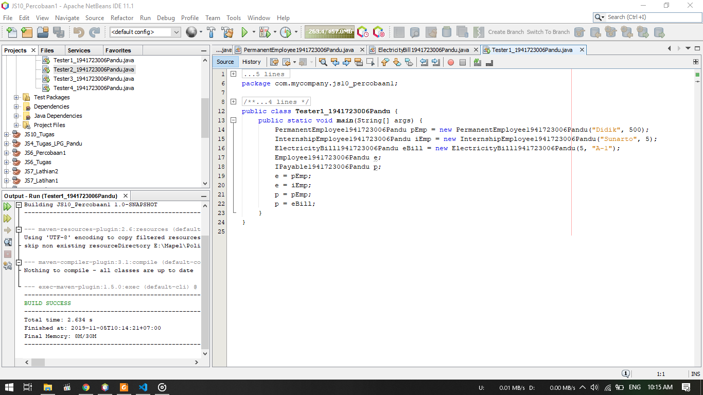
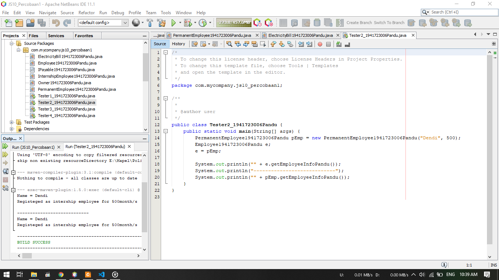
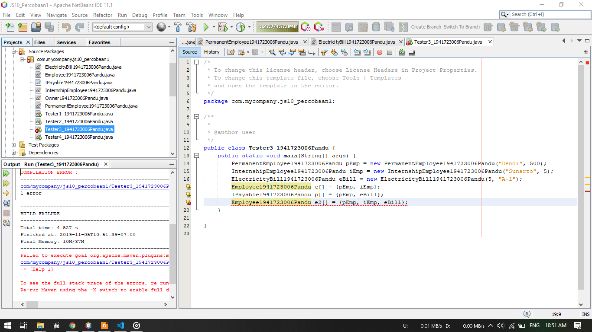
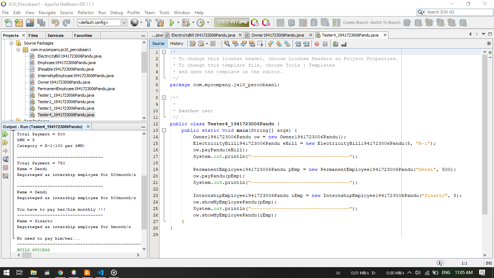
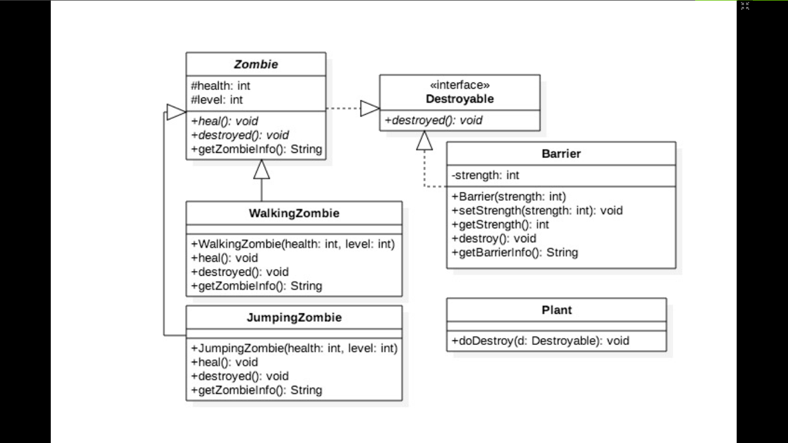
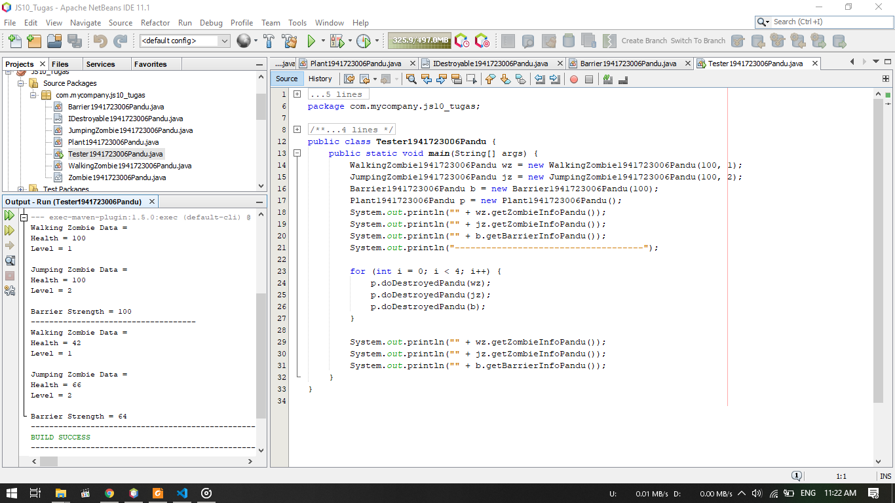

# Laporan Praktikum #10 - Polimorfisme

## Kompetensi

Setelah menyelesaikan lembar kerja ini mahasiswa diharapkan mampu:

1. Memahami konsep dan bentuk dasar polimorfisme
2. Memahami konsep virtual method invication
3. Menerapkan polimorfisme pada pembuatan heterogeneous collection
4. Menerapkan polimorfisme pada parameter/argument method
5. Menerapkan object casting untuk meng-ubah bentuk objek

## Ringkasan Materi

1. Virtual Method Invocation

    Virtual method invocation terjadi ketika ada pemanggilan overriding method dari suatu objek polimorfisme. Disebut virtual karena antara method yang dikenali oleh compiler dan method yang dijalankan oleh JVM berbeda.
2. Heterogeneous Collection

    Dengan adanya konsep polimorfisme, maka variabel array bisa dibuat heterogen. Artinya di dalam array tersebut bisa berisi berbagai macam objek yang berbeda
3. Polymorphic Argument

    Polimorfisme juga bisa diterapkan pada argument suatu method. Tujuannyaagar method tersebut bisa menerima nilai argument dari berbagai bentuk objek.
4. Operator Instanceof

    Operator instanceof bisa digunakan untuk mengecek apakah suatu objek merupakan hasil instansiasi dari suatu class tertentu. Hasil dari instanceof berupa nilai boolean.
5. Object Casting

    Casting objek digunakan untuk mengubah tipe dari suatu objek. Jika ada suatu objek dari subclass kemudian tipenya diubah ke superclass, maka hal ini termasuk ke upcasting. Downcast terjadi jika ada suatu objek superclass, kemudian diubah menjadi objek dari subclass. Proses downcasting sering disebut juga sebagai explicit casting, karena bentuk tujuan dari casting harus dituliskan dalam tanda kurung, di depan objek yang akan di-casting.

## Percobaan

### Percobaan 1



1. Gambar diatas merupakan hasil dari percobaan 1
2. Disini akan dicoba penggunaan polimorfisme dimana terdapat class employee yang memiliki beberapa bentuk/ subclass yaitu class IntersihpEmployee dan PermanentEmployee
3. Terdapat sebuah Interface yang akan diimplementasi oleh class ElectrivityBill 

### Pertanyaan Percobaan 1

1. Class apa sajakah yang merupakan turunan dari class Employee?

    Yang merupakan turunan dari class Employee ialah class IntershipEmployee dan class PermanentEmployee
2. Class apa sajakah yang implements ke interface IPayable?

    Class yang mengimplementasi Interface IPayable  ialah class ElectricityBill dan class PermanentEmployee
3. Perhatikan class Tester1, baris ke-10 dan 11. Mengapa e, bisa diisi dengan objek pEmp (merupakan objek dari class PermanentEmployee) dan  objek iEmp (merupakan objek dari class InternshipEmploye) ?

    Karena objek tersebut dibuat dari class - class yang merupakan turunan dari class Employee
4. Perhatikan class Tester1, baris ke-12 dan 13. Mengapa p, bisa diisi dengan objek pEmp (merupakan objek dari class PermanentEmployee) dan objek eBill (merupakan objek dari class ElectricityBill) ?

    Karena pada class PermanentEmployee mengimplementasikan Interface IPayable begitu juga class ElectricityBill
5. Coba tambahkan sintaks:

    ```java
    p = iEmp;
    e = eBill;
    ```

    pada baris 14 dan 15 (baris terakhir dalam method main) ! Apa yang menyebabkan error?

    Yang menyebabkan error pada syntaks tersebut ialah pada objek p tidak diwariskan/ diturunkan oleh class IntershipEmployee yang merupakan pemilik objek iEmp. Kemudian pada objek e terjadi error karena pada class IntershipEmployee tidak mengimplementasi Interface IPayable sehingga tidak dapat memanggil objek eBill
6. Ambil kesimpulan tentang konsep/bentuk dasar polimorfisme!

    Pada subclass agar dapat membedakan bentuk harus mengimplementasi Interface

Berikut untuk link ke file Employee : [klik untuk menuju file ](../../src/10_Polimorfisme/Percobaan_1/Employee1941723006Pandu.java)<br>
Berikut untuk link ke file Intership Employee : [klik untuk menuju file ](../../src/10_Polimorfisme/Percobaan_1/IntershipEmployee1941723006Pandu.java)<br>
Berikut untuk link ke file Permanent Employee : [klik untuk menuju file ](../../src/10_Polimorfisme/Percobaan_1/PermanentEmployee1941723006Pandu.java)<br>
Berikut untuk link ke file Electricity Bill : [klik untuk menuju file ](../../src/10_Polimorfisme/Percobaan_1/ElectricityBill1941723006Pandu.java)<br>
Berikut untuk link ke file IPayable : [klik untuk menuju file ](../../src/10_Polimorfisme/Percobaan_1/IPayable1941723006Pandu.java)<br>
Berikut untuk link ke file Tester 1 : [klik untuk menuju file ](../../src/10_Polimorfisme/Percobaan_1/Tester1_1941723006Pandu.java)

### Percobaan 2



1. Pada percobaan ini, dilakukan percobaan Virtual method invocation
2. Masih menggunakan class pada percobaan 1
3. Dibuat objek pEmp pada class PermanentEmployee dan objek e pada class Employee
4. Dicoba melakukan pemanggilan melalui objek pEmp dan e dimana objek e sama dengan objek pEmp dan PermanentEmployee merupakan turunan dari Employee
5. Output program dapat dilihat pada screenshot diatas

### Pertanyaan Percobaan 2

1. Perhatikan class Tester2 di atas, mengapa pemanggilan e.getEmployeeInfo() pada baris 8 dan pEmp.getEmployeeInfo() pada baris 10 menghasilkan hasil sama?

    Karena setelah pembuatan objek e, dideklarasikan e sama dengan pEmp sehingga dapat memangil isi dari getEmployeeInfo dari class PermanentEmployee, dan juga PermanentEmployee merupakan turunan dari Employee
2. Mengapa pemanggilan method e.getEmployeeInfo() disebut sebagai pemanggilan method virtual (virtual method invication), sedangkan  pEmp.getEmployeeInfo() tidak?

    Karena method yang dipanggil berasal dari class PermanentEmployee sedangkan pEmp merupakan objek dari class PermanentEmployee, sehingga tidak dapat disebut pemanggilan method virtual
3. Jadi apakah yang dimaksud dari virtual method invocation? Mengapa disebut virtual?

    Dipanggil virtual karena tidak berasal dari class tersebut namun memiliki rangka / bentuk yang sama sehingga dapat dipanggil

Berikut untuk link ke file Tester 2 : [klik untuk menuju file ](../../src/10_Polimorfisme/Percobaan_2/Tester2_1941723006Pandu.java)

### Percobaan 3



1. Pada percobaan ini akan menerapkan penggunaan Heterogenous Collection
2. Pada class Tester 3, dilakukan langsung instansiasi objek
3. Kemudian dibuat objet array pada class Employee dan interface IPayable untuk menamnggil isi dari objek yang dibuat tadi
4. Bisa dilihat terdapat error pada program, karena pada objek array e2 tidak memiliki relasi padad class ElectricityBill 

### Pertanyaan Percobaan 3

1. Perhatikan array e pada baris ke-8, mengapa ia bisa diisi dengan objek-objek dengan tipe yang berbeda, yaitu objek pEmp (objek dari PermanentEmployee) dan objek iEmp (objek dari InternshipEmployee) ?

    Karena objek iEmp dan pEmp merupakan objek dari class turunan Employee sehingga dapat diisi pada objek yang dibuat oleh class parent yaitu Employee
2. Perhatikan juga baris ke-9, mengapa array p juga biisi dengan objek - objek dengan tipe yang berbeda, yaitu objek pEmp (objek dari PermanentEmployee) dan objek eBill (objek dari ElectricityBilling) ?    

    Karena pada class ElectricityBill dan class PermanentEmployee menmgimplementasi Interface IPayable sehingga pada objek p dapat memanggil objek eBill dan pEmp
3. Perhatikan baris ke-10, mengapa terjadi error?

    Terjadi error karena pada class Employee tidak ada relasi sama sekali oleh class ElectricityBill

Berikut untuk link ke file Tester 3 : [klik untuk menuju file ](../../src/10_Polimorfisme/Percobaan_3/Tester3_1941723006Pandu.java)

### Percobaan 4



1. Pada percobaan ini akan menerapkan penggunaan Argumen polimorfisme, instanceod dan casting objek
2. Pada percobaan ini ditambahkan class baru yaitu owner. Owner bisa melakukan pembayaran baik kepada pegawai permanen maupun rekening listrik melalui method pay(). Selain itu juga bisa menampilkan info pegawai permanen maupun pegawai magang melalui methodshowMyEmployee()
3. Kemudian dibuat objet ow pada class Owner dengan parameter Ipayable

### Pertanyaan Percobaan 4

1. Perhatikan class Tester4 baris ke-7 dan baris ke-11, mengapa pemanggilan ow.pay(eBill) dan ow.pay(pEmp) bisa dilakukan, padahal jika  diperhatikan method pay() yang ada di dalam class Owner memiliki argument/parameter bertipe Payable? Jika diperhatikan lebih detil eBill  merupakan objek dariElectricityBill dan pEmp merupakan objek dari PermanentEmployee?

    Karena kedua class tersebut mengimplementasikan Interface IPayable sehingga dapat dipanggil melalui method pay()
2. Jadi apakah tujuan membuat argument bertipe Payable pada method pay() yang ada di dalam class Owner?

    Aagar dapat menanggil objek yang mengimplementasi Interface IPayable tanpan harus membuat method yang berulang - ulang
3. Coba pada baris terakhir method main() yang ada di dalam class Tester4 ditambahkan perintah ```ow.pay(iEmp);```. Mengapa terjadi error?

    Karena pada class IntershipEmployee tidak mengimplementasi interface IPayable sehingga tidak dapat diisi pada pemanggilan method
4. Perhatikan class Owner, diperlukan untuk apakah sintaks p instanceof ElectricityBill pada baris ke-6 ?

    Untuk memeriksa apakah ElectricityBill mengimplementasi Ipayable atau tidak
5. Perhatikan kembali class Owner baris ke-7, untuk apakah casting objek disana (ElectricityBill eb = (ElectricityBill) p) diperlukan ? Mengapa  objek p yang bertipe Payable harus di-casting ke dalam objek eb yang bertipe ElectricityBill ? 

    Untuk mengembalikan ke instansiasi sesungguhnya sehingga dapat memanggil method getBillInfo() yang ada di class ElectricityBill saja

Berikut untuk link ke file Owner : [klik untuk menuju file ](../../src/10_Polimorfisme/Percobaan_4/Owner1941723006Pandu.java)<br>
Berikut untuk link ke file Tester 4 : [klik untuk menuju file ](../../src/10_Polimorfisme/Percobaan_4/Tester4_1941723006Pandu.java)

## Tugas




1. Berikut merupakan hasil dari Tugas polimorfisme yaitu Zombie
2. Pada class Zombie memiliki turunan yaitu class WalingZombie dan class JumpingZombie
3. Terdapat sebuah interface yaitu IDestroyable yang diimplementasi oleh class Barrier dan Zombie
4. Programnya jika plant menyerang barrier atau zombie maka health akan berkurang

Berikut untuk link ke file Zombie : [klik untuk menuju file ](../../src/10_Polimorfisme/Tugas/Zombie1941723006Pandu.java)<br>\
Berikut untuk link ke file Walking Zombie : [klik untuk menuju file ](../../src/10_Polimorfisme/Tugas/WalkingZombie1941723006Pandu.java)<br>
Berikut untuk link ke file Jumping Zombie : [klik untuk menuju file ](../../src/10_Polimorfisme/Tugas/JumpingZombie1941723006Pandu.java)<br>
Berikut untuk link ke file Plant : [klik untuk menuju file ](../../src/10_Polimorfisme/Tugas/Plant1941723006Pandu.java)<br>
Berikut untuk link ke file IDestroyable : [klik untuk menuju file ](../../src/10_Polimorfisme/Tugas/IDestroyable1941723006Pandu.java)<br>
Berikut untuk link ke file Tester : [klik untuk menuju file ](../../src/10_Polimorfisme/Tugas/Tester1941723006Pandu.java)

## Kesimpulan

Kesimpulan yang saya dapat selama praktikum ini adalah kita dapat menggunakan polimorfisme jika terdapat subclass yang lebih dari satu. Digunakan juga interface untuk merubah tampilan dari subclass yang bayak tersebut. Polimorfisme juga digunakan untuk menghemat memory yang dipakai oleh program.

## Pernyataan Diri

Saya menyatakan isi tugas, kode program, dan laporan praktikum ini dibuat oleh saya sendiri. Saya tidak melakukan plagiasi, kecurangan, menyalin/menggandakan milik orang lain.

Jika saya melakukan plagiasi, kecurangan, atau melanggar hak kekayaan intelektual, saya siap untuk mendapat sanksi atau hukuman sesuai peraturan perundang-undangan yang berlaku.

Ttd,

***(Pandu Dwi Laksono)***
