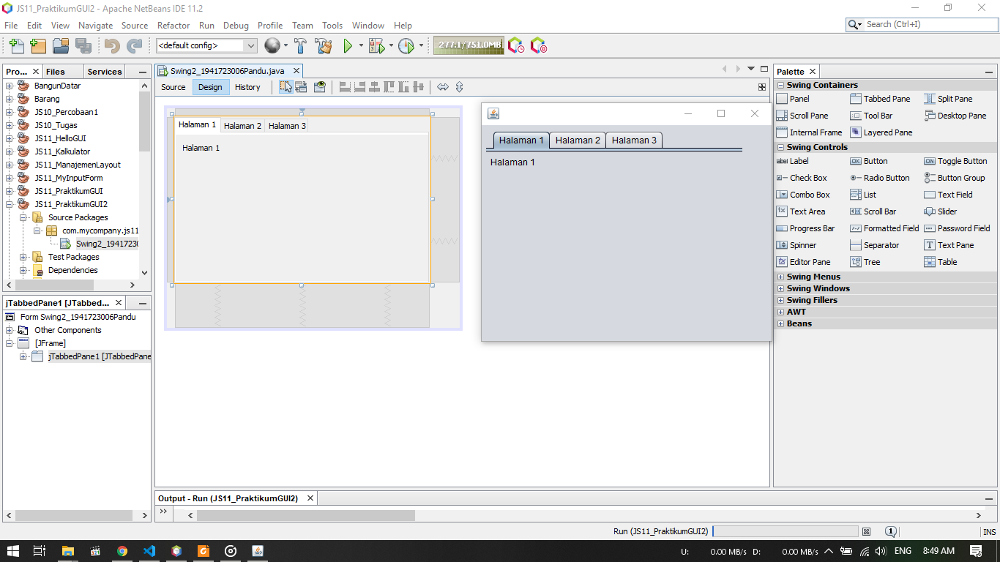

# Laporan Praktikum #11 - GUI

## Kompetensi

Setelah menyelesaikan lembar kerja ini mahasiswa diharapkan mampu:

1. Membuat aplikasi Graphical User Interface sederhana dengan bahasa pemrograman java
2. Mengenal komponen GUI seperti frame, label, textfield, combobox, radiobutton, checkbox, textarea, menu, serta table
3. Menambahkan event handling pada aplikasi GUI.

## Ringkasan Materi

Dalam pemrograman GUI terdapat beberapa bagian yang harus dilakukan yaitu:
1. Membuat windows utama
2. Menentukan komponen-komponen pendukung program
3. Menentukan tata letak layout agar nantinya semua komponen – komponen yang sudah dipersiapkan bisa diaatur sedemikian rupa
4. Event Handling dari sebuah aktivitas, seperti penekanan button, check box dan lain-lain

Java Swing merupakan bagian dari JFC (Java Foundation Classes) yang menyediakan API untuk menangani hal yang berkaitan dengan GUI bagi program Java. Kita bisa membedakan komponen Swing dengan komponen AWT, di mana pada umumnya kelas-kelas yang berada dalam komponen Swing diawali dengan huruf J, misal: JButton, JLabel, JTextField, JRadioButton.

## Percobaan

### Percobaan 1


1. Gambar diatas merupakan hasil dari percobaan 1
2. Dimana pada percobaan ini akan dibuat sebuah Frame GUI dengan ukuran 600 X 300
3. Terdapat button X jika ditekan, maka frame akan tertutup/close

Berikut untuk link ke file Hello GUI : [klik untuk menuju file ](../../src/11_GUI/Percobaan_1/HelloGUI1941723006Pandu.java)

### Percobaan 2


1. Pada percobaan ini, dilakukan percobaan input pada GUI
2. dibuat 2 buah textfield dan 1 button
3. Jika button diklik maka akan mengkalikan isi dari kedua textfield tersebut dan menampilkannya dibagian hasil
4. Output program dapat dilihat pada screenshot diatas

Berikut untuk link ke file My Input Form : [klik untuk menuju file ](../../src/11_GUI/Percobaan_2/MyInputFrom1941723006Pandu.java)

### Pertanyaan Percobaan 2

1. Modifikasi kode program dengan menambahkan JButton baru untuk melakukan fungsi perhitungan penambahan, sehingga ketika button di klik (event click) maka akan menampilkan hasil penambahan dari nilai A dan B

    Jawab :

    
    
        

### Percobaan 3


1. Pada percobaan ini akan menerapkan penggunaan manajemen layout pada GUI
2. Dibuat 3 buah Frame, yaitu : grid, box, dan border
3. Tiap - tiap Frame memiliki tampilan yang berbeda sesuai karakteristik/layout
4. Hasil bisa dilihat pada screenshot diatas

Berikut untuk link ke file Border : [klik untuk menuju file ](../../src/11_GUI/Percobaan_3/Border1941723006Pandu.java)<br>
Berikut untuk link ke file Box : [klik untuk menuju file ](../../src/11_GUI/Percobaan_3/Box1941723006Pandu.java)<br>
Berikut untuk link ke file Grid : [klik untuk menuju file ](../../src/11_GUI/Percobaan_3/Grid1941723006Pandu.java)<br>
Berikut untuk link ke file Layout GUI : [klik untuk menuju file ](../../src/11_GUI/Percobaan_3/LayoutGUI1941723006Pandu.java)

### Pertanyaan Percobaan 3

1. Apa perbedaan dari Grid Layout, Box Layout dan Border Layout?

    Jawab :

    Perbedaanya terdapat pada hasil layout masing - masing jenis. Border layout membuat box menyesuaikan border, grid layout membuat tiap - tiap box sama persis dan memenuhi frame, box layout membuat box biasa tanpa terpengaruh panjang frame
2. Apa fungsi dari masing - masing kode berikut :
    ```java
        JFrame frame = new Border1941723006Pandu();
        frame.setDefaultCloseOperation(JFrame.EXIT_ON_CLOSE);
        frame.setVisible(true);
        
        JFrame frame2 = new Box1941723006Pandu();
        frame2.setDefaultCloseOperation(JFrame.EXIT_ON_CLOSE);
        frame2.setVisible(true);
        
        JFrame frame3 = new Grid1941723006Pandu();
        frame3.setDefaultCloseOperation(JFrame.EXIT_ON_CLOSE);
        frame3.setVisible(true);
    ```
    Jawab :

    Fungsinya ialah mendeklarasikan/membuat objek frame sesuai class - class yang dibuat tadi

### Percobaan 4


1. Pada percobaan ini akan membuat GUI melalui IDE Netbeans


2. Terdapat menu pada bagian kanan. Kita tinggal drag and drop untuk membuat GUI
3. Untuk mengganti teks yang ditampilkan tinggal klik pada bagian yang akan diganti kemudian tekan F2
4. Untuk mengganti nama variable tiap - tiap objek tinggal klik kanan kemudian change variable name
5. Hasil dapat dilihat pada screenshot pertama diatas

Berikut untuk link ke file Java Swing : [klik untuk menuju file ](../../src/11_GUI/Percobaan_4/Swing1941723006Pandu.java)<br>
Berikut untuk link ke file Form Swing : [klik untuk menuju file ](../../src/11_GUI/Percobaan_4/Swing1941723006Pandu.form)

### Pertanyaan Percobaan 4

1. Apa fungsi dari potongan program berikut :
```java
java.awt.EventQueue.invokeLater(new Runnable() {
            public void run() {
                new Swing1941723006Pandu().setVisible(true);
            }
        });
```

    Jawab :

    Fungsi kode program diatas ialah menampilkan sebuah form baru, pada kasus percobaan ini akan muncul sebuah message box ketika button tampil diklik
2. Mengapa pada bagian logika checkbox dan radio button digunakan multiple if ?

    Jawab :

    Karena dapat memungkinkan memilih lebih dari satu mata kuliah
3. Lakukan modifikasi pada program untuk melakukan menambahkan inputan berupa alamat dan berikan fungsi pemeriksaan pada nilai Alamat tersebut jika belum diisi dengan menampilkan pesan peringatan

    Jawab :

    
    
    


### Percobaa 5




1. Pada percobaan ini kita akan menggunakan TabPane, Tree pada GUI
2. Seperti percobaan sebelumnya kita tinggal drag and drop pada menu bagian kanan
3. Hasil dapat dilihat pada screenchot diatas

Berikut untuk link ke file Java Swing : [klik untuk menuju file ](../../src/11_GUI/Percobaan_5/Swing2_1941723006Pandu.java)<br>
Berikut untuk link ke file Form Swing : [klik untuk menuju file ](../../src/11_GUI/Percobaan_5/Swing2_1941723006Pandu.form)

### Pertanyaan Percobaan 5

1. Apa kegunaan komponen swing JTabPane, JTtree, pada percobaan 5?

    Jawab :

    Kegunaan komponen TabPane pada swing untuk membuat tab pada Frame/GUI. Kegunaan komponen swing Tree pada GUI untuk membuat sebuah menu hierarki atau forder yang memiliki subfolder
2. Modifikasi program untuk menambahkan komponen JTable pada tab Halaman 1 dan tab Halaman 2

    Jawab :


## Tugas


1. Pada kasus kali ini akan dibuat sebuah GUI berupa kalkulator
2. Seperti kalkulator pada umumnya terdapat bilangan dari 0 sampai 9 berikut juga tanda koma, tombol kali, tombol bagi, tombol tambah, tombol kurang, dan tombol sama dengan
3. Hasil pengoperasian akan ditampilkan di bagian text field

Berikut untuk link ke file Java Kalkulator : [klik untuk menuju file ](../../src/11_GUI/Tugas/Kalkulator1941723006Pandu.java)<br>
Berikut untuk link ke file Form Kalkulator : [klik untuk menuju file ](../../src/11_GUI/Tugas/Kalkulator1941723006Pandu.form)

## Kesimpulan

Dengan GUI, kita dapat membuat tampilan progam java menjadi lebih mudah dipahami dan lebih menarik bagi user

## Pernyataan Diri

Saya menyatakan isi tugas, kode program, dan laporan praktikum ini dibuat oleh saya sendiri. Saya tidak melakukan plagiasi, kecurangan, menyalin/menggandakan milik orang lain.

Jika saya melakukan plagiasi, kecurangan, atau melanggar hak kekayaan intelektual, saya siap untuk mendapat sanksi atau hukuman sesuai peraturan perundang-undangan yang berlaku.

Ttd,

***(Pandu Dwi Laksono)***
