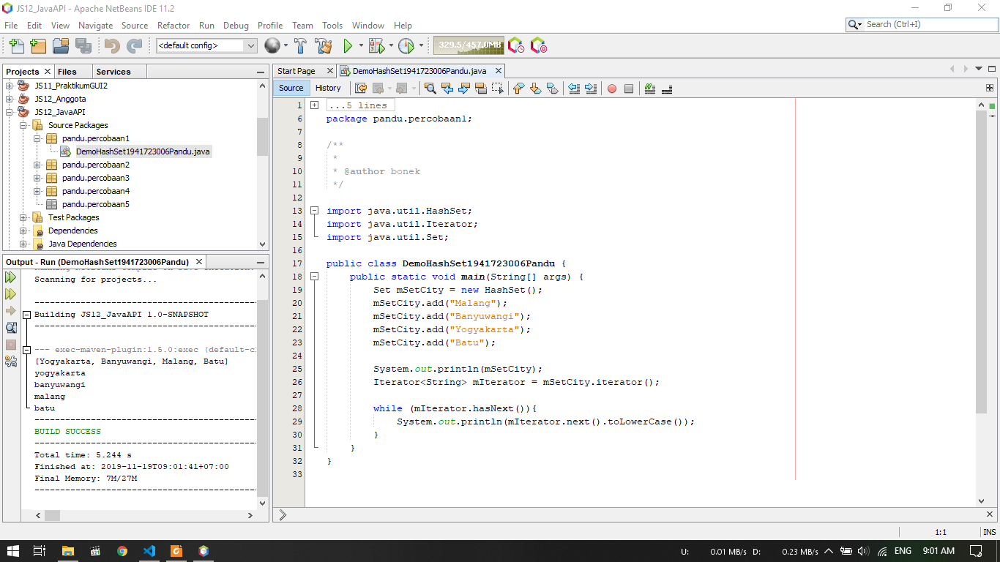
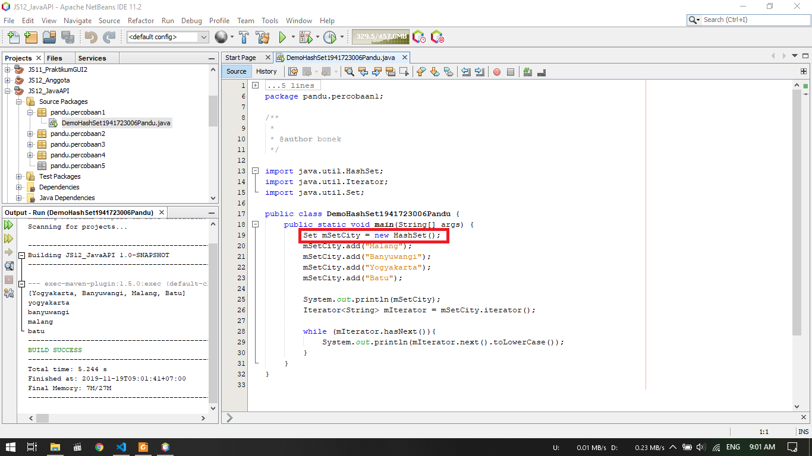
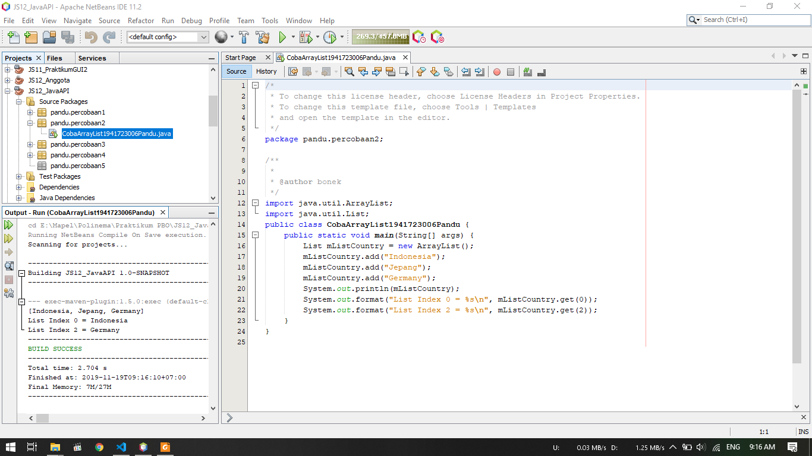
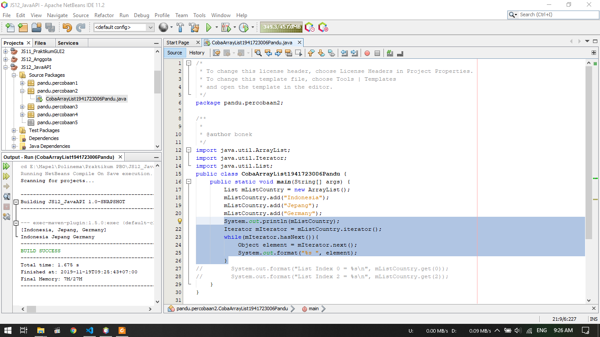
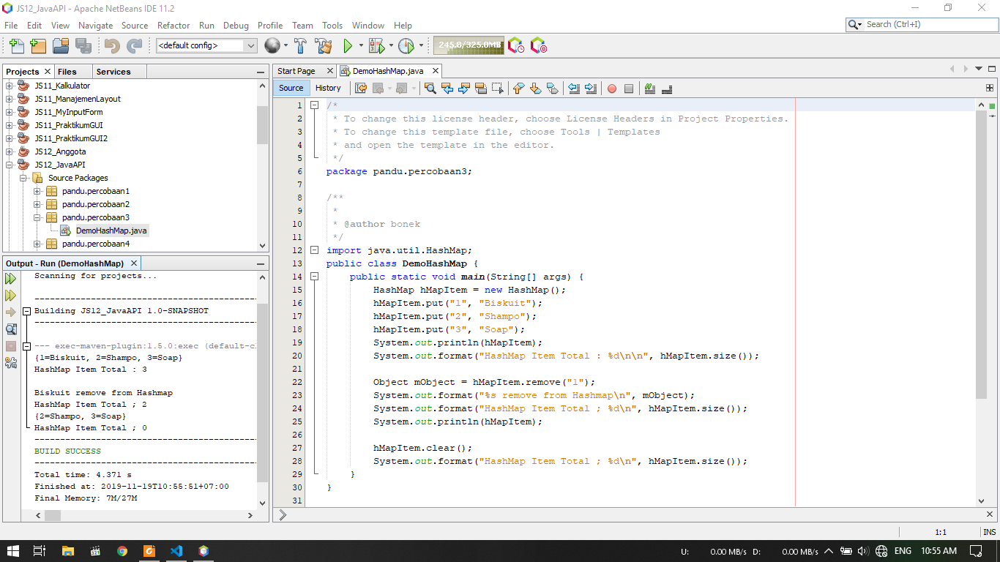
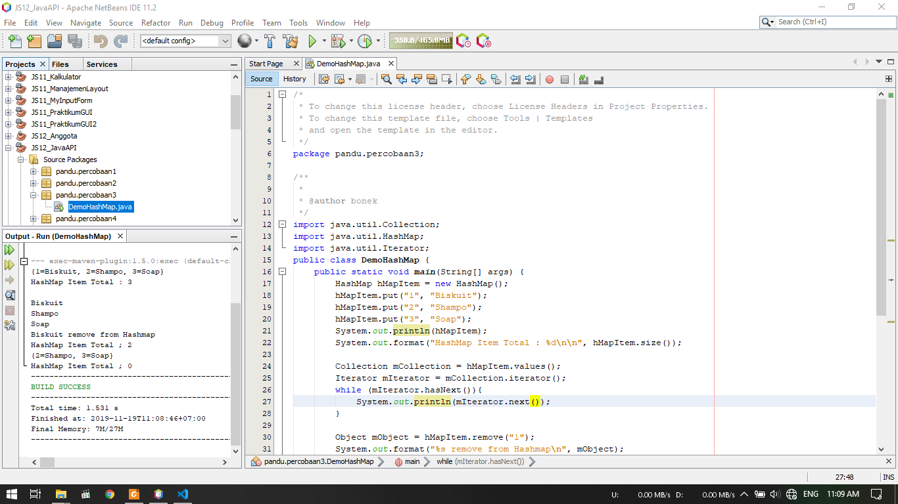
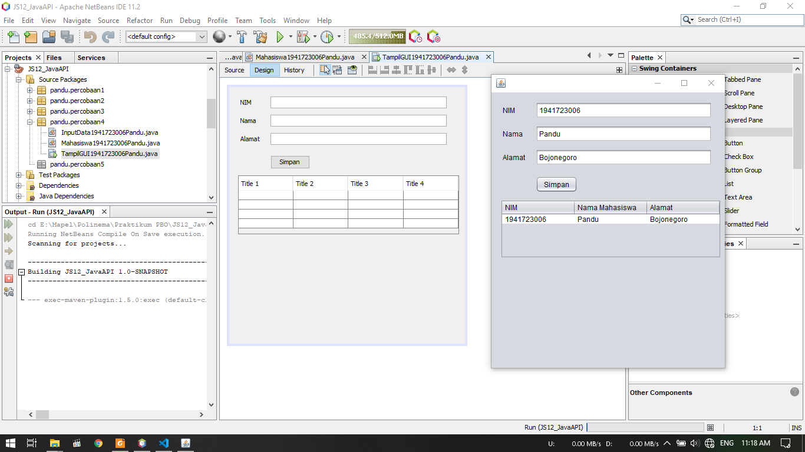
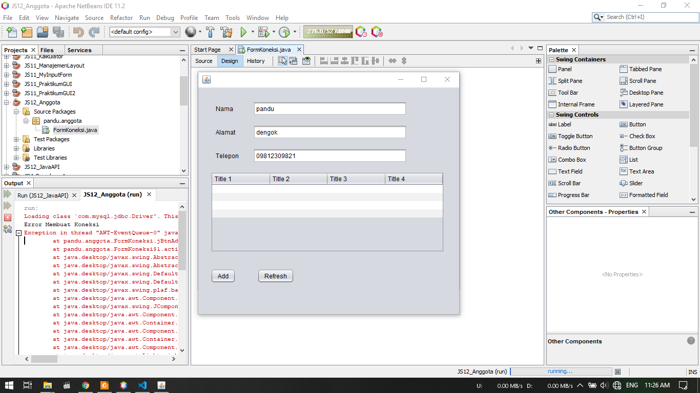

# Laporan Praktikum #12 - Java API

## Kompetensi

Setelah menyelesaikan lembar kerja ini mahasiswa diharapkan mampu:

1. Memahami cara penyimpanan objek menggunakan Collection dan Map.
2. Mengetahui pengelompokan dari Collection.
3. Mengetahui perbedaan dari interface Set, List dan Map.
4. Mengetahui penggunaan class-class dari interface Set, List, dan Map.
5. Memahami koneksi database menggunakan JDBC dan JDBC API

## Ringkasan Materi

1. Collection 

    Collection adalah suatu objek yang bisa digunakan untuk menyimpan sekumpulan objek. Objek yang ada dalam Collection disebut elemen. Collection menyimpan elemen yang bertipe Object.Class-class Collection diletakkan dalam package java.util dan mempunyai dua interface utama yaitu Collection. Collection terbagi menjadi 3 kelompok yaitu :

    - Set

        Set mengikuti model himpunan, dimana objek/anggota yang tersimpan dalam Set harus unik. Urutan maupun letak dari anggota tidak penting, hanya keberadaan anggota saja yang penting. Kelas konkrit yang mengimplementasikan Set harus memastikan bahwa tidak terdapat elemen duplikat yang dapat ditambahkan ke dalam set

    - List

        List digunakan untuk menyimpan sekumpulan objek berdasarkan urutan masuk (ordered) dan menerima duplikat. Cara penyimpanannya seperti array. Class-class yang mengimplementasikan interface List adalah Vector, Stack, Linked List dan Array List. ArrayList digunakan untuk membuat array yang ukurannya dinamis.
    
    - Map

        Untuk menyimpan objek pada Map, perlu sepasang objek, yaitu key yang bersifat unik dan nilai yang disimpan. Untuk mengakses nilai tersebut maka kita perlu mengetahui key dari nilai tersebut. Map juga dikenal sebagai dictionary/kamus. 

    - JDBC API

        JDBC API merupakan Java Database Connectivity Application Programming Interface ( JDBC API). Pada dasarnya JDBC API terdiri dari satu set kelas dan interface yang digunakan untuk berinteraksi dengan database dari aplikasi Java. Umumnya, JDBC API melakukan 3 (tiga) fungsi berikut :
        - Membangun koneksi antara aplikasi Java dan database
        - Membangun dan mengeksekusi query
        - Memproses hasil

## Percobaan

### Percobaan 1



1. Pada percobaan ini, dilakukan percobaan HashSet
2. Dibuat sebuah objek Hashset baru bernama  SetCity
3. Pada SetCity diisi data array berupa Malang, Banyuwangi, Jogja, dan Batu.
4. Kemudian dilakukan iterasi untuk emmanggil data array tersebut berdasarkan SetCity
5. Hasil output dapat dilihat pada screenshot diatas

### Pertanyaan Percobaan 1

1. Apakah fungsi import java.util.*; pada program diatas!

    Mengimport seluruh library util 
2. Pada baris program keberapakah yang berfungsi untuk menciptakan object HashSet?

    
3. Apakah fungsi potongan program dibawah ini pada percobaan 1!
    ```java
        mSetCity.add("Malang");
        mSetCity.add("Banyuwangi");
        mSetCity.add("Yogyakarta");
        mSetCity.add("Batu");
    ```

    Untuk menambahkan data array pada objek mSetCity
4. Tambahkan ```set.add(“Malang”); ```kemudian jalankan program! Amati hasilnya dan jelaskan mengapa terjadi error!

    Terjadi error karena objek set tidak dibuat sehingga tidak dapat menambahkan data array 
5. Jelaskan fungsi potongan program dibawah ini pada percobaan 1!
    ```java
        Iterator<String> mIterator = mSetCity.iterator();
        
        while (mIterator.hasNext()){
            System.out.println(mIterator.next().toLowerCase());
    ```

    Fungsi dari potongan program diatas ialah untuk l=melakukan perulangan saat menampilkan data array, kemudian saat data ditampilkan semua karakter akan disetting menjadi lowercase

Berikut untuk link ke file Demo HashSet : [klik untuk menuju file ](../../src/12_Java_API/Percobaan_1/DemoHashSet1941723006Pandu.java)


### Percobaan 2



1. Pada percobaan ini, dilakukan percobaan ArrayList
2. Dibuat sebuah object arraylist baru bernama mListCountry
3. Pada objek tersebut diisi array berupa teks Indonesia, Jepang, Germany
4. kemudian akan ditampilkan data array ke 0 dan ke 2 saja
5. Output program dapat dilihat pada screenshot diatas

### Pertanyaan Percobaan 2

1. Apakah fungsi potongan program dibawah ini!
```java
    System.out.println(mListCountry);
    System.out.format("List Index 0 = %s\n", mListCountry.get(0));
    System.out.format("List Index 2 = %s\n", mListCountry.get(2));
```

    Baris pertama berfungsi untuk menampilkan semua data array
    Baris kedua berfungsi untuk menampilkan data ke 1 dengan mengambil data array ke 0
    Baris ketiga berfungsi untuk menampilkan data ke 3 dengan mengambil data array ke 2
2. Ganti potongan program pada soal no 1 menjadi sebagai berikut :
```java
    System.out.println(mListCountry);
        Iterator mIterator = mListCountry.iterator();
        while(mIterator.hasNext()){
            Object element = mIterator.next();
            System.out.format("%s ", element);
        }
```


   

3. Jelaskan perbedaan menampilkan data pada ArrayList menggunakan potongan program pada soal no 1 dan no 2!

    Pada soal 1 dipanggil data array secara spesifik, sedangkan pada soal no 2 dilakukan perulangan pemanggilan data pada objek arraylist

Berikut untuk link ke Coba ArrayList : [klik untuk menuju file ](../../src/12_Java_API/Percobaan_2/CobaArrayList1941723006Pandu.java)

### Percobaan 3



1. Pada percobaan ini akan menerapkan penggunaan Map
2. Dibuat objek HashMap baru bernama hMapItem
3. Dalam objek tersebut diisi item yaitu : key 1 untuk Biskuit, key 2 untuk Shampoo, dan key 3 untuk Soap
4. Hasil dapat dilihat pada screenshot diatas

### Pertanyaan Percobaan 3

1. Jelaskan fungsi ```hMapItem.put("1","Biskuit")``` pada program!

    Pada HashMap membutuhkan key dan value untuk mengisi nilai item, sehingga pada key 1 terdapat value berupa "Biskuit"
2. Jelaskan fungsi ```hMapItem.size()``` pada program!

    fungsi tersebut untuk menampilkan jumlah item yang terdapat pada objek hMapItem
3. Jelaskan fungsi ```hMapItem.remove("1")``` pada program!

    Fungsi tersebut berguna untuk menghapus item dengan key 1 yang ada pada objek
4. Jelaskan fungsi ```hMapItem.clear()``` pada program!

    Fungsi tersebut berguna untuk menghapus ssemua item yang berada pada objek sehingga setelah digunakan fungsi ```hMapItem.size()``` maka hasilnya akan kosong

5. Tambahkan kode program yang di blok pada program yang sudah anda buat!
    ```java
        Collection mCollection = hMapItem.values();
        Iterator mIterator = mCollection.iterator();
        while (mIterator.hasNext()){
            System.out.println(mIterator.next());
        }
    ```
    Jalankan proram tersebut !

    

7. Apakah perbedaan program sebelumnya dan setelah ditambahkan kode program pada soal no 5 diatas? Jelaskan!

    Perbedaannya terdapat pada denampahan hasil output berupa item yang terdapat pada objek dipanggil satu per satu untuk ditampilkan

Berikut untuk link ke Demo HashMap : [klik untuk menuju file ](../../src/12_Java_API/Percobaan_3/DemoHashMap1941723006Pandu.java)

### Percobaan 4



1. Pada percobaan ini akan menerapkan penggunaan Implementasi ArrayList dalam GUI
2. Terdapat atribut yang dideklarasikan dalam tipe private pada class Mahasiswa yaitu : NIM, Nama, Alamat
3. Kemudian dibuat juga kontruktor dan method getter pada class Mahasiswa tersebut
4. Kemudian pada class InputData dibuat arraylist beruma ListMahasiswa
5. Dibuat juga JFrame untuk memasukan nilai yang akan diinputkan 
    
6. Hasil dapat dilihat pada screenshot pertama


Berikut untuk link ke Mahasiwa : [klik untuk menuju file ](../../src/12_Java_API/Percobaan_4/Mahasiswa1941723006Pandu.java)<br>
Berikut untuk link ke Input Data : [klik untuk menuju file ](../../src/12_Java_API/Percobaan_4/InputData1941723006Pandu.java)<br>
Berikut untuk link ke Form Tampil GUI : [klik untuk menuju file ](../../src/12_Java_API/Percobaan_4/TampilGUI1941723006PandumoHashMap1941723006Pandu.form)<br>
Berikut untuk link ke Tampil GUI : [klik untuk menuju file ](../../src/12_Java_API/Percobaan_4/TampilGUI1941723006PandumoHashMap1941723006Pandu.java)

### Percobaan 5



1. Pada percobaan ini akan membuat aplikas biodata
2. Terdapat input teks yaitu Nama, Alamat, dan Telepon
3. Terdapat Tabel yang berfungsi menampilkan data yang telah diisi pada textfield tadi setelah disimpan
4. Terdapat 2 buah button, yaitu : add untuk menambah data yang diisi pada textfield ke database dan button refresh untuk merefresh tabel agar data terupdate

### Pertanyaan Percobaan 5
1. Setelah menambah code pada action button klik, coba jalankan program dan tambahkan data. Apakah program berhasil menambahkan data? Jika tidak apakah penyebabnya.

    Data tidak dapat ditambah karena pada program yang sebelumnya hanya mengecek koneksi pada database
2. Jelaskan maksud source code untuk melakukan insert data diatas?
    

    Pertama kita akan mengkoneksikan ke MySQL terlebih dahulu, kemudian dibuat perintah SQL untuk insert data berdasarkan isi dar textfield yang tadi. Kemudian akan dicek koneksi untuk mengupdate data, jika berhasil akan muncul notifikasi "Data Berhasil ditambah"
    
Berikut untuk link ke Form FormKoneksi : [klik untuk menuju file ](../../src/12_Java_API/Percobaan_5/FormKoneksi1941723006Pandu.form)<br>
Berikut untuk link ke FormKoneksi : [klik untuk menuju file ](../../src/12_Java_API/Percobaan_5/FormKoneksi1941723006Pandu.java)

## Kesimpulan

Kesimpulan yang saya dapat selama praktikum ini adalah kita dapat membuat objek menggunakan Collection. Dalam colection terdapat beberapa cara dalam pembuatan objek dimana masing - masing cara tersebut memiliki karakteristik tersendiri.

## Pernyataan Diri

Saya menyatakan isi tugas, kode program, dan laporan praktikum ini dibuat oleh saya sendiri. Saya tidak melakukan plagiasi, kecurangan, menyalin/menggandakan milik orang lain.

Jika saya melakukan plagiasi, kecurangan, atau melanggar hak kekayaan intelektual, saya siap untuk mendapat sanksi atau hukuman sesuai peraturan perundang-undangan yang berlaku.

Ttd,

***(Pandu Dwi Laksono)***
