# Laporan Praktikum #14 - GUI dan Database

## Kompetensi

Setelah menyelesaikan lembar kerja ini mahasiswa diharapkan mampu:

1. Menggunakan paradigma berorientasi objek untuk interaksi dengan database
2. Membuat backend dan frontend
3. Membuat form sebagai frontend

## Ringkasan Materi

Pada praktikum ini akan mempelajari membuat aplikasi berbasis database dan dilengkapi dengan form sebagai Graphical User Interface (GUI).
Secara umum, tahapan yang akan kita lakukan adalah sebagai berikut:
1. Membuat database dan tabel-tabelnya.
2. Membuat backend yang berisi class-class yang mewakili data yang ada pada database, dan class helper untuk melakukan eksekusi query database.
3. Membuat frontend yang merupakan antarmuka kepada pengguna. Frontend ini bisa berbasis teks (console), GUI, web, mobile, dan sebagainya.

Library yang digunakan untuk project ini antara lain:
1. JDBC, untuk melakukan interaksi ke database.
2. ArrayList, untuk menampung data hasil query ke database.
3. Swing, untuk membuat tampilan GUI

## Percobaan

### Percobaan 1

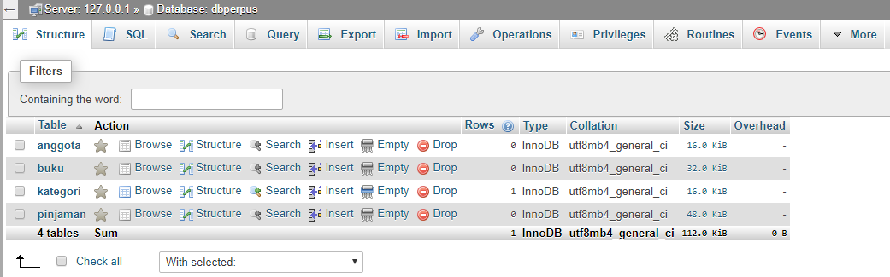

1. Pada percobaan ini, diminta unutk memebuat sebuah database bernama dbperpus
2. Pada database tersebut, terdapat 4 buah tabel yaitu : anggota, buku, kategori, dan pinjaman
3. Berikut ialah diagram relasi antara keempat tabel tersebut

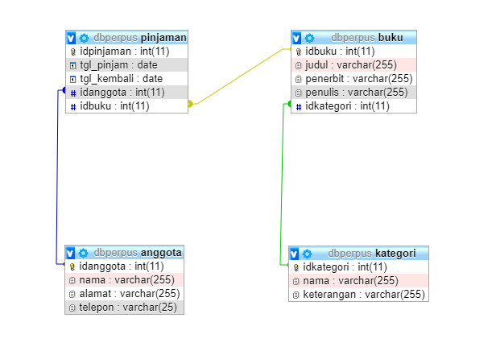

Berikut untuk link ke file dbperpus : [klik untuk menuju file ](../../src/14_GUI_dan_Database/Percobaan_1/dbperpus.sql)


### Percobaan 2

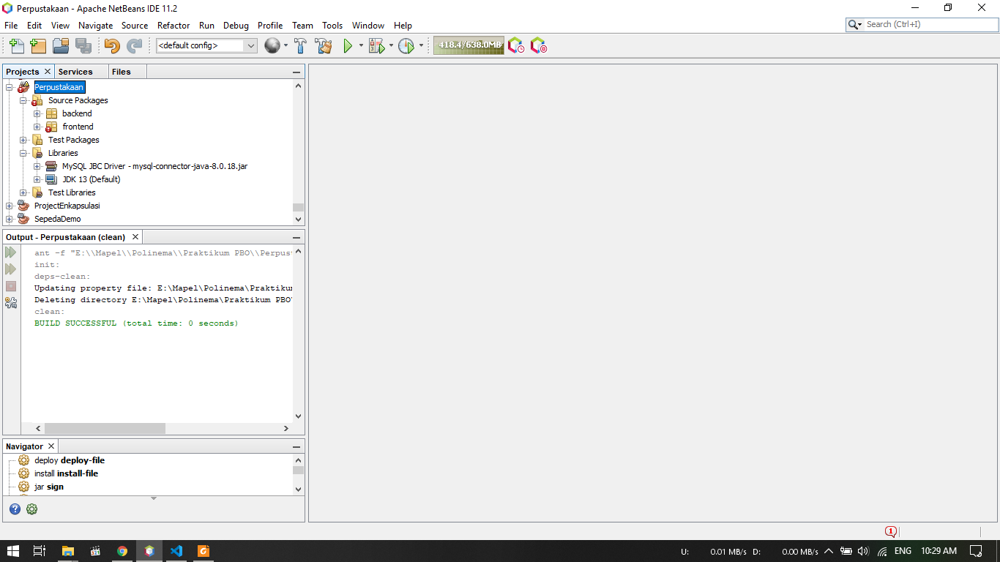

1. Pada percobaan ini, dibuat sebuah project baru bernama Perpustakaan
2. Didalam project tersebut terdapat 2 buah packages yaitu : frontend dan backend
3. Kemudian ditambahkan juga library MySQL JDBC Driver pada bagian libraries


### Percobaan 3

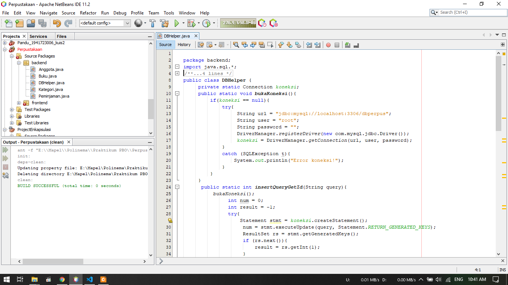

1. Pada percobaan ini akan dibuat class DBHelper yang akan diletakan pada package backend
2. Pada class ini berisi metod - method yang memiliki fungsi sendiri, yaitu :
    - ```bukaKoneksi()```, untuk membuka koneksi ke database
    - ```insertQueryGetId(String query)```, untuk melakukan insert ke tabel dan mengembalikan nilai ID yang digenerate oleh database (hasil Auto Increment).
    - ```executeQuery(String query)```, untuk mengeksekusi query yang tidak mengembalikan nilai (misal: insert, update, delete).
    - ```selectQuery(String query)```, untuk mengeksekusi select query yang mengembalikan nilai hasil query

Berikut untuk link ke DBHelper : [klik untuk menuju file ](../../src/14_GUI_dan_Database/Percobaan_3/DBHelper1941723006Pandu.java)

### Percobaan 4

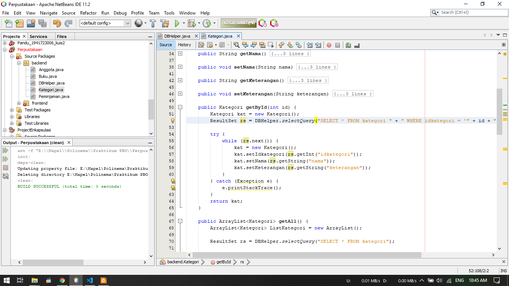

1. Pada percobaan ini akan akan dibuat sebuah class Kategori
2. Class Kategori terletak pada package backend
3. Pada class ini berisi method - method yang berfungsi untuk pengoperasian CRUD

Berikut untuk link ke Kategori : [klik untuk menuju file ](../../src/14_GUI_dan_Database/Percobaan_4/Kategori1941723006Pandu.java)

### Percobaan 5

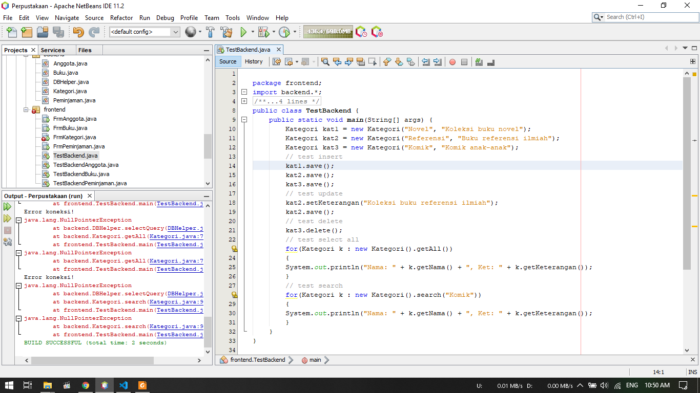

1. Pada percobaan ini akan dilakukan tes class - class yang dibuat pada percobaan 3 dan 4
2. dibuat class TestBackend yang terletak pada package frontend
3. pada class Testbackend dilakukan ```import backend.*``` untuk memanggil semua class yang terletak pada package backend 
    
Berikut untuk link ke TestBackend : [klik untuk menuju file ](../../src/14_GUI_dan_Database/Percobaan_5/TestBackEnd1941723006Pandu.java)

### Percobaan 6

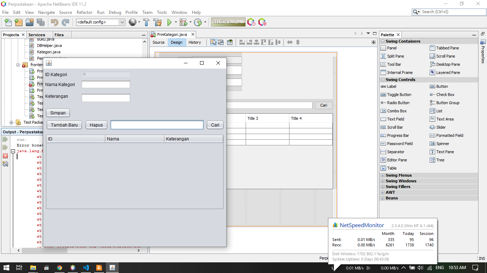

1. Pada percobaan ini dibuat sebuah form untuk Kategori
2. Form tersebut terletak pada package frontend karena berinteraksi langsung dengan user
3. Pada form tersebut terdapat beberapa button diantaranya :
    - Simpan = untuk menyimpan data yang telah diinputkan kedalam textfield
    - Tambah Baru = untuk menambah lagi data yang baru setelah data yang sebelumnya diinputkan disimpan
    - Hapus = untuk emnghapus data yang telah tersimpan dalam tabel
    - Cari = untuk mencari data yang telah tersimpan dalam tabel

Berikut untuk link ke FrmKategori : [klik untuk menuju file ](../../src/14_GUI_dan_Database/Percobaan_6/FrmKategori1941723006Pandu.java)<br>
Berikut untuk link ke FrmKategori : [klik untuk menuju file ](../../src/14_GUI_dan_Database/Percobaan_6/FrmKategori1941723006Pandu.form)

### Percobaan 7

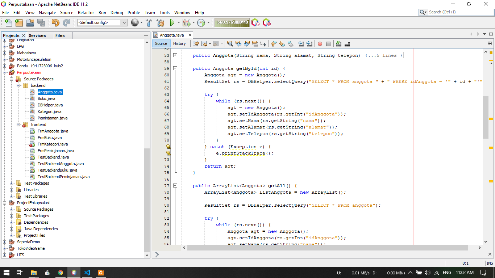
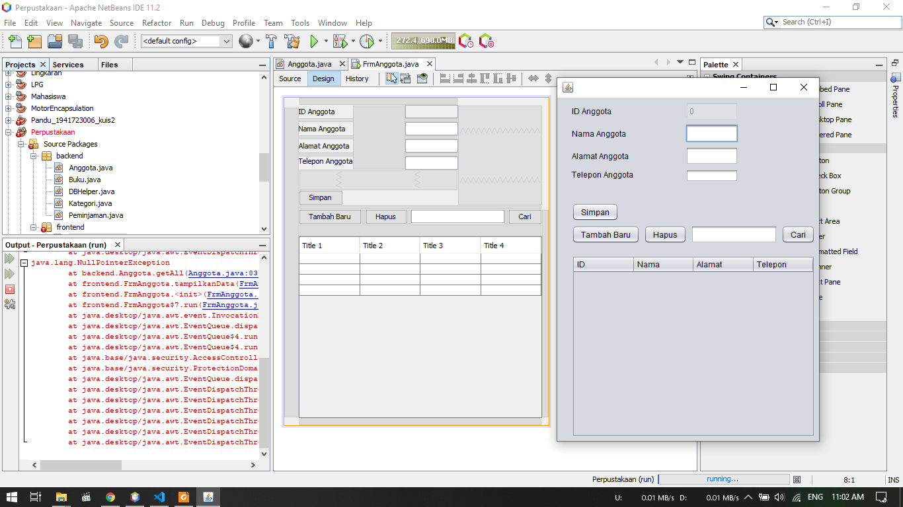

1. Pada percobaan ini langkahnya mirip dengan perintah pada class Kategori
2. Dibuat class Anggota pada package backend untuk operasi CRUD
3. Dibuat form FrmAnggota untuk input data pada package frontend

Berikut untuk link ke Anggota : [klik untuk menuju file ](../../src/14_GUI_dan_Database/Percobaan_7/Anggota1941723006Pandu.java)<br>
Berikut untuk link ke FrmAnggota : [klik untuk menuju file ](../../src/14_GUI_dan_Database/Percobaan_7/FrmAnggota1941723006Pandu.java)<br>
Berikut untuk link ke FrmAnggota : [klik untuk menuju file ](../../src/14_GUI_dan_Database/Percobaan_7/FrmAnggota1941723006Pandu.form)

### Percobaan 8

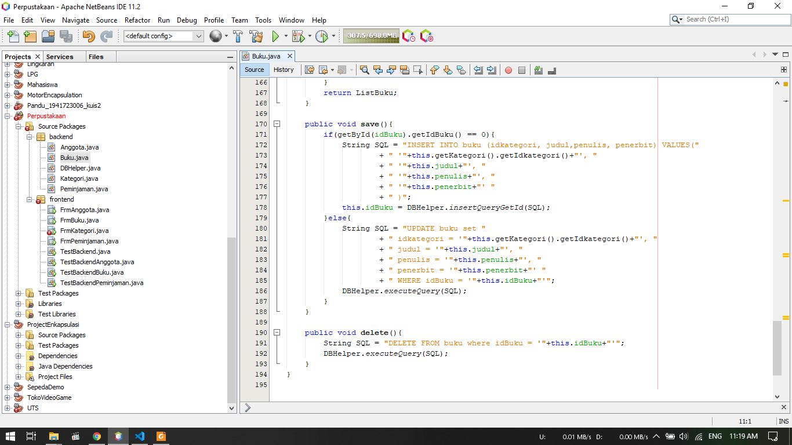
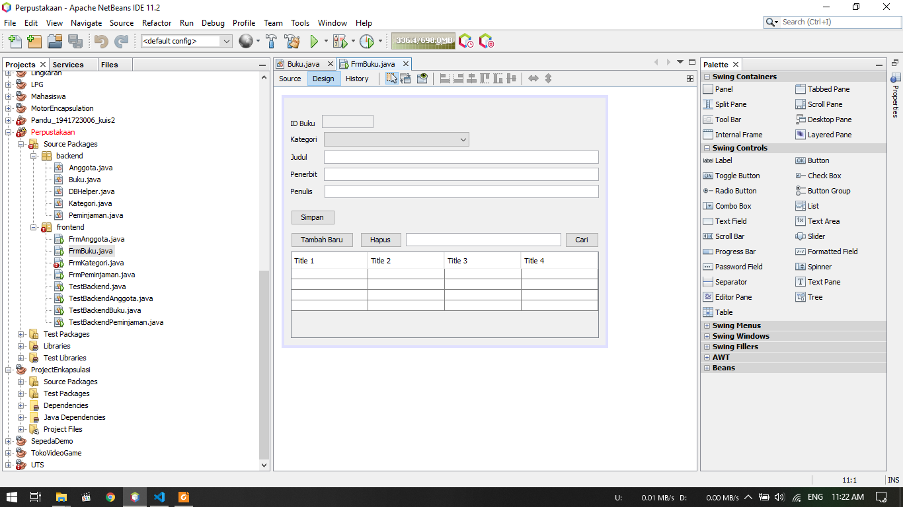

1. Sama seperti percobaan sebelumnya, pada percobaan ini diminta untuk membuat form dan class Buku
2. class Buku terletak pada package backend, berfungsi untuk mengoperasikan CRUD yang ada pada form buku
3. From Buku terletak pada package frontend, digunakan untuk meinputkan data buku

Berikut untuk link ke Buku : [klik untuk menuju file ](../../src/14_GUI_dan_Database/Percobaan_8/Buku1941723006Pandu.java)<br>
Berikut untuk link ke FrmBuku : [klik untuk menuju file ](../../src/14_GUI_dan_Database/Percobaan_8/FrmBuku1941723006Pandu.java)<br>
Berikut untuk link ke FrmBuku : [klik untuk menuju file ](../../src/14_GUI_dan_Database/Percobaan_8/FrmBuku1941723006Pandu.form)

## Tugas

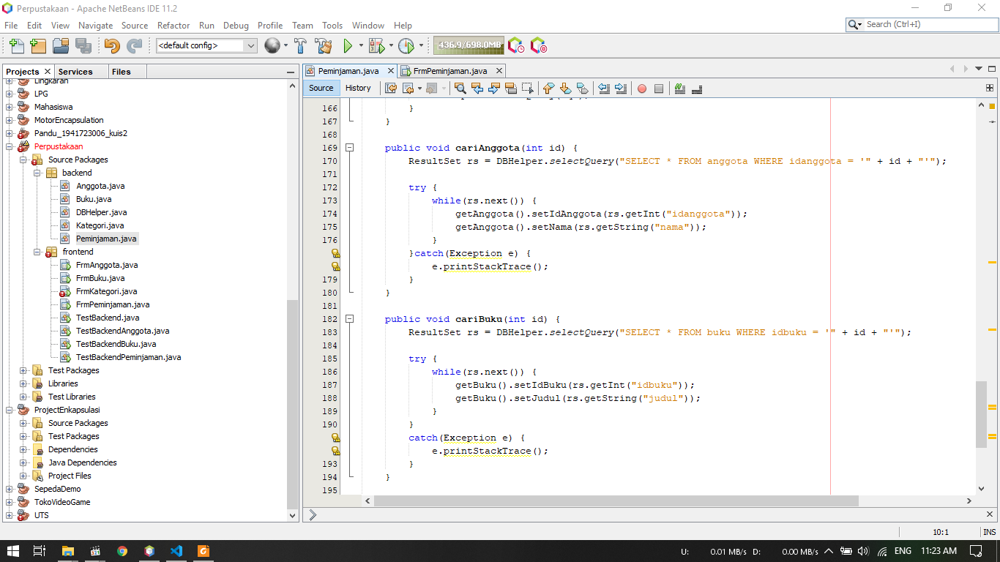
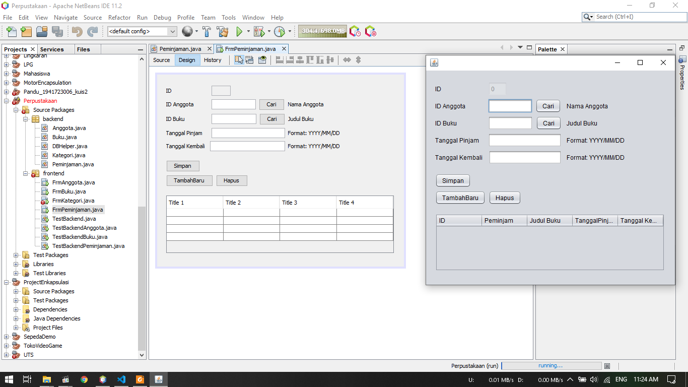

1. Pada tugas ini diminta untuk membuat form Peminjaman 
2. Pada form ini dapat menangani transaksi peminjaman dan pengembalian
3. Dibuat form Peminjaman pada package frontend
4. Pada package backend, dibuat class Peminjaman untuk operasi CRUDnya

Berikut untuk link ke Peminjaman : [klik untuk menuju file ](../../src/14_GUI_dan_Database/Tugas/Peminjaman1941723006Pandu.java)<br>
Berikut untuk link ke FrmPeminjaman : [klik untuk menuju file ](../../src/14_GUI_dan_Database/Tugas/FrmPeminjaman1941723006Pandu.java)<br>
Berikut untuk link ke FrmPeminjaman : [klik untuk menuju file ](../../src/14_GUI_dan_Database/Tugas/FrmPeminjaman1941723006Pandu.form)

## Kesimpulan

Kesimpulan yang saya dapat selama praktikum ini adalah kita dapat membuat program yang terkoneksi dengan database menggunakan MySQL. Program tersebut terdapat GUI berupa form - from yang digunakan untuk menginput data ke database berikut juga mencari data yang terdapat dalam database

## Pernyataan Diri

Saya menyatakan isi tugas, kode program, dan laporan praktikum ini dibuat oleh saya sendiri. Saya tidak melakukan plagiasi, kecurangan, menyalin/menggandakan milik orang lain.

Jika saya melakukan plagiasi, kecurangan, atau melanggar hak kekayaan intelektual, saya siap untuk mendapat sanksi atau hukuman sesuai peraturan perundang-undangan yang berlaku.

Ttd,

***(Pandu Dwi Laksono)***
