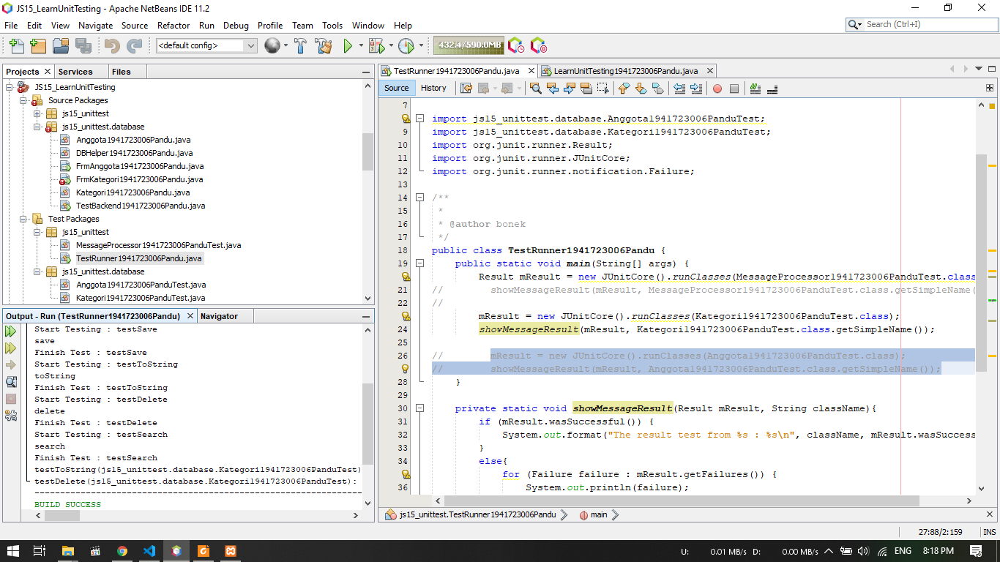

# Laporan Praktikum #15 - Unit Testing

## Kompetensi

Setelah menyelesaikan lembar kerja ini mahasiswa diharapkan mampu:

1. Memahami konsep dan fungsi unit testing
2. Menerapkan unit testing dengan JUnit pada program sederhana.
3. Menerapkan unit testing dengan JUnit pada progam yang terkoneksi database

## Ringkasan Materi

Pada praktikum ini akan mempelajari Unit testing. Unit testing adalah sebuah proses yang digunakan untuk melakukan testing terhadap setiap method-method atau komponen yang ada di dalam suatu class apakah method atau komponen tersebut sudah berjalan sesuai dengan diharapkan. 
Library yang digunakan untuk unit testing bernama JUnit.

## Percobaan

### Percobaan 1

1. Gambar diatas merupakan hasil dari penggunaan unit testing
2. Pada percobaan testing diatas dilakukan pengecekan apakah text yang dikeluarkan sama dengan yang diminta seperti pada gambar dibawah

3. Jika text yang diminta sesuai dengan output maka hasilnya akan seperti gambar dibawah ini 

Berikut untuk link ke file LearnUnitTesting : [klik untuk menuju file ](../../src/15_Unit_Testing/Percobaan_1/LearnUnitTesting1941723006Pandu.java) 
Berikut untuk link ke file MessageProcessor : [klik untuk menuju file ](../../src/15_Unit_Testing/Percobaan_1/MessageProcessor1941723006Pandu.java) 
Berikut untuk link ke file MessageProcessorTest : [klik untuk menuju file ](../../src/15_Unit_Testing/Percobaan_1/MessageProcessor1941723006PanduTest.java) 
Berikut untuk link ke file TestRunner : [klik untuk menuju file ](../../src/15_Unit_Testing/Percobaan_1/TestRunner1941723006Pandu.java)

### Percobaan 2

1. Pada percobaan ini, akan digunakan unittesting dengan testcase
2. Langkah pertama ialah klik kanan pada package kemudian pilih new > other
3. Kemudian muncul form, pilih unti test > Test for Existing Class

4. Kemudian Pilih class yang berada pada source package, dan pastikan checkmark seperti gambar dibawah ini

5. Klik finish jika sudah selesai
6. Hasil dari testing diatas dapat dilihat pada gambar dibawah ini

Berikut untuk link ke file TestRunner : [klik untuk menuju file ](../../src/15_Unit_Testing/Percobaan_2/TestRunner1941723006Pandu.java) 
Berikut untuk link ke file Kategori : [klik untuk menuju file ](../../src/15_Unit_Testing/Percobaan_2/Kategori1941723006Pandu.java) 
Berikut untuk link ke file KategoriTest : [klik untuk menuju file ](../../src/15_Unit_Testing/Percobaan_2/Kategori1941723006PanduTest.java)

## Tugas

1. Pada tugas ini diminta untuk melakukan pengetesan seperti percobaan 2
2. Pada test ini diambil file Anggota dari Jobsheet 14
3. Langkah pembuatan class test sama seperti percobaan 2
4. Hasil dapat dilihat pada gambar dibawah ini

Berikut untuk link ke file Anggota : [klik untuk menuju file ](../../src/15_Unit_Testing/Tugas/Anggota1941723006Pandu.java) 
Berikut untuk link ke file AnggotaTest : [klik untuk menuju file ](../../src/15_Unit_Testing/Tugas/Anggota1941723006PanduTest.java) 
Berikut untuk link ke file TestRunner : [klik untuk menuju file ](../../src/15_Unit_Testing/Tugas/TestRunner1941723006Pandu.java)

## Kesimpulan

Kesimpulan yang saya dapat selama praktikum ini adalah unit testing digunakan untuk mengecek apakah output program dapat muncul sesuai yang diharapkan. jika tidak sama maka akan muncul pesan letak error tersebut

## Pernyataan Diri

Saya menyatakan isi tugas, kode program, dan laporan praktikum ini dibuat oleh saya sendiri. Saya tidak melakukan plagiasi, kecurangan, menyalin/menggandakan milik orang lain.

Jika saya melakukan plagiasi, kecurangan, atau melanggar hak kekayaan intelektual, saya siap untuk mendapat sanksi atau hukuman sesuai peraturan perundang-undangan yang berlaku.

Ttd,

***(Pandu Dwi Laksono)***
