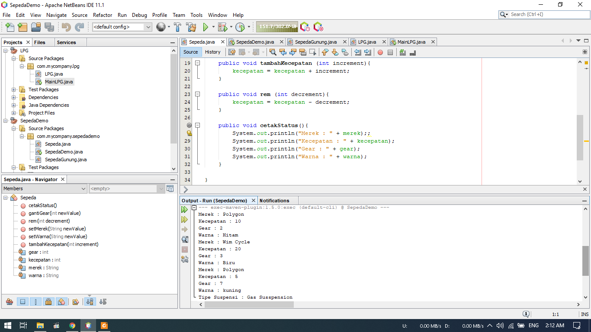
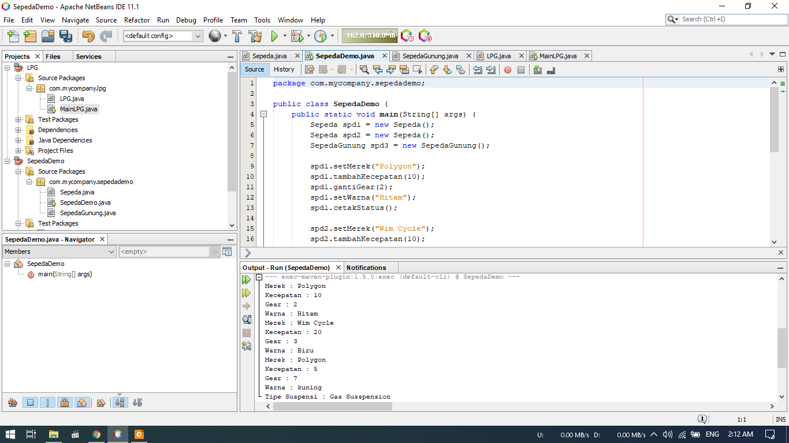
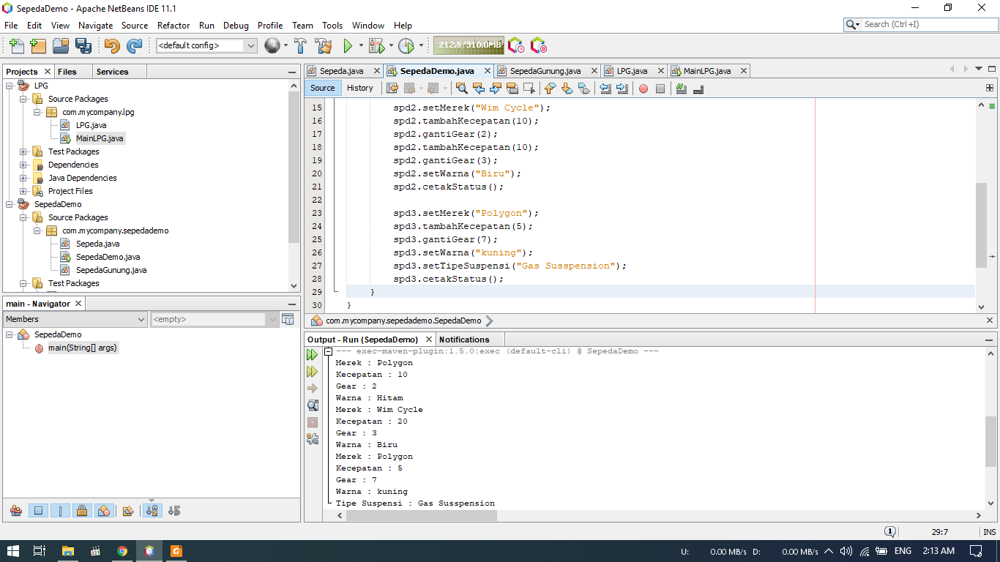
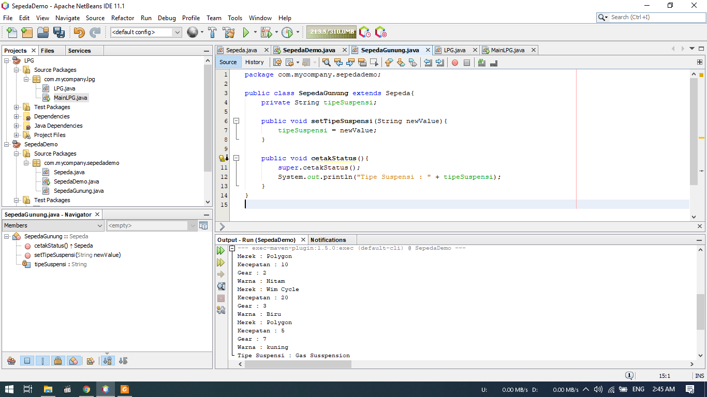
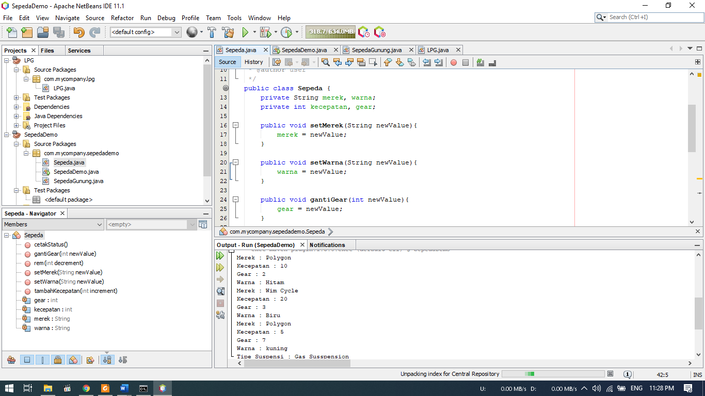
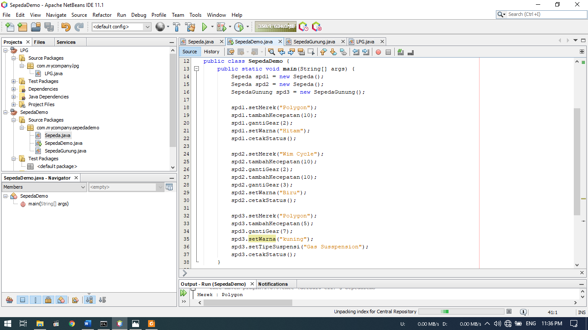

# Laporan Praktikum #1 - Pengantar Konsep PBO

## Kompetensi

Setelah menempuh materi percobaan ini, mahasiswa mampu mengenal:
1. Perbedaan paradigma berorientasi objek dengan paradigma struktural
2. Konsep dasar PBO

## Ringkasan Materi

1. Class merukapan rangka, blueprint, rancangan sedangkan objek merupakan hasil dari rancangan tersebut,
2. Ada 4 pilar dalam OOP diantaranya : capsulation, abstraction, inheritate, dan polimorphime,

## Percobaan

### Percobaan 1

 
 

- Pada percobaan ini kita akan membuat project SepedaDemo.
- Gambar diatas merupakan class Sepeda, dengan atribut merek dan warna dengan tipe data string, kecepatan dan gear dengan tipe data integer.
- Kemudian dibuat beberapa method untuk menjalankan/memproses tipe data tadi.

 
 

- Pada gambar diatas merupakan class SepedaDemo yang berfungsi sebagai main class
- Disini kita membuat objek berupa 2 sepeda yaitu : spd1 dan spd2
- Pada objek tersebut, kita memasukan nilai atribut dari sepeda tersebut
- Hasilnya dapat dilihat pada bagian bawah

Berikut untuk link ke file Sepeda : [klik untuk menuju file Sepeda.java](../../src/1_Pengantar_Konsep_PBO/Sepeda.java) 
Berikut untuk link ke file SepedaDemo : [klik untuk menuju file SepedaDemo.java](../../src/1_Pengantar_Konsep_PBO/SepedaDemo.java)

### Percobaan 2

- Pada percobaan ini kita akan membuat class baru berupa SepedaGunung yang merupakan turunan dari class Sepeda

Berikut untuk link ke file SepedaGunung : [klik untuk menuju file SepedaGunung.java](../../src/1_Pengantar_Konsep_PBO/SepedaGunung.java)

## Pertanyaan

1.	Sebutkan dan jelaskan aspek – aspek yang ada pada pemrograman berorientasi objek! 
    a.	Objek 
            Objek adalah suatu rangkaian dalam program yang terdiri dari state dan behaviour. Object pada software dimodelkan sedemikian         rupa sehingga mirip dengan objek yang ada di dunia nyata. Objek memiliki state dan behaviour. State adalah ciri-ciri atau               atribut dari objek tersebut. Sedangkan behavior adalah perilaku yang dapat dilakukan oleh objek tersebut.

    b.	Class 
            Class adalah blueprint atau prototype dari sebuah objek. Class digunakan hanya untuk membuat kerangka dasar. Yang akan kita         pakai nantinya adalah hasil cetakan dari class, yakni “object”.

    c.	Enkapsulasi 
            Enkapsulasi Kemampuan sebuah objek untuk menempatkan suatu batasan atas propertinya (data atau method). Enkapsulasi mengunci         data dan method secara aman dalam “kapsul” dari sebuah class yang hanya bisa diakses oleh user yang dipercaya (yakni, method             dari class tersebut). Enkapsulasi dapat dianalogikan seperti mengendarai mobil, sopir tidak perlu tahu detail dari suspensi dll.         Mengapa? Karena kita tidak harus tahu implementasi detail suatu komponen jika ingin menggunakannya. Keuntungan enkapsulasi               adalah modularitas, kualitas kode, dan kemudahan maintenance.

    d.	Inheritance 
            Inheritance atau Pewarisan/Penurunan adalah konsep pemrograman dimana sebuah class dapat “menurunkan” property dan method           yang dimilikinya kepada class lain. Konsep inheritance digunakan untuk memanfaatkan fitur “code reuse” untuk menghindari                 duplikasi kode program. Inheritance memungkinkan kita untuk mengorganisir struktur program dengan natural. Inheritance juga             memungkinkan kita untuk memperluas fungsionalitas program tanpa harus mengubah banyak bagian program.

    e.	Polimorfisme 
            Polimorfisme juga meniru sifat objek di dunia nyata, dimana sebuah objek dapat memiliki bentuk, atau menjelma menjadi bentuk         - bentuk lain. Contoh pada objek LPG dapat diwariskan menjadi LPG 3kg, LPG 12kg, bright gas,dll.
 
2.	Apa yang dimaksud dengan objek dan apa bedanya dengan class? 
    Object adalah suatu rangkaian dalam program yang terdiri dari state dan behaviour. Sedangkan class ialah kerangka dari objek             tersebut. Contoh terdapat objek laptop, class ialah kerangka dari laptop tersebut, terdapat  komponen berupa processor, RAM,             storage, dsb.

3.	Sebutkan salah satu kelebihan utama dari pemrograman berorientasi objek dibandingkan dengan pemrograman struktural! 
    -	Dibandingkan dengan SSAD, waktu pengembangan, level organisasi, ketangguhan,dan penggunaan kembali (reuse) kode program lebih           tinggi dibandingkan dengan metode OOAD (Sommerville, 2000).

4.	Pada class Sepeda, terdapat state/atribut apa saja?
    Atribut pada class Sepeda :
    -	Atribut string : merek
    -	Atribut integer : kecepatan, gear

5.	Tambahkan atribut warna pada class Sepeda! 
     
     
     
    
6.	Mengapa pada saat kita membuat class SepedaGunung, kita tidak perlu membuat class nya dari nol? 
        Karena class SepedaGunung merupakan turunan dari class Sepeda, jadi kita tidak perlu membuat dari nol. Sehingga class               SepedaGunung dapat mengambil atribut dari super classnya yaitu class Sepeda.
        

## Tugas

(silakan kerjakan tugas di sini beserta `screenshot` hasil kompilasi program. Jika ada rujukan ke file program, bisa dibuat linknya di sini.)

`contoh screenshot yang benar, menampilkan 3 komponen, yaitu struktur project, kode program, dan hasil kompilasi`

Contoh link kode program : [ini contoh link ke kode program](../../src/1_Pengantar_Konsep_PBO/Contoh12345Habibie.java)

## Kesimpulan

(Berisi simpulan yang telah diperoleh selama praktikum atau belajar pada pertemuan ini)

## Pernyataan Diri

Saya menyatakan isi tugas, kode program, dan laporan praktikum ini dibuat oleh saya sendiri. Saya tidak melakukan plagiasi, kecurangan, menyalin/menggandakan milik orang lain.

Jika saya melakukan plagiasi, kecurangan, atau melanggar hak kekayaan intelektual, saya siap untuk mendapat sanksi atau hukuman sesuai peraturan perundang-undangan yang berlaku.

Ttd,

***(Pandu Dwi Laksono)***
