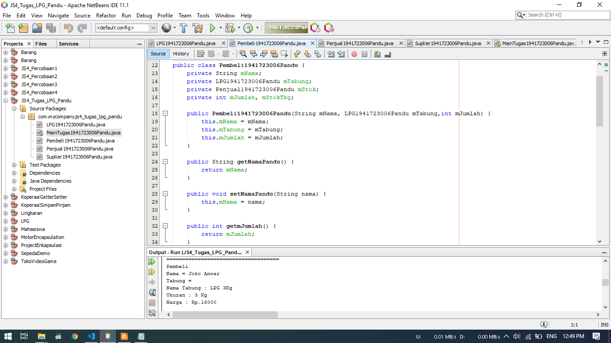

# Laporan Praktikum #4 - Relasi Class

## Kompetensi

Setelah menempuh pokok bahasan ini, mahasiswa mampu:
1. Memahami konsep relasi kelas;
2. Mengimplementasikan relasi has‑a dalam program.

## Ringkasan Materi

1. Penggunaan relasi antar class dalam program java sehingga dapat memanggil objek dari class lain
2. Penggunaan agregitas antar class dapat mengetahui class mana yang merupakan class turunan/indukan
3. Getter dan Setter dapat membuat atribut private dapat dipanggil pada class lain

## Percobaan

### Percobaan 1


- Pada kali ini kita akan melakukan percobaan dari Class Diagram diatas
- Class Processor Merupakan bagian atau agregasi dari Class Laptop
- Dimana pada CLass Laptop, Terdapat atribut processor yang merupakan objek dari Class Processor yang berelasi dengan Class Laptop


- Pada gambar diatas merupakan Class Processor


- Pada gambar diatas merupakan class Laptop


- Berikut merupakan Main dari percobaan 1
- Dimana kita membuat objek kemudian memasukan nilai langsung setelah objek dibuat
- Hasil dapat dilihat pada bagian bawah

Berikut untuk link ke file Laptop : [klik untuk menuju file](../../src/4_Relasi_Class/Percobaan_1/Laptop1941723006Pandu.java)<br>
Berikut untuk link ke file Processor : [klik untuk menuju file](../../src/4_Relasi_Class/Percobaan_1/Processor1941723006Pandu.java)<br>
Berikut untuk link ke file Main : [klik untuk menuju file](../../src/4_Relasi_Class/Percobaan_1/MainPercobaan11941723006Pandu.java)

### Pertanyaan Percobaan 1
 1. Di dalam class Processor dan class Laptop , terdapat method setter dan getter untuk masing‑masing atributnya. Apakah gunanya method setter dan getter tersebut ?
 
    Jawab :
    
    Setter dan Getter digunakan untuk memanipulasi nilai dari atribut private

 2. Di dalam class Processor dan class Laptop, masing‑masing terdapat konstruktor default dan konstruktor berparameter. Bagaimanakah beda penggunaan dari kedua jenis konstruktor tersebut ?

    Jawab :
    
    Konstruktor deafault digunakan untuk mengisi nilai objeks setelah dibuat, sedangkan konstruktor default digunakan jika nilai objek tidak diisi sehingga hasil tidak eror

 3. Perhatikan class Laptop, di antara 2 atribut yang dimiliki (merk dan proc), atribut manakah yang bertipe object ?

    Jawab : 
    
    Atribut yang bertipe objek ialah atribut Proc

 4. Perhatikan class Laptop, pada baris manakah yang menunjukan bahwa class Laptop memiliki relasi dengan class Processor ?

    Jawab : 
    
    Relasi dapat dilihat pada gambar diatas baris 14, dimana pembuatan atribut proc dari kelas Processor

 5. Perhatikan pada class Laptop , Apakah guna dari sintaks proc.info() ?

    Jawab :
    
    Untuk memanggil method info pada Class Processor

 6. Pada class MainPercobaan1, terdapat baris kode: Laptop l = new Laptop("Thinkpad", p);. Apakah p tersebut ?
 Dan apakah yang terjadi jika baris kode tersebut diubah menjadi:Laptop l = new Laptop("Thinkpad", new Processor("Intel i5", 3));
 Bagaimanakah hasil program saat dijalankan, apakah ada perubahan ?

     Jawab : 
     - P merupakan pemanggilan objek p saat pembuatan objek processor
     - Hasil akan sama, karena nilai yang dimasukan sama dengan isi dari objek p

### Percobaan 2

  

  - Berikut merupakan Class Diagram Dari percobaan 2
  - Dimana pada percobaan 2 terdapat Class sopir dan class Mobil yang berelasi dengan Class Pelanggan
  
  

  - Berikut merupakan isi dari Class sopir

  

  - Berikut merupakan isi dari Class Mobil
  
  
  

  - Berikut merupakan isi dari Class Pelanggan

  

  - Berikut merupakan isi dari Class main
  - Dimana kita akan membuat pelanggan yang akan menyewa mobil sekaligus sopirnya
  - Hasil output berupa total biaya yang dikeluarkan seperti pada bagian bawah

  Berikut untuk link ke file Mobil : [klik untuk menuju file](../../src/4_Relasi_Class/Percobaan_2/Mobil1941723006Pandu.java)<br>
  Berikut untuk link ke file Pelanggan : [klik untuk menuju file](../../src/4_Relasi_Class/Percobaan_2/Pelanggan1941723006Pandu.java)<br>
  Berikut untuk link ke file Sopir : [klik untuk menuju file](../../src/4_Relasi_Class/Percobaan_2/Sopir1941723006Pandu.java)<br>
  Berikut untuk link ke file Main : [klik untuk menuju file](../../src/4_Relasi_Class/Percobaan_2/MainPercobaan2.java)

### Pertanyaan Percobaan 2
 1. Perhatikan class Pelanggan. Pada baris program manakah yang menunjukan bahwa class Pelanggan  memiliki relasi dengan class Mobil dan class Sopir ?

    Jawab :
    
    - Pada baris 14 dan 15 yang merupakan pembuatan atribut dari class mobil dan class sopir
    - pada method getMobil, setMobil, getSopir, setSopir

 2. Perhatikan method hitungBiayaSopir pada class Sopir, serta method hitungBiayaMobil pada class Mobil. Mengapa menurut Anda method tersebut harus memiliki argument hari ?

    Jawab :
    
    Argument hari digunakan untuk menghitung biaya sewa/hari

 3. Perhatikan kode dari class Pelanggan. Untuk apakah perintah mobil.hitungBiayaMobil(hari) dan sopir.hitungBiayaSopir(hari) ?

    Jawab :
    - method mobil.hitungBiayaMobil(hari) digunakann untuk menghitung biaya sewa mobil/hari yang berapa pada class mobil
    - method sopir.hitungBiayaSopir(hari) untuk menghitung biaya sewa sopir/hari pada class sopir

 4. Perhatikan class MainPercobaan2. Untuk apakah sintaks p.setMobil(m) dan p.setSopir(s) ?

    Jawab : 
    - p.setMobil(m) digunakan untuk mengambil variable dari objek m yang sudah diintansiasi
    - p.setSopir(s) digunakan untuk mengambil variable dari ojbek s yang sudah diinstansiasi

 5. Perhatikan class MainPercobaan2. Untuk apakah proses p.hitungBiayaTotal() tersebut ?

    Jawab :
     
    Menghitung biaya total dari sewa mobil dan sewa sopir

 6. Perhatikan class MainPercobaan2, coba tambahkan pada baris terakhir dari method main dan amati perubahan saat di‑run!
 
     System.out.println(p.getMobil().getMerk());


    Jadi untuk apakah sintaks p.getMobil().getMerk() yang ada di dalam method main tersebut?

    Jawab :

    sintsaks tersebut berfungdi untuk menampilkan nilai objek mobil dan merk mobil

### Percobaan 3

   

   - Pada percobaan ini kita akan membuat projek sesusai sengan class diagram diatas
   - Terdapat Class Pegawai yang berelasi dengan Class KeretaApi

   
   

   - Berikut merupakan isi dari class pegawai

   
   
   
   

   - Berikut merupakan isi dari class kereta api

   

   - Berikut adalah main dari projek percobaan 3
   - Dimana pada project ini akan menampilkan beberapa pegawai atau menerapkan relasi one to many
   - Hasil dari project ini dapat dilihat pada bagian bawah gambar

   Berikut untuk link ke file Pegawai : [klik untuk menuju file](../../src/4_Relasi_Class/Percobaan_3/Pegawai1941723006Pandu.java)<br>
   Berikut untuk link ke file Kereta Api : [klik untuk menuju file](../../src/4_Relasi_Class/Percobaan_3/KeretaApi1941723006Pandu.java)<br>
   Berikut untuk link ke file Main : [klik untuk menuju file](../../src/4_Relasi_Class/Percobaan_3/MainPercobaan3.java)

### Pertanyaan Percobaan 3
 1. Di dalam method info() pada class KeretaApi, baris this.masinis.info() dan this.asisten.info() digunakan untuk apa ?
   
    Jawab ;

    - method this.masisnis.info() digunakan untuk mengambil nilai output dari objek masinis
    - method this.asisten.info() digunakan untuk mengambil nilai output dari objek asisten

 2. Buatlah main program baru dengan nama class MainPertanyaan pada package yang sama.
 
    Tambahkan kode berikut pada method main() !
 
     Pegawai masinis = new Pegawai("1234", "Spongebob Squarepants");

     KeretaApi keretaApi = new KeretaApi("Gaya Baru", "Bisnis", masinis);

     System.out.println(keretaApi.info());
 3. Apa hasil output dari main program tersebut ? Mengapa hal tersebut dapat terjadi ?

     Jawab :

     Hasilnya akan seperti dibawah ini

     

 4. Perbaiki class KeretaApi sehingga program dapat berjalan !

     Jawab :

     
     
     
     

     - Berikut merupakan isi dari class kereta api

### Percobaan 4

   

   - Pada percobaan ini kita akan membuat project berdasarkan class diagram diatas
   - Terdapat Class Penumpang, Class Kursi, dan Class Gerbong

   
   

   - Berikut merupakan isi dari Class Penumpang

   
   

   - Berikut merupakan isi dari Class Kursi

   
   

   - Berikut merupakan isi dari Class gerbong

   

   - berikut merupakan main dari percobaan 4
   - Dimana akan menampilkan gerbong dan penumpang. 
   - Pada penumpang akan ditampilkan id yang berupa KTp dan nama
   - Setiap penumpang menempati kursi sesuai penempatannya
   - Hasil dapat dilihat pada bagian bawah gambar diatas

   Berikut untuk link ke file Penumpang : [klik untuk menuju file](../../src/4_Relasi_Class/Percobaan_4/Penumpang1941723006Pandu.java)<br>
   Berikut untuk link ke file Kursi : [klik untuk menuju file](../../src/4_Relasi_Class/Percobaan_4/Kursi1941723006Pandu.java)<br>
   Berikut untuk link ke file Gerbong : [klik untuk menuju file](../../src/4_Relasi_Class/Percobaan_4/Gerbong1941723006Pandu.java)<br>
   Berikut untuk link ke file Main : [klik untuk menuju file](../../src/4_Relasi_Class/Percobaan_4/MainPercobaan41941723006Pandu.java)

### Pertanyaan Percobaan 4
 1. Pada main program dalam class MainPercobaan4, berapakah jumlah kursi dalam Gerbong A ?

     Jawab :

      

      Terdapat 10 kursi pada gerbong sesuai gambar diatas  

 2. Perhatikan potongan kode pada method info() dalam class Kursi. Apa maksud kode tersebut ?

    ```java

      if (this.penumpang != null) {

        info += "Penumpang: " + penumpang.info() + "\n";

      }
    
    ```

    Jawab : maksud dari potongan program diatas ialah jika data penumpang pada class Kursi kosong maka akan memanggil method info() dari class Penumpang

 3. Mengapa pada method setPenumpang() dalam class Gerbong, nilai nomor dikurangi dengan angka 1 ?

    Jawab:Karena data yang digunakan berupa array, dan array dimulai dari angka 0.

 4. Instansiasi objek baru budi dengan tipe Penumpang, kemudian masukkan objek baru tersebut pada gerbong dengan gerbong.setPenumpang(budi, 1). Apakah yang terjadi ?

    Jawab :
        
        - Objek Mr. Crab tertumpuk dan tergantikan oleh objek budi

 5. Modifikasi program sehingga tidak diperkenankan untuk menduduki kursi yang sudah ada penumpang lain !

     Jawab :
        

## Tugas
Disini saya membuat projek bernama LPG. Dimana dalam projek tersebut ada class LPG, Main, Pembeli, Penjual, dan Suplier.


- berikut merupakan class diagram dari projek diatas


- berikut merupakan isi dari class lpg


- berikut merupakan isi dari class penjual


- Berikut merupaka isi dari class suplier


- berikut merupakan isi dari class pembeli


- berikut merupakan isi dari class main
- Dimana pada class main akan menampilkan data pembeli, data tabung, jumlah beli dan total biaya, data agen, dan data penjual
- Hasil dapat dilihat pada gambar dibawah


Berikut untuk link ke file LPG : [klik untuk menuju file](../../src/4_Relasi_Class/Tugas/LPG1941723006Pandu.java)<br>
Berikut untuk link ke file Penjual : [klik untuk menuju file](../../src/4_Relasi_Class/Tugas/Penjual1941723006Pandu.java)<br>
Berikut untuk link ke file Pembeli : [klik untuk menuju file](../../src/4_Relasi_Class/Tugas/Pembeli1941723006Pandu.java)<br>
Berikut untuk link ke file Suplier : [klik untuk menuju file](../../src/4_Relasi_Class/Tugas/Suplier1941723006Pandu.java)<br>
Berikut untuk link ke file Main Tugas : [klik untuk menuju file](../../src/4_Relasi_Class/Tugas/MainTugas1941723006Pandu.java)

## Kesimpulan
- Getter dan Setter berguna saat penggunaan relasi antar class
- atribut bertipe private dapat dipanggil menggunakan getter dan setter
- Sebuah Class dapat berelasi dengan beberapa Class

## Pernyataan Diri

Saya menyatakan isi tugas, kode program, dan laporan praktikum ini dibuat oleh saya sendiri. Saya tidak melakukan plagiasi, kecurangan, menyalin/menggandakan milik orang lain.

Jika saya melakukan plagiasi, kecurangan, atau melanggar hak kekayaan intelektual, saya siap untuk mendapat sanksi atau hukuman sesuai peraturan perundang-undangan yang berlaku.

Ttd,

***(Pandu Dwi Laksono)***
