# Laporan Praktikum #6 - Inheritance

## Kompetensi

Setelah melakukan percobaan pada modul ini, mahasiswa memahami konsep:
1. Memahami konsep dasar inheritance / pewarisan
2. Mampu membuat subclass dari suatu superclass tertentu
3. Mampu mengimplementasikan konsep single atau multilevel inheritance
4. Mampu membuat objek dari suatu subclass dan melakukan pengaksesan terhadap atribut dan method baik yang dimiliki sendiri atau turunan dari subclassnya


## Ringkasan Materi

1. Inheritance merupakan pewarisan data yang terdapat pada parent class kepada subclass
2. Data pada parent class tidak perlu ditulis kembali di subclass karena dapat dipanggil menggunakan super
3. Terdapat beberapa jenis inheritance yaitu single inheritance dan multilevel inheritance


## Percobaan

### Percobaan 1

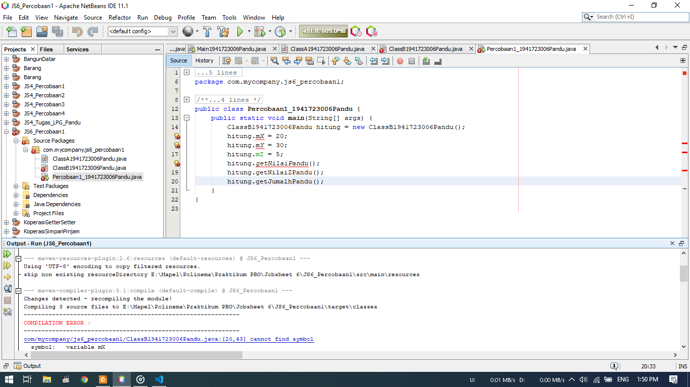

1. Gambar diatas merupakan hasil dari percobaan 1
2. Dimana saat terdapat dua class, yaitu classA dan classB dimana classB merupakan subclass dari classA
3. Bisa dilihat output pada program tersebut error karena ada kode yang belum dimasukan. Perbaikan akan dijawab di pertanyaan

### Pertanyaan Percobaan 1
1. Pada percobaan diatas program dijalankan terjadi eror, kemudian perbaiki program tersebut sehingga tidak terjadi eror !

    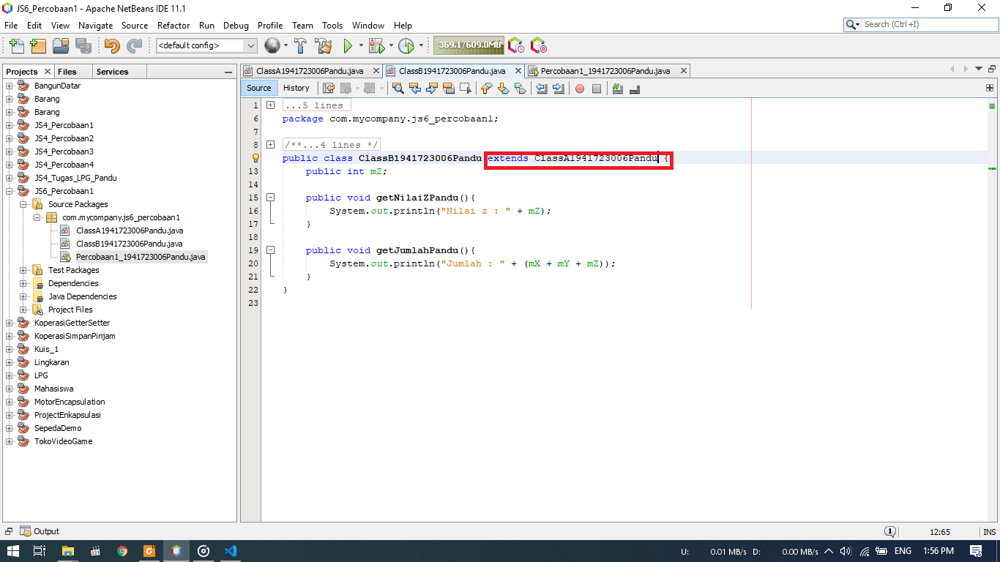

    Perbaikannya dengan menambah extends class parent dimana parentnya ialah ClassA. Hasil dari perbaikannya dapat dilihat pada gambar dibawah ini.

    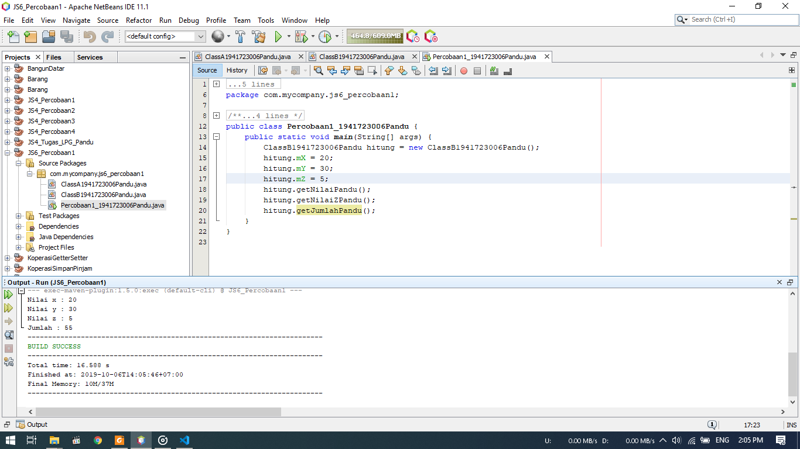

2. Jelaskan apa penyebab program pada percobaan 1 ketika dijalankan terdapat eror !
    
    Pada percobaan 1 terdapat eror karena pada ClassB tidak dideklarasikan sebagai class turunan dari CLassA. Sehingga data pada classB tidak dapat dipanggil oleh objek yang dibuat oleh classA dan akhirnya terjadi eror

Berikut untuk link ke file ClassA : [klik untuk menuju file ](../../src/6_Inheritance/Percobaan_1/ClassA1941723006Pandu.java)<br>
Berikut untuk link ke file ClassB : [klik untuk menuju file ](../../src/6_Inheritance/Percobaan_1/ClassB1941723006Pandu.java)<br>
Berikut untuk link ke file Percobaan 1 : [klik untuk menuju file ](../../src/6_Inheritance/Percobaan_1/Percobaan1_1941723006Pandu.java)


### Percobaan 2

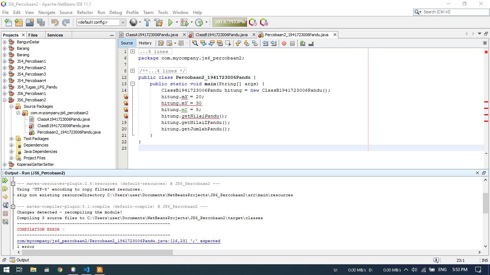
1. Pada percobaan ini, digunakan pemberian hak akses saat penggunaan inheritance
2. Dimana atribut dibuat menjadi private dan harus dibuat setter dan getter supaya dapat digunakan pada class lain
3. Program diatas masih terdapat eror dan akan diperbaiki pada bagian pertanyaan

### Pertanyaan Percobaan 2
1. Pada percobaan diatas program dijalankan terjadi eror, kemudian perbaiki program tersebut sehingga tidak terjadi eror !

    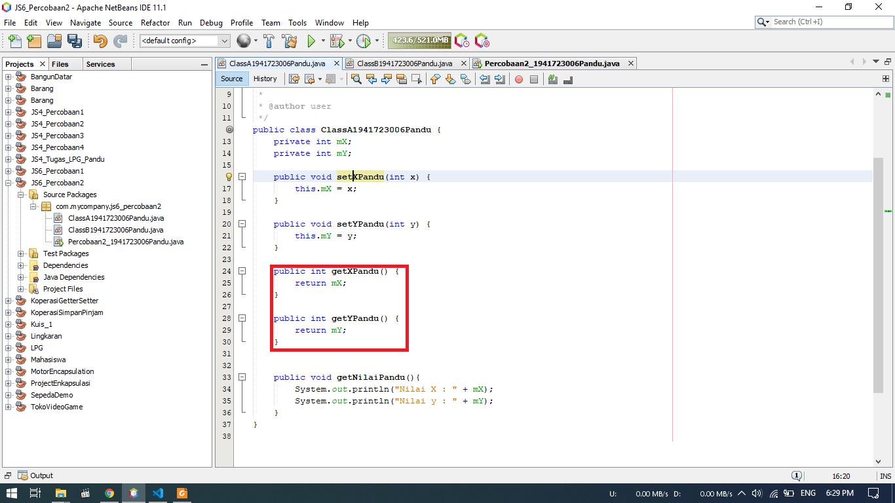
    Pada class parent yaitu classA, dibuat method getter supanya atribut private dapat digunakan pada class lain termasuk subclassnya

    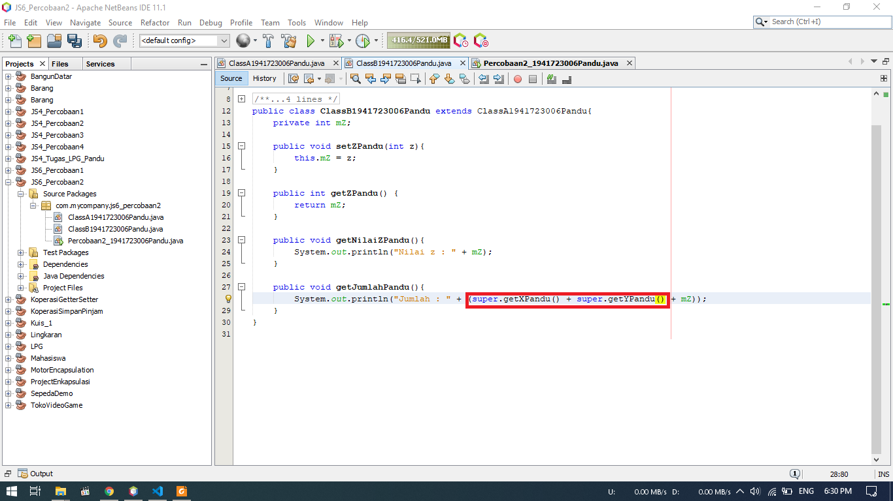
    Pada classB, pemanggilan atribut dapat menggunakan method getter tadi dengan menuliskan super.method()

    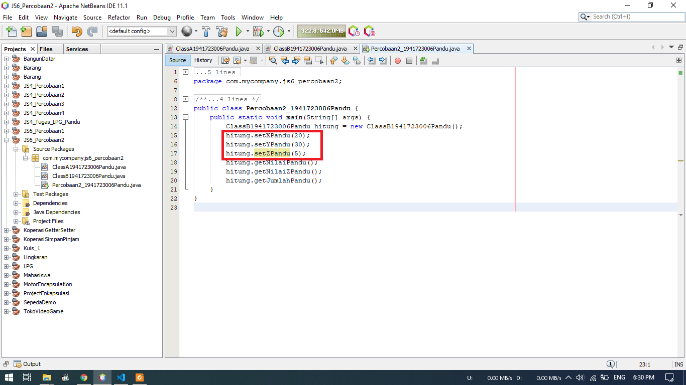
    Pada main Class, proses instansiasi variabel digantikan menggunakan method setter seperti pada gambar diatas

    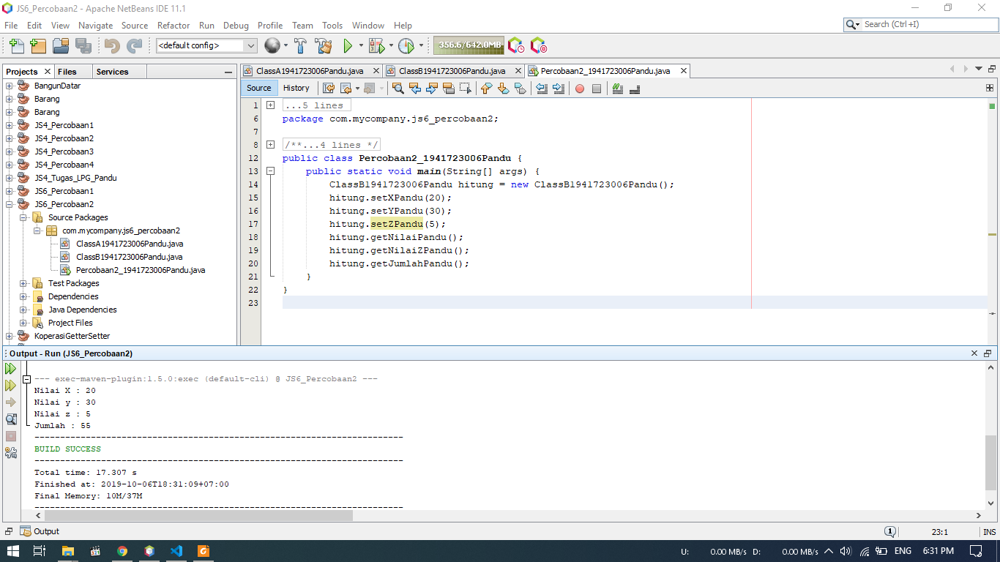
    berikut ialah hasil output dari program diatas

2. Jelaskan apa penyebab program pada percobaan 2 ketika dijalankan terdapat eror !
    - Program tersebut menjadi eror karena atribut private tidak dapat dipanggil oleh class lain sehingga harus menggunakan method getter dan setter
    - Tidak dideklarasikan subclass pada ClassB sehingga tidak dapat memanggil atribut pada parentclass

Berikut untuk link ke file ClassA : [klik untuk menuju file ](../../src/6_Inheritance/Percobaan_2/ClassA1941723006Pandu.java)<br>
Berikut untuk link ke file ClassB : [klik untuk menuju file ](../../src/6_Inheritance/Percobaan_2/ClassB1941723006Pandu.java)<br>
Berikut untuk link ke file Percobaan 2 : [klik untuk menuju file ](../../src/6_Inheritance/Percobaan_2/Percobaan2_1941723006Pandu.java)


### Percobaan 3

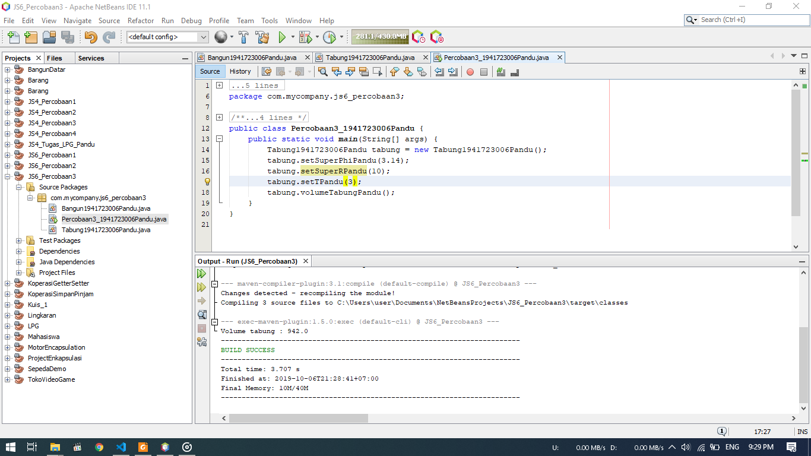

1. Pada percobaan ini akan menerapkan penggunaan super.
2. Super digunakan untuk memanggil data yang ada pada class Parent
3. Pada percobaan 3. Class tabung merupakan subclass dari class Bangun.
4. Pada gambar dibawah bisa dilihat class tabung memanggil atribut mR dan mPhi dari class Tabung sehingga dapat dioperasikan pada method volume()

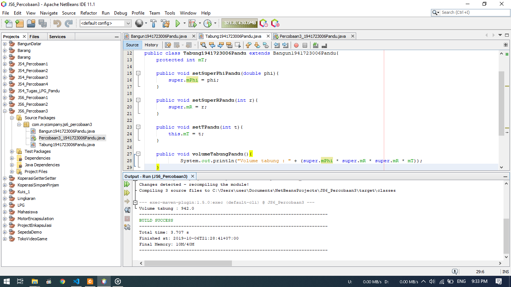

### Pertanyaan Percobaan 3

1. Jelaskan fungsi "super" pada potongan class Tabung dibawah ini !
   ```java
    public void setSuperPhi(double phi){
        super.phi = phi;
    }

    public void setSuperR(int r){
        super.r = r;
    }
    ```

    Super diatas digunakan untuk memanggil/menggunakan atribut pada class parent yaitu class Bangun, dimana atribut yang dipanggil yaitu phi dan r

2. Jelaskan fungsi "super" dan "this" pada potongan program berikut pada class Tabung !

    ```java
    public void volume(){
        System.out.println("Volume Tabung : " + (super.phi * super.r * super.r * this.t));
    }
    ```
    Pada perhitungan diatas, super digunakan untuk memanggil atribut "phi" dan "r" dari class Bangun/ class parent sedangkan this digunakan untuk memanggil atribut "t" dari class itu sendiri

3. Jelaskan mengapa pada class Tabung tidak dideklarasikan phi dan r tetapi dapat mengakses atribut tersebut !

    Karena class Tabung merupakan turunan/subclass dari class Bangun sehingga dapat menggunakan atribut dari parent class dengan menggunakan super tanpa harus mendeklarasikan ulang atribut phi dan r
    

Berikut untuk link ke file Bangun : [klik untuk menuju file ](../../src/6_Inheritance/Percobaan_3/Bangun1941723006Pandu.java)<br>
Berikut untuk link ke file Tabung : [klik untuk menuju file ](../../src/6_Inheritance/Percobaan_3/Tabung1941723006Pandu.java)<br>
Berikut untuk link ke file Percobaan 3 : [klik untuk menuju file ](../../src/6_Inheritance/Percobaan_3/Percobaan3_1941723006Pandu.java) 


### Percobaan 4
  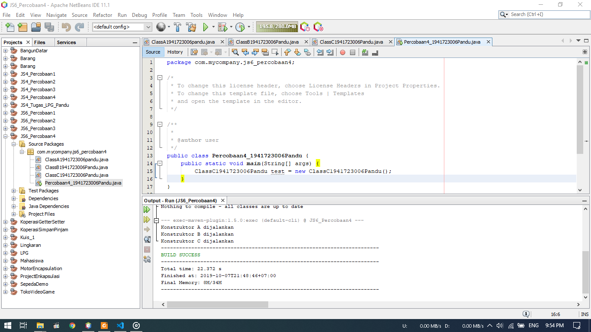
1. Gambar diatas merupakan hasil dari percobaan 4
2. Pada program diatas, ClassC merupakan subclass dari ClassB dan ClassB merupakan subclass dari ClassA
3. Pada mainclass dibuat objek pada class C tanpa parameter
4. Pada saat program dijalankan, akan memanggil isi dari kontruktor pada setiap class tanpa membuat objek satu per satu tiap class

### Pertanyaan Percobaan 4
1. Pada percobaan 4, sebutkan mana superclass dan mana subclass, kemudian jelaskan alasannya?
    - ClassA merupakan superclass pada ClassB, dan ClassB merupakan subclass dari ClassA. Alasannya karena pada ClassB terdapat extends ClassA yang merupakan deklarasi inheritance
    - ClassB merupakan superclass pada ClassC, dan ClassC merupakan subclass dari ClassB.Alasannya karena pada ClassC terdapat extends ClassB yang merupakan deklarasi inheritance
2. Ubahlah isi konstruktor default pada ClassC seperti berikut :
    ```java
        public class ClassC entends ClassB{
            ClassC(){
                super();
                System.out.println("Konstruktor C dijalankan");
            }
        }
    ```
    Coba jalankan kembali class percobaan4 dan tidak ada perbedaan dari hasil outputnya!
3. Ubahlah isi konstruktor ClassC seperti berikut :
    ```java
        public class ClassC entends ClassB{
            ClassC(){
                System.out.println("Konstruktor C dijalankan");
                super();
            }
        }
    ```
    Ketika mengubah posisi super() pada baris kedua pada konstruktor defaultnya maka terlihat ada eror. Kemudian kembalikan super() ke posisi semula. Maka eror akan hilang.<br>
    Perhatikan hasil output pada porcobaan4. Kenapa hasil output bisa seperti itu saat instansiasi objek dari classC. Jelaskan proses jalannya kronstruktor saat objek test dibuat!<br>
    Jawab : Karena pada saat program dijalankan, konstruktor classC memanggil konstruktor parent dengan kode super() sehingga isi konstruktor classB dapat dipanggil juga, begiitu juga pada kasus classB dan classA
4. Apa fungsi super() pada potongan program dibawah inin pada ClassC? 
    ```java
        public class ClassC entends ClassB{
            ClassC(){
                super();
                System.out.println("Konstruktor C dijalankan");
            }
        }
    ```
    
    Jawab : untuk memanggil kontruktor parent/superclass<br><br>
Berikut untuk link ke file ClassA : [klik untuk menuju file ](../../src/6_Inheritance/Percobaan_4/ClassA1941723006Pandu.java)<br>
Berikut untuk link ke file ClassB : [klik untuk menuju file ](../../src/6_Inheritance/Percobaan_4/ClassB1941723006Pandu.java)<br>
Berikut untuk link ke file ClassC : [klik untuk menuju file ](../../src/6_Inheritance/Percobaan_4/ClassC1941723006Pandu.java)<br>
Berikut untuk link ke file Percobaan 4 : [klik untuk menuju file ](../../src/6_Inheritance/Percobaan_4/Percobaan4_1941723006Pandu.java)

### Percobaan 5
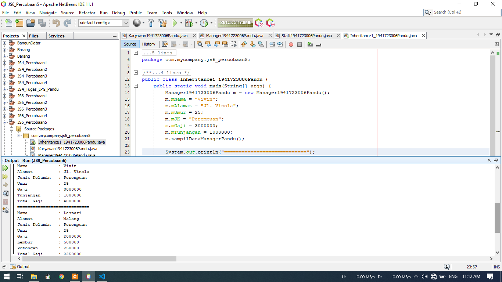
1. Berikut merupakan hasil dari percobaan 5
2. Pada perconbaan ini kita mencoba membuat inheritance dengan 2 subclass
3. Pada class Karyawan terdapat data umum yang dimiliki oleh semua subclass
4. Pada subclass terdapat data yang dibuat kusus sesuai classnya seperti tunjangan pada class Manager, dan lembur pada class Staff

### Pertanyaan Percobaan 5
1. Sebutkan mana yang merupakan superclass dan subclass pada percobaan 5 diatas !
    
    - SuperClass dari percobaan 5 diatas yaitu class Karyawan
    - SubClass dari percobaan 5 diatas yaitu class Manager dan class Staff
2. Kata kunci apakah yang digunakan untuk menurunkan suatu class ke class lain ?

    Untuk menurunkan/mewariskan suatu class cukup ditambahkan extends "class parent" setelah nama class
3. Perhatikan kode program class Manager, atribut apa saja yang diimiliki oleh class tersebut dan atribut apa saja yang diwariskan oleh class Karyawan?
    - Atribut yang dimiliki oleh class Manager yaitu atribut mTunjangan
    - Atribut yang diwariskan oleh class Karyawan yaitu atribut mNama, mAlamat, mUmur, mJK, mGaji
4. Jelaskan kata kunci super pada potongan program dibawah !
    ```java
        System.out.println("Total Gaji      : " + (super.mGaji + mTunjangan));
    ```
    Jawab : super digunakan untuk memanggil data pada class parent, seperti contoh diatas digunakan super untuk memanggil atribut gaji yang berada pada parent class yaitu class karyawan
5. Program percobaan 5 diatas termasuk jenis inhheritance apa? Jelaskan !

    Program percobaan 5 diatas termasuk jenis single inheritance karena hanya diturunkan sekali, dan subclassnya tidak memiliki turunan lagi

Berikut untuk link ke file Karyawan : [klik untuk menuju file ](../../src/6_Inheritance/Percobaan_5/Karyawan1941723006Pandu.java)<br>
Berikut untuk link ke file Manager : [klik untuk menuju file ](../../src/6_Inheritance/Percobaan_5/Manager1941723006Pandu.java)<br>
Berikut untuk link ke file Staff : [klik untuk menuju file ](../../src/6_Inheritance/Percobaan_5/Staff1941723006Pandu.java)<br>
Berikut untuk link ke file Inheritance 1 : [klik untuk menuju file ](../../src/6_Inheritance/Percobaan_5/Inheritance1_1941723006Pandu.java)

### Percobaan 6
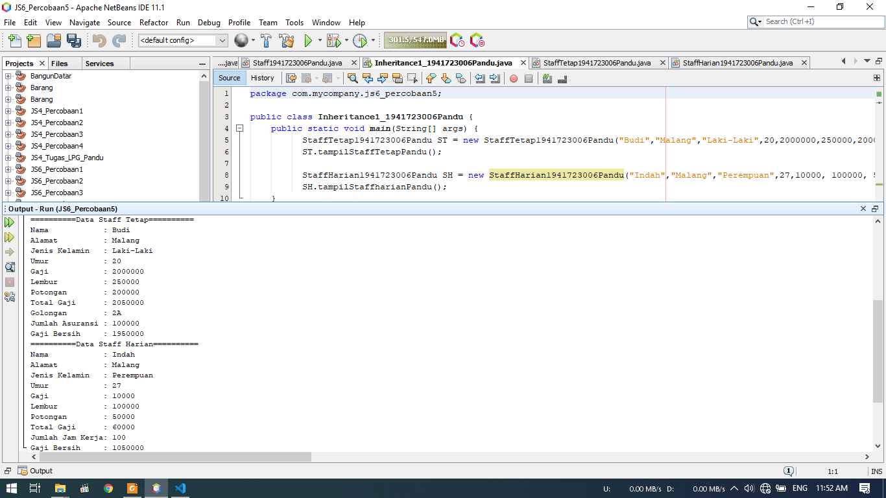
1. Gambar diatas merupakan hasil dari percobaan 6
2. dimana ditambahkan lagu subclass dari class Staff yaitu stafftetap dan staffharian
3. Data dari class staff dipanggil menggunaan konstruktor dan super sehingga tidak perlu mengulang lagi pengetikan atribut

### Pertanyaan Percobaan 6
1. Pada percobaan diatas, manakah yang termasuk single inheritance dan multilevel inherirtance?

    Pada percobaan diatas, yang termasuk single inheitance yaitu class Manager karena tidak memiliki subclass lagi. Sedangkan yang termasuk multilevel inheritance ialah class staff karena pada class staff memiliki turunan/subclass lagi yaitu class StaffHarian dan class staffTetap

2. Perhatikan kode program class staffharian dan staffTetap, atribut apa saja yang dimiliki oleh class tersebut?Sebutkan atribut mana yang diwariskan oleh class staff!
    - Atribut yang dimiliki oleh class StaffHarian yaitu mJmlJamKerja
    - Atribut yang dimiliki oleh class StaffTetap yaitu mGolongan  dan mAsuransi
    - Atribut yang diwariskan oleh class Staff yaitu mLembur dan mPotongan
3. Apa fungsi potongan program berikut pada class StaffHarian?
    ```java
        super(mNama, mAlamat, mJK, mUmur, mGaji, mLembur, mPotongan);
    ```
    Potongan program diatas berfungsi untuk memanggil atribut - atribut pada class super pada saat konstruktor dibuat
4. Apa fungsi potongan program berikt pada class StaffHarian?
    ```java
        super.tampilDataStaff();
    ```
    Potongan program diatas berfungsi untuk memanggil method tampilDataStaff() yang berada pada super class
5. Perhatikan potongan program berikut yang ada pada class StaffTetap :
    ```java
    System.out.println("Gaji bersih     : " + (mGaji*mLembur-mPotongan-mAsuransi));
    ```
    Terlihat dipotongan	program	diatas atribut gaji, lembur dan potongan dapat diakses langsung. Kenapa hal	ini bisa terjadi dan bagaimana class StaffTetap memiliki atribut gaji,lembur,dan potongan	padaha dalam class tersebut tidak dideklarasikan atribut gaji,lembur, dan potongan?

    Jawab : Karena atribut tersebut sudah terpanggil pada Konstruktor sehingga atribut - atribut pada class super dapat dipakai

Berikut untuk link ke file Karyawan : [klik untuk menuju file ](../../src/6_Inheritance/Percobaan_5/Karyawan1941723006Pandu.java)<br>
Berikut untuk link ke file Manager : [klik untuk menuju file ](../../src/6_Inheritance/Percobaan_5/Manager1941723006Pandu.java)<br>
Berikut untuk link ke file Staff : [klik untuk menuju file ](../../src/6_Inheritance/Percobaan_5/Staff1941723006Pandu.java)<br>
Berikut untuk link ke file Staff Harian: [klik untuk menuju file ](../../src/6_Inheritance/Percobaan_5/StaffHarian1941723006Pandu.java)<br>
Berikut untuk link ke file Staff Tetap: [klik untuk menuju file ](../../src/6_Inheritance/Percobaan_5/StaffTetap1941723006Pandu.java)<br>
Berikut untuk link ke file Inheritance 1 : [klik untuk menuju file ](../../src/6_Inheritance/Percobaan_5/Inheritance1_1941723006Pandu.java)

## Tugas

1. Berikut merupakan hasil dari Tugas
2. Dimana terdapat class Komputer sebagai parent class dan subclassnyaa berupa class Laptop dan class PC
3. Pada class Laptop terdapat subclass Lagi berupa class Mac dan class Windows
4. Pemanggilan atribut menggunakan super dan construktor, seperti pada percobaan - percobaan sebelumnya sehingga pada class masing - masing memiliki atribut kususnya sendiri

Berikut untuk link ke file Komputer : [klik untuk menuju file ](../../src/6_Inheritance/Tugas/Komputer1941723006Pandu.java)<br>
Berikut untuk link ke file Laptop : [klik untuk menuju file ](../../src/6_Inheritance/Tugas/Laptop1941723006Pandu.java)<br>
Berikut untuk link ke file PC : [klik untuk menuju file ](../../src/6_Inheritance/Tugas/PC1941723006Pandu.java)<br>
Berikut untuk link ke file Mac : [klik untuk menuju file ](../../src/6_Inheritance/Tugas/Mac1941723006Pandu.java)<br>
Berikut untuk link ke file Windows : [klik untuk menuju file ](../../src/6_Inheritance/Tugas/Windows1941723006Pandu.java)<br>
Berikut untuk link ke file MainTugas : [klik untuk menuju file ](../../src/6_Inheritance/Tugas/MainTugas1941723006Pandu.java)<br>


## Kesimpulan

Kesimpulan yang saya dapat selama praktikum ini adalah kita dapat menggunakan atribut parent class pada subclass tanpa harus mengetik ulang lagi atribut tersebut. Pemanggilan atribut juga dapat melalui konstruktor sehingga pada saat instansiasi tinggal memasukan nilai atribut tersebut

## Pernyataan Diri

Saya menyatakan isi tugas, kode program, dan laporan praktikum ini dibuat oleh saya sendiri. Saya tidak melakukan plagiasi, kecurangan, menyalin/menggandakan milik orang lain.

Jika saya melakukan plagiasi, kecurangan, atau melanggar hak kekayaan intelektual, saya siap untuk mendapat sanksi atau hukuman sesuai peraturan perundang-undangan yang berlaku.

Ttd,

***(Pandu Dwi Laksono)***
