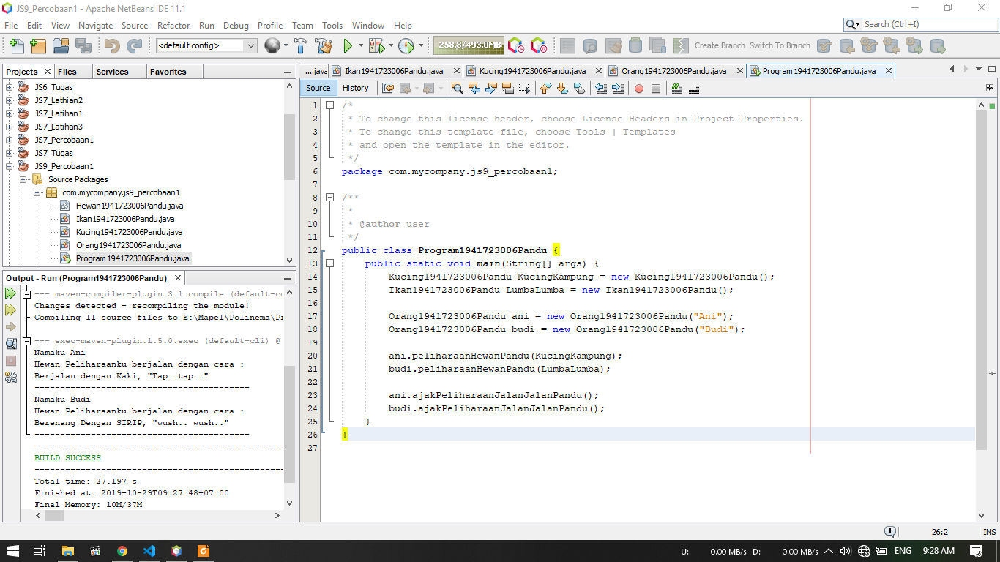
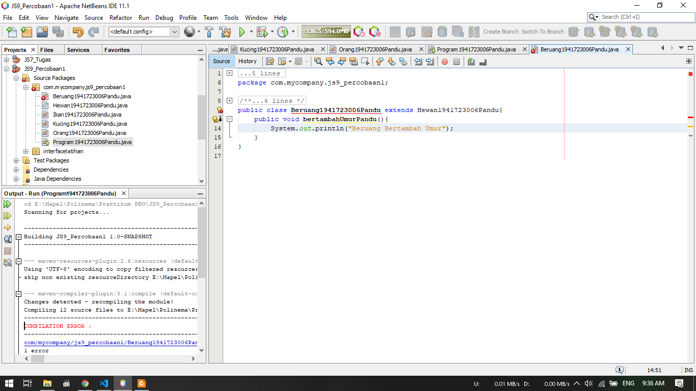
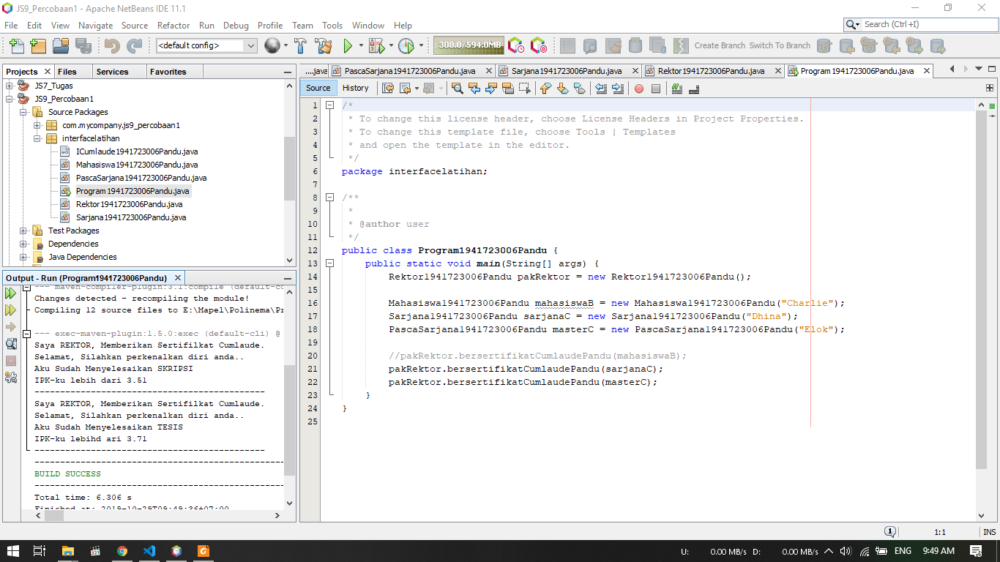
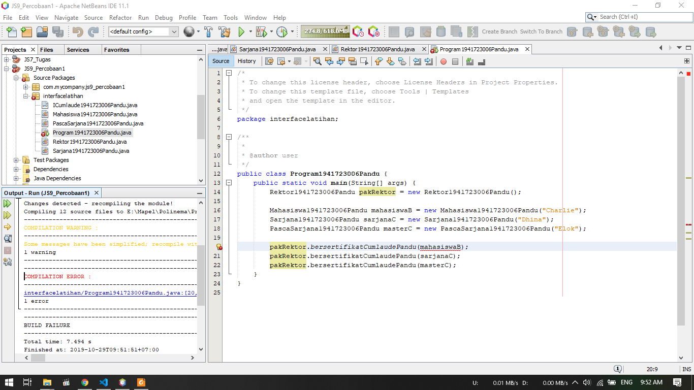
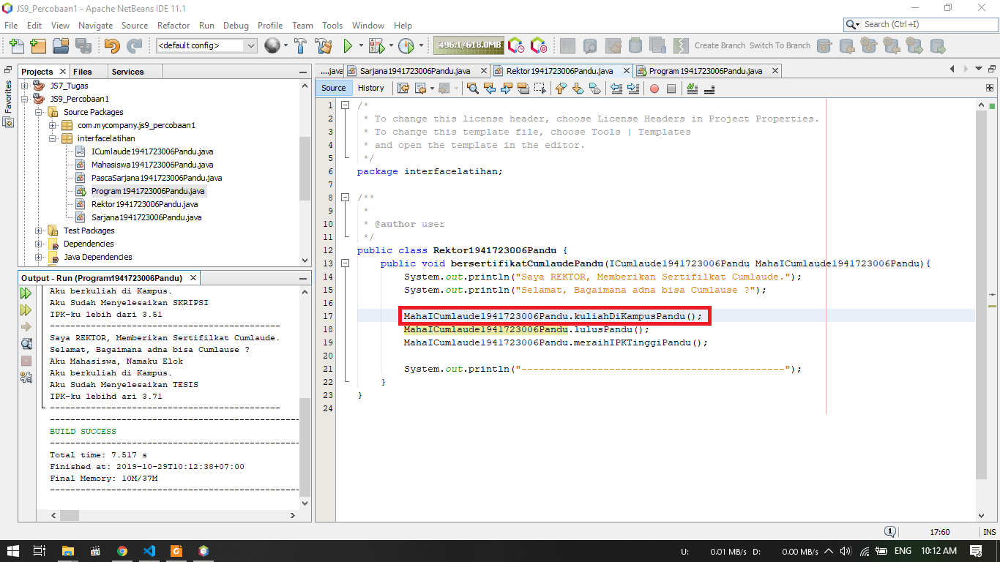
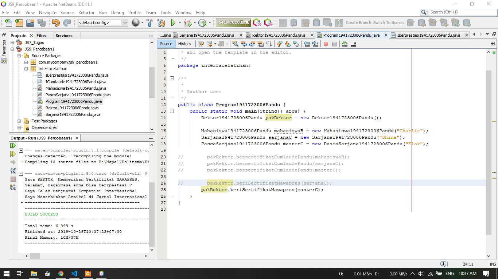
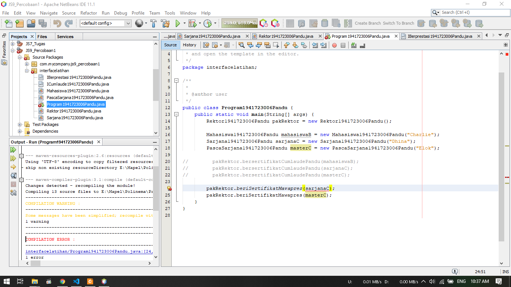
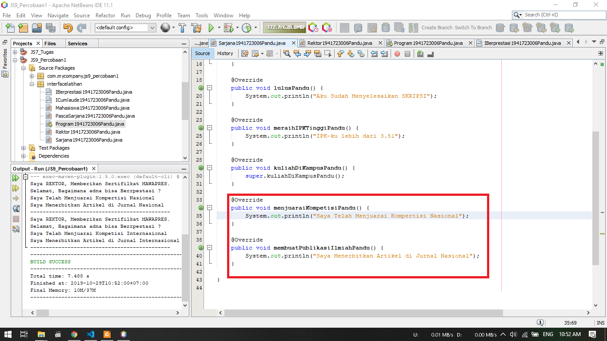
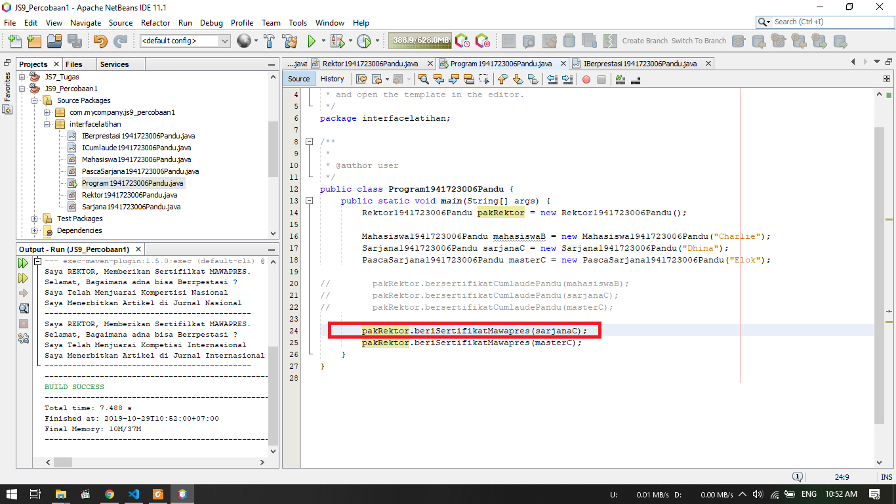

# Laporan Praktikum #9 - Abstract Class dan Interface

## Kompetensi

Setelah menyelesaikan lembar kerja ini mahasiswa diharapkan mampu:
1. Menjelaskan maksud dan tujuan penggunaan Abstract Class;
2. Menjelaskan maksud dan tujuan penggunaan Interface;
3. Menerapkan Abstract Class dan Interface di dalam pembuatan program.


## Ringkasan Materi

1. Abstract class merupakan class yang tidak dapat diinstansiasi namun dapat di-extend. Abstract class baru dapat dimanfaatkan ketika ia di-extend.
2. Abstracrt class dapat memiliki atribut dan method seperti class biasa, namun terdapat sebuah method abstract yang tidak terdapat isi dengan karakteristik ```abstract ``` pada methodnya
3. Interface adalah struktur data yang hanya berisi abstract methods. Tidak ada apa-apa selain method abstract pada interface, termasuk atribut getter dan setter.
4. Pada class interface, penamaan class selalu diawalai dengan huruf "I" diawal nama class interface untuk menandai class tersebut merupakan class interface


## Percobaan

### Percobaan 1



1. Gambar diatas merupakan hasil dari percobaan 1
2. Disini akan dicoba penggunaan abstract dimana class Hewan merupakan class Abstract dan class kucing, class ikan, class Beruang merupakan subclass dari class Hewan
3. Class orang merupakan pengguna method dari abstract class tadi yang akan dieksekusi pada class main yaitu class Program


### Pertanyaan Percobaan 1
1. Bolehkah apabila sebuah class yang meng-extend suatu abstract class tidak mengimplementasikan method abstract yang ada di class induknya? Buktikan!
    Tidak Bisa, akan terjadi error karena subclass dari class abstrak harus mengimplementasi method abstrak
    

Berikut untuk link ke file Hewan : [klik untuk menuju file ](../../src/9_Abstract_Class_dan_Interface/Percobaan_1/Hewan1941723006Pandu.java)<br>
Berikut untuk link ke file Ikan : [klik untuk menuju file ](../../src/9_Abstract_Class_dan_Interface/Percobaan_1/Ikan1941723006Pandu.java)<br>
Berikut untuk link ke file Kucing : [klik untuk menuju file ](../../src/9_Abstract_Class_dan_Interface/Percobaan_1/Kucing1941723006Pandu.java)<br>
Berikut untuk link ke file Beruang : [klik untuk menuju file ](../../src/9_Abstract_Class_dan_Interface/Percobaan_1/Beruang1941723006Pandu.java)<br>
Berikut untuk link ke file Orang : [klik untuk menuju file ](../../src/9_Abstract_Class_dan_Interface/Percobaan_1/Orang1941723006Pandu.java)<br>
Berikut untuk link ke file Program : [klik untuk menuju file ](../../src/9_Abstract_Class_dan_Interface/Percobaan_1/Program1941723006Pandu.java)

### Percobaan 2


1. Pada percobaan ini, dilakukan percobaan interface
2. Dimana terdapat class interface yaitu ICumlaude yang akan digunakan pada beberapa class yaitu, class Sarjana dan class PascaSarjana
3. Pada class Sarjana dan class PascaSarjana akan diimplementasikan method abstract yang ada pada class ICumlaude
4. Pada class Rektor, hanya akan memanggil method - method yang terdapat pada class mahasiswa
5. Output program dapat dilihat pada screenshot diatas

### Pertanyaan Percobaan 2
1. Mengapa pada langkah nomor 9 terjadi error? Jelaskan!
    
    Terjadi error karena pada class Mahasiswa tidak diimplementasikan method abstract yang ada pada class interface yaitu class ICumlaude sehingga pada saat pemanggilan di class Rektor terjadi error
    

2. Dapatkah method kuliahDiKampus() dipanggil dari objek sarjanaCumlaude di class Program? Mengapa demikian?
    Bisa, dengan menambahkan method abstract kuliahDiKampus() pada class interface Icumlaude
    ```java
        public abstract void kuliahDiKampusPandu();
        
    ```
3. Dapatkah method kuliahDiKampus() dipanggil dari parameter mahasiswa di method beriSertifikatCumlaude() pada class Rektor? Mengapa demikian?
    Bisa, karena class Rektor memanggil method abstract pada ICumlaude melalui class Mahasiswa sehingga tinggal menambahkan method dibawah pada class Rektor
    ```java
        MahaICumlaude1941723006Pandu.kuliahDiKampusPandu();
    ```

4. Modifikasilah method beriSertifikatCumlaude() pada class Rektor agar hasil eksekusi class Program menjadi seperti berikut ini:
    

Berikut untuk link ke file ICumlaude : [klik untuk menuju file ](../../src/9_Abstract_Class_dan_Interface/Percobaan_2/ICumlaude1941723006Pandu.java)<br>
Berikut untuk link ke file Mahasiswa : [klik untuk menuju file ](../../src/9_Abstract_Class_dan_Interface/Percobaan_2/Mahasiswa1941723006Pandu.java)<br>
Berikut untuk link ke file Sarjana : [klik untuk menuju file ](../../src/9_Abstract_Class_dan_Interface/Percobaan_2/Sarjana1941723006Pandu.java)<br>
Berikut untuk link ke file PascaSarjana : [klik untuk menuju file ](../../src/9_Abstract_Class_dan_Interface/Percobaan_2/PascaSarjana1941723006Pandu.java)<br>
Berikut untuk link ke file Rektor : [klik untuk menuju file ](../../src/9_Abstract_Class_dan_Interface/Percobaan_2/Rektor1941723006Pandu.java)<br>
Berikut untuk link ke file Program : [klik untuk menuju file ](../../src/9_Abstract_Class_dan_Interface/Percobaan_2/Program1941723006Pandu.java)


### Percobaan 3



1. Pada percobaan ini akan menerapkan penggunaan mutiple interface.
2. Dibuat interface baru yaitu IBerprestasi yang akan dipanggil pada class PascaSarjana
3. Pada Class Rektor dibuat method baru yang akan mengeksekusi method yangd ada pada interface IBerprestasi
4. Pada main Class dinonaktifkan pemanggilan method pada interface ICumlaude dan ditambahkan pemanggilan method IBerprestasi seperti pada screenshot diatas
5. Hasil program dapat dilihat pada screenshot diatas
 

6. Terdapat sebuah error karena ada method yang tidak diimplementasi pada class Sarjana, sehingga diperbaiki dengan memberikan tanda comment pada pemanggilan Sarjana di method ``` beriSertifikatPandu(sarjanaC); ```


### Pertanyaan Percobaan 3

1. Apabila Sarjana Berprestasi harus menjuarai kompetisi NASIONAL dan menerbitkan artikel di jurnal NASIONAL, maka modifikasilah class-class yang terkait pada aplikasi Anda agar di class Program objek pakRektor dapat memberikan sertifikat mawapres pada objek sarjanaCumlaude.
    
    - Dengan mengimplementasikan method abstract IBerprestasi pada class Sarjana

    
    - Kemudian pada main class, hapus comment pada pemanggilan ``` pakRektor.beriSertifikatMawapres(sarjanaC); ```

Berikut untuk link ke file IBerprestasi : [klik untuk menuju file ](../../src/9_Abstract_Class_dan_Interface/Percobaan_3/IBerprestasi1941723006Pandu.java)<br>
Berikut untuk link ke file Mahasiswa : [klik untuk menuju file ](../../src/9_Abstract_Class_dan_Interface/Percobaan_3/Mahasiswa1941723006Pandu.java)<br>
Berikut untuk link ke file Sarjana : [klik untuk menuju file ](../../src/9_Abstract_Class_dan_Interface/Percobaan_3/Sarjana1941723006Pandu.java)<br>
Berikut untuk link ke file PascaSarjana : [klik untuk menuju file ](../../src/9_Abstract_Class_dan_Interface/Percobaan_3/PascaSarjana1941723006Pandu.java)<br>
Berikut untuk link ke file Rektor : [klik untuk menuju file ](../../src/9_Abstract_Class_dan_Interface/Percobaan_3/Rektor1941723006Pandu.java)<br>
Berikut untuk link ke file Program : [klik untuk menuju file ](../../src/9_Abstract_Class_dan_Interface/Percobaan_3/Program1941723006Pandu.java)


## Kesimpulan

Kesimpulan yang saya dapat selama praktikum ini adalah kita dapat menggunakan method abstract pada class parent dan dieimplementasikan pada subclass sehingga tinggal mengubah isi dari method abstract tersebut. Penggunaan abstract class digunakan untuk menggurangi method yang banyak namun memiliki fungsi sama.

Pada penggunaan Interface, dapat membuat method abstract baru tanpa harus dibuat di class parent, kemudian dapat dipanggil di subclass dengan menambahkan ``` implement Interface_class ``` disamping nama class setelah extends class

## Pernyataan Diri

Saya menyatakan isi tugas, kode program, dan laporan praktikum ini dibuat oleh saya sendiri. Saya tidak melakukan plagiasi, kecurangan, menyalin/menggandakan milik orang lain.

Jika saya melakukan plagiasi, kecurangan, atau melanggar hak kekayaan intelektual, saya siap untuk mendapat sanksi atau hukuman sesuai peraturan perundang-undangan yang berlaku.

Ttd,

***(Pandu Dwi Laksono)***
